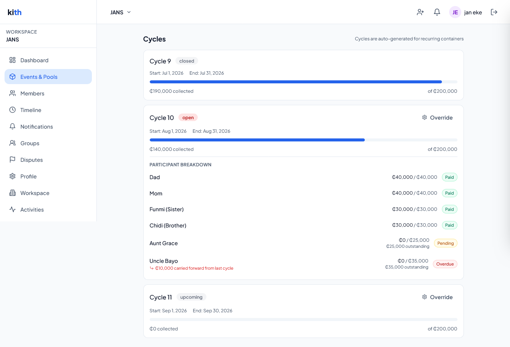
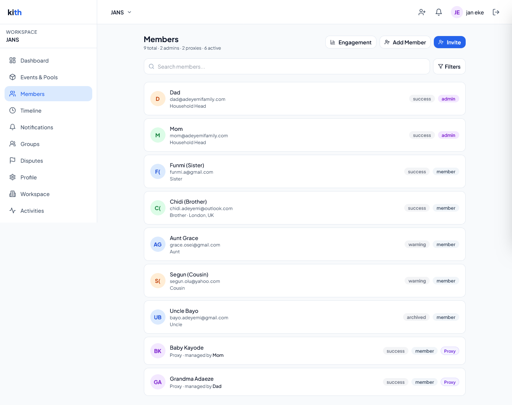
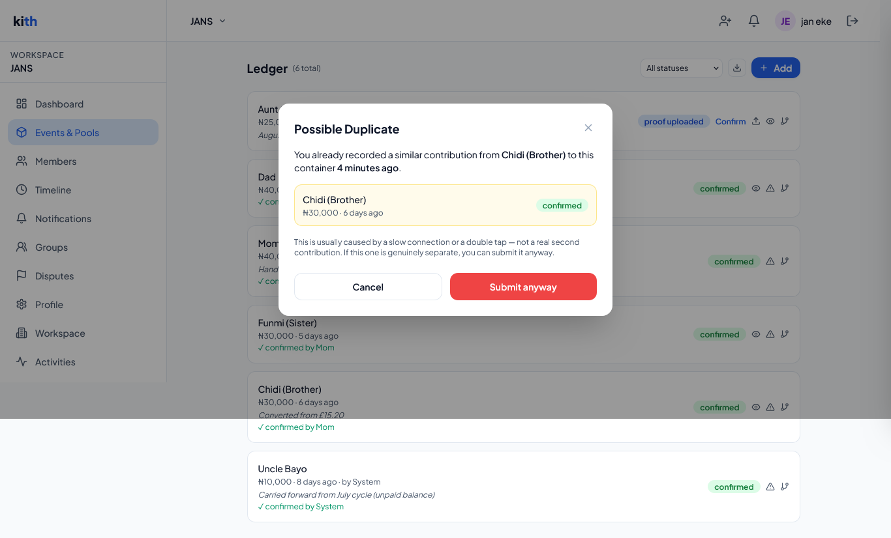
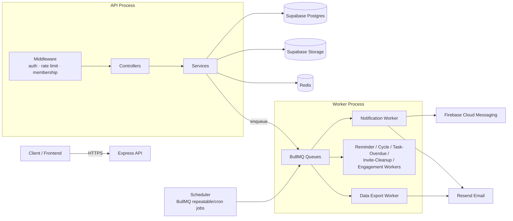
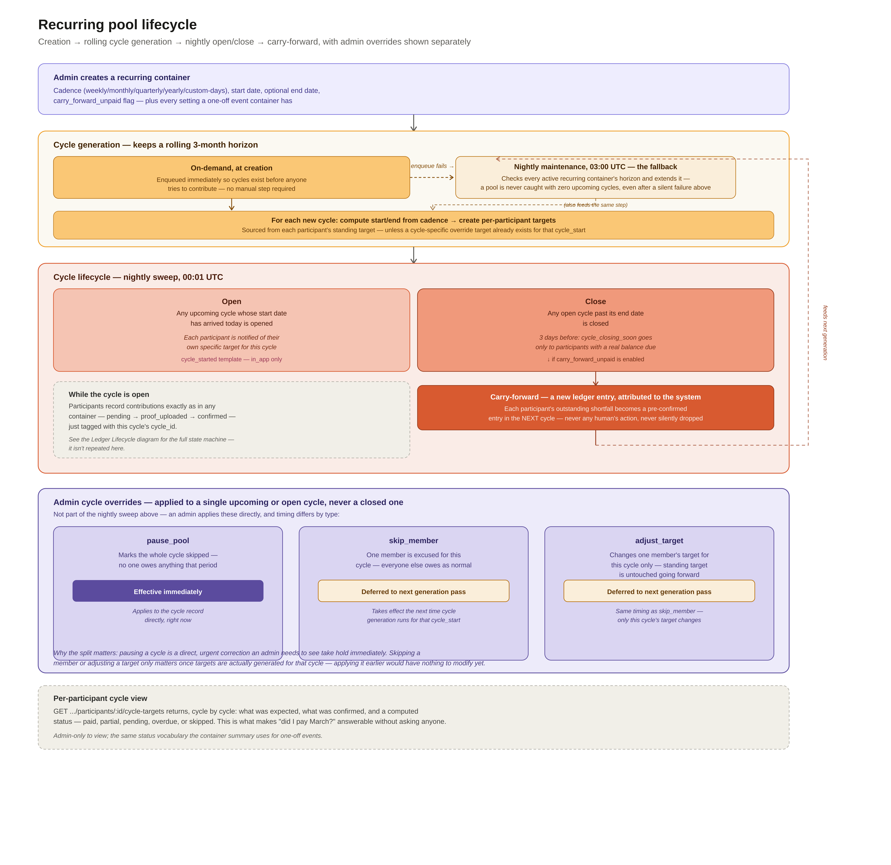
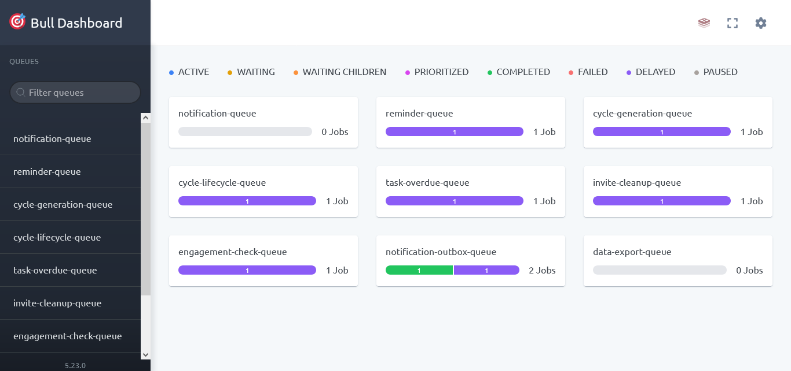

# Kith — Family Financial & Coordination Platform


**Live demo:** [ADD YOUR LIVE URL HERE] · [Architecture](docs/ARCHITECTURE.md) · [Product Overview](docs/PRODUCT_OVERVIEW.md)

Kith is a family coordination platform for managing shared money, responsibilities, and recurring obligations in one place. It replaces the group chat, the spreadsheet, and the person who has to remember to open this month's rent pool with structured family **workspaces**, a trustworthy financial **ledger**, automated **recurring pools**, **tasks**, a **dispute workflow**, and an **audit trail**.

It's a backend-heavy project built around problems that don't show up in typical CRUD apps: financial history that has to stay provably correct under concurrent writes, billing cycles that run unattended for months, a notification layer that can't silently lose a delivery, and a family member (a child, an elderly relative) who needs to be represented in the system without ever logging in.

This is a monorepo with two apps:

- **`backend/`** — a Node.js/Express API and background job system (Supabase, Redis, BullMQ).
- **`frontend/`** — a Vite + React + TypeScript single-page app that consumes the API.

Most of this README focuses on the backend, since that's where the core domain logic lives — the [Frontend](#frontend) section near the end covers the client app's stack.

## In Action


*Everything an admin needs to know about their family's shared finances and responsibilities, on one screen, updated live — pulled from the ledger, the task tracker, the dispute system, and the audit log simultaneously.*

---

## Why I Built This

Families share money and responsibility the same way small companies do — recurring contributions, one-off costs, disputes, people who never quite pay on time — but without any of the tooling a company would reach for. Rent gets split in a group chat. A rotating savings pool gets tracked in someone's notes app. A relative who isn't tech-literate gets left out of the system entirely, even though they're still part of the obligation. I built Kith to see what it looks like to give a household the structure a company gets by default: a real ledger instead of "did you send that already?", scheduled automation instead of one person remembering to open a cycle every month, and a dispute workflow instead of an argument in the family group chat.

I used this project to go deep on problems that don't show up in typical CRUD apps: money that has to be provably correct (corrections instead of edits, idempotency keys, a dispute state machine), recurring billing that runs unattended (cycle generation, carry-forward, per-cycle overrides), and a notification layer reliable enough that a failed push or email doesn't just silently vanish (an outbox pattern re-attempts anything stuck). It's also where I made deliberate, documented trade-offs — like accepting a bounded 30-second staleness window on membership checks to avoid two extra DB round-trips on the hottest path in the app — rather than pretending every corner has a perfect answer.

## What Kith Does

**Shared family workspaces.** A workspace is a household — members, roles (admin/member), and a shared history. A person can belong to more than one (their own family, their in-laws') as a distinct membership in each.

**Financial coordination.** Members submit contributions, admins confirm them, proof-of-payment files are verified server-side, and confirmed entries are corrected (never edited) or disputed through a structured workflow — not a group-chat argument.

**Recurring pools.** Monthly rent, a rotating savings pool, an ongoing care fund — cycles generate automatically ahead of time, open and close on schedule, and can carry forward an unpaid balance into the next cycle, with per-cycle admin overrides (pause, skip a member, adjust a target).



*Cycles open and close on their own — an admin steps in only to override, not to remember.*

**Responsibilities.** Tasks sit alongside money with the same participant/permission model — assign, self-report progress, admin-confirm, attach proof, and get flagged automatically when overdue.

**Accountability & notifications.** Every consequential action is written to an immutable audit log and, where relevant, triggers a notification (in-app, push, or email) — so "who changed this?" and "does everyone know?" both have real answers.

**Inclusion for non-users.** Proxy membership lets an admin record contributions and tasks on behalf of a baby, an elderly relative, or anyone who isn't going to install and learn a new app — without excluding them from the system tracking their obligations.



*Not every family member can use an app. Kith lets an admin record contributions on behalf of a baby or an elderly relative who'll never log in — with a named, accountable manager and the same financial rigor as everyone else.*

---

## Engineering Highlights

**Immutable financial history.** Confirmed ledger entries are never edited in place. A correction creates a new, linked entry referencing the original — the original stays exactly as it was recorded, so the full history (original number, and any later correction) is always visible.


*Every contribution is fully traceable: who paid, in what currency, who confirmed it, and — for entries the system generates itself, like a carried-forward balance — that it wasn't a person who made the call.*

**Idempotent financial writes.** Ledger submissions carry a client-supplied idempotency key, so a network retry after a flaky response can never create a duplicate entry. A separate, independent duplicate-detection heuristic (same amount, same container, 10-minute window) catches the different problem of a person genuinely double-submitting by mistake — two different failure modes, two different defenses.



*A slow connection or an anxious double-tap shouldn't record the same payment twice — but a genuine second contribution shouldn't be blocked either. Kith warns, shows exactly what it's comparing against, and lets the person decide.*

**Atomic state transitions.** Operations with a real race condition if done as sequential writes — dispute raise/resolve, invite acceptance, contributor-target updates, converting an event into a recurring pool — are pushed into single Postgres RPC calls rather than multi-step application code, so there's no window where two related records can disagree.

**Resilient background processing.** Nine Redis-backed BullMQ queues move slow, scheduled, or external work (notifications, cycle generation, reminders, data export, cleanup) off the request path, so a slow push provider or a heavy CSV export never blocks an API response.

**Notification delivery recovery.** If enqueueing a push or email delivery fails, the delivery is marked `failed` rather than silently dropped, and a background sweep every five minutes re-enqueues anything stuck `pending`/`failed` — a transactional-outbox pattern applied to notification delivery specifically so a failed send leaves a trace instead of just vanishing.

**Automated recurring workflows.** Recurring pools generate roughly three months of upcoming cycles ahead of time, open and close them on a nightly schedule, apply admin overrides, and optionally carry an unpaid balance forward — with a daily maintenance job as a fallback if the on-demand generation triggered at creation-time silently failed.

**Layered authorization.** Authentication (`requireAuth`, verifying a Supabase JWT), tenancy (`requireMembership`, verifying active workspace membership), and role-based authorization (`requireAdmin`) are three separate, composable middleware checks — with field-level authorization layered underneath (e.g. a member can edit their own display name but not their own role).

### A Financial Workflow Designed for Auditability


Once a contribution is confirmed, the record itself is never edited again. A dispute or a correction are the only two ways its effective state can subsequently change — and both are atomic at the database level, so the dispute record and the ledger entry's status can never disagree, even under concurrent access. Full reasoning in [ARCHITECTURE.md §21.1](docs/ARCHITECTURE.md#211-recording-and-confirming-a-contribution-ledger-entry).

---

## Architecture

The API follows a layered **routes → controllers → services → Supabase** structure. Controllers are thin HTTP adapters (parse request, call a service, shape the response); all business logic, validation-adjacent rules, and database access live in the service layer. Services accept plain parameter objects rather than Express `req`/`res`, which is what lets the exact same service function run from an HTTP controller or a background worker.


<details>
<summary>Mermaid version (same diagram, GitHub-native rendering)</summary>



</details>

The API and the workers can run as **separate processes** (`server.js` for the API, `workers/index.js` for workers + scheduler), which allows the two workloads to be scaled independently in a multi-instance deployment, or as **one process** (`start-all.js`) for local development or small single-instance deployments — both paths call the exact same worker-factory functions, so nothing behaves differently based on which mode is running.

Key cross-cutting mechanisms:

- **Membership resolution** (`middleware/workspace.js`) verifies the caller belongs to `:workspaceId` on every workspace-scoped route, attaches `req.member`/`req.workspace`, and is backed by a 30-second Redis cache (`services/membership-cache.service.js`) with explicit invalidation on role/active-status changes — trading a bounded 30s staleness window for removing two DB round trips from the hottest path in the app.
- **Rate limiting** is Redis-backed (shared across instances) and split by identity availability: an IP-keyed baseline limiter runs globally before auth resolves, and a user-keyed limiter runs on workspace-scoped routes after `requireAuth` has populated `req.user`.
- **Notifications** always go through a single `notification.service.js#send()` entry point, which renders a template, writes an in-app row immediately, and enqueues external (push/email) deliveries — with an outbox worker that re-enqueues anything stuck in `pending`/`failed` for more than 5 minutes.
- **Recurring pools** are driven by two cooperating services: `cycle_generation.service.js` (creates upcoming cycles ahead of time, applying any pause/skip/adjust overrides) and `cycle_lifecycle.service.js` (opens/closes cycles on schedule and, if configured, carries forward unpaid balances into the next open cycle).

### Domain Model

```
Workspace (a household)
 ├─ Members (admin | member, may be a "proxy" member managed by an admin)
 ├─ Groups (named subsets of members)
 ├─ Invite links (token-based, expiring)
 └─ Containers
     ├─ type: "event" (one-off) | "recurring" (pool)
     ├─ Participants (per-container opt-in to money/task tracking, targets)
     ├─ Cycles (recurring containers only — generated/opened/closed automatically)
     ├─ Ledger entries (contribution | expense | correction | carry_forward)
     │   └─ Disputes
     ├─ Tasks
     └─ Milestones / timeline entries
```

Supporting cross-cutting entities: **notifications** (+ deliveries), **audit log**, and **contributor targets** (per-participant, optionally per-cycle, money goals).

Full request-lifecycle diagrams, the database schema, and the reasoning behind every atomic RPC are in [ARCHITECTURE.md](docs/ARCHITECTURE.md).

---

## Automation & Background Jobs



A recurring pool always has roughly three months of upcoming cycles ready to go — generated on-demand the moment the pool is created, with a nightly maintenance job as a safety net that catches and extends the horizon if that first attempt silently failed for infrastructure reasons. Nine BullMQ queues, each with a dedicated worker, handle everything that doesn't need to finish before the HTTP response is sent:

| Job | Queue | Schedule | Purpose |
|---|---|---|---|
| `reminder-scan` | `reminder-queue` | Daily 07:00 UTC | Upcoming-payment, overdue, admin-summary, and cycle-closing-soon reminders |
| `cycle-lifecycle` | `cycle-lifecycle-queue` | Daily 00:01 UTC | Opens due cycles, closes ended ones, carries forward unpaid balances |
| `task-overdue-check` | `task-overdue-queue` | Daily 06:00 UTC | Flags pending tasks past their due date and notifies assignee + admins |
| `invite-cleanup` | `invite-cleanup-queue` | Daily 02:00 UTC | Deletes expired, unused invite links |
| `engagement-check` | `engagement-check-queue` | Weekly, Sunday 06:00 UTC | Recomputes each member's `last_active_at` from ledger/task activity |
| `cycle-gen-maintenance` | `cycle-generation-queue` | Daily 03:00 UTC | Ensures recurring pools always have cycles generated 3 months ahead |
| `notification-outbox-scan` | `notification-outbox-queue` | Every 5 minutes | Re-enqueues push/email deliveries stuck `pending`/`failed` for 5+ minutes |

`data-export-queue` and `notification-queue` are consumed on-demand (triggered by user action) rather than on a schedule. An admin-only **Bull Board** dashboard (`/admin/queues`, IP-allowlisted + Basic Auth, only mounted if credentials are configured) makes every queue's live job count observable — not just described in a README, but running and inspectable.



*Not a diagram of what the background system is supposed to do — a screenshot of it actually running.*

---

## Security Highlights

- Workspace membership lookups return `404` (never `403`) on access failure, to prevent workspace-ID enumeration.
- Public, unauthenticated lookup endpoints (invite preview, public container view) carry a dedicated, tighter Redis-backed rate limit tuned against token-space enumeration.
- Refresh tokens are stored in an `httpOnly`, `secure` (in production), `SameSite=strict` cookie scoped to `/v1/auth/refresh` — never returned in a JSON body.
- Password changes for a logged-in user require re-verifying the current password via a real sign-in attempt before the change is allowed; the separate password-recovery endpoint checks the JWT's `amr` claim for a `recovery` entry rather than accepting any valid access token.
- Google OAuth `redirect_to` is validated against the configured `FRONTEND_URL` origin or an explicit deep-link allowlist, closing an open-redirect vector.
- Uploaded files are re-verified server-side by checking actual byte signatures ("magic bytes") against the declared content type at confirm-time — not just trusted from the client-declared type at upload-URL-issuance time.
- Ledger entry creation supports client-supplied idempotency keys (plus a duplicate-detection time window) to make retried submissions safe.
- Multi-step state changes that must be atomic (dispute raise/resolve, invite acceptance, contributor-target updates, event→recurring conversion) go through single Postgres RPC calls rather than sequential application-level writes.
- Search and member-listing inputs are escaped before being embedded in `ILIKE` patterns, preventing wildcard-injection.
- The last active admin of a workspace cannot be demoted or removed.
- The Bull Board admin queue dashboard is gated behind an IP allowlist (exact match or CIDR) and constant-time-compared Basic Auth credentials, and is only mounted at all if its credentials are configured.
- Helmet is configured with HSTS, deny-framing, and a `no-referrer` policy; CORS is locked to a single configured origin with credentials enabled (no wildcard fallback).

One honest architectural note: because the backend uses Supabase's **service-role** client (which bypasses Row-Level Security) for nearly all operations, RLS is not the enforcement boundary for this app — the middleware chain above is. That's a deliberate trade-off, not an oversight, and it's why the middleware ordering and consistent application described above carries real weight. Full reasoning in [SECURITY.md](docs/SECURITY.md).

---

## Testing & CI

Tests are split into three Jest projects and run automatically on every push and pull request to `main`/`develop` via GitHub Actions.

| Suite | Command | What it covers |
|---|---|---|
| Unit | `npm run test:unit` | Isolated service/utility logic, no external dependencies |
| Integration | `npm run test:integration` | Full request flows against a real Postgres (via PostgREST) and Redis instance |
| Rate limiting | `npm run test:ratelimit` | Redis-backed request throttling behavior specifically, isolated from the rest of the integration suite |

```bash
npm test                # runs all three Jest projects
npm run test:unit       # unit tests only — no external services needed
```

Integration and rate-limit tests need a real Postgres and Redis instance, stood up via Docker Compose:

```bash
npm run test:docker:up      # starts Postgres + Redis via docker-compose.test.yml
npm run test:docker:seed    # applies migrations/001_schema.sql to the test DB
npm run test:integration
npm run test:ratelimit
npm run test:docker:down    # tears the containers back down
```

**In CI**, the integration job goes a step further than local Docker Compose: it also spins up [PostgREST](https://postgrest.org/) in front of the test Postgres instance, since the app talks to Supabase through a PostgREST-compatible client — this makes the CI environment a much closer match to the real Supabase-backed production setup than hitting Postgres directly would be. Unit tests run in a separate, lighter job with no service containers at all. See [`.github/workflows/test.yml`](.github/workflows/test.yml) for the full configuration.

---

## Backend Tech Stack

| Layer | Technology |
|---|---|
| Runtime | Node.js ≥ 18, Express 4 |
| Database | Supabase (managed Postgres), accessed via `@supabase/supabase-js` |
| Auth | Supabase Auth (email/password + Google OAuth), JWT bearer tokens, httpOnly refresh-token cookie |
| Cache / Queue backing store | Redis (`ioredis`) |
| Background jobs | BullMQ (queues + workers), `rate-limit-redis` for distributed rate limiting |
| File storage | Supabase Storage (signed upload/download URLs) |
| Validation | Zod |
| Push notifications | Firebase Admin SDK (FCM) |
| Transactional email | Resend |
| Logging | Winston |
| Security middleware | Helmet, CORS, `express-rate-limit` |
| Error tracking (optional) | Sentry (`@sentry/node`) |
| Queue monitoring (optional) | Bull Board, IP-allowlisted + Basic Auth |
| CSV generation | `csv-stringify` |
| Testing | Jest |

---

## API

The backend exposes a versioned REST API under `/v1`. Workspace-scoped routes require an active `workspace_members` row and are mounted at `/v1/workspaces/:workspaceId/...`.

Major resource groups:

- **Auth** — signup, login, refresh, Google OAuth, password reset/change, profile, contacts, GDPR data export
- **Public** — unauthenticated invite preview, invite acceptance, public container share view
- **Workspaces** — CRUD, dashboard, settings, search, announcements, audit log (+ CSV export), overdue summary
- **Members, invites, groups** — membership management, engagement stats, bulk participant assignment
- **Containers** — event/recurring-pool CRUD, complete/archive/restore, convert-to-recurring, cycles
- **Participants, ledger, disputes** — targets, contribution CRUD, proof upload/confirm, corrections, dispute lifecycle
- **Tasks** — CRUD, bulk create, reassign, status override, admin confirm, CSV export
- **Timeline, milestones, notifications** — merged activity feed, user-scoped notification inbox

Every response follows a consistent envelope (`{ data, meta? }` for success, `{ error: { code, message, ... } }` for failures), and list endpoints share a common pagination shape and `?sort=field` / `?sort=-field` convention. Full route-by-route detail is in [ARCHITECTURE.md §7](docs/ARCHITECTURE.md#7-api-architecture) and [PRODUCT_OVERVIEW.md](docs/PRODUCT_OVERVIEW.md). The full machine-readable spec is in [`docs/openapi.yaml`](docs/openapi.yaml).

---

## Backend Project Structure

```
backend/src/
├── app.js                 # Express app: middleware, route mounting, error handler
├── server.js               # API-only process entry point
├── start-all.js             # Combined API + workers + scheduler entry point (local/small deploys)
├── config/                  # External service clients (Supabase, Redis, Firebase, Resend)
├── constants/                # Shared enums (audit action names + descriptions)
├── controllers/               # Thin HTTP adapters — parse req, call service, shape response
├── services/                  # Business logic, DB access, orchestration
├── middleware/                # auth, membership resolution, role checks, rate limiting, logging
├── routes/                    # Express routers, one per resource, mounted in app.js/workspace.routes.js
├── validators/                 # Zod request-body schemas
├── utils/                      # Cross-cutting helpers (errors, pagination, sorting, ILIKE escaping, etc.)
├── queues/                     # BullMQ queue registry + cron scheduler
└── workers/                    # BullMQ Worker process wiring (delegates to services/)
```

---

## Getting Started

### Prerequisites

- Node.js ≥ 18
- A Supabase project (Postgres + Auth + Storage)
- A Redis instance

### Installation

Clone the repo, then install the backend and frontend separately — each has its own `package.json`.

```bash
git clone <this-repo>
cd <this-repo>

# Backend
cd backend
npm install
cp .env.example .env   # if present — otherwise see Configuration below
cd ..

# Frontend
cd frontend
npm install
cp .env.example .env   # if present — set VITE_API_URL, VITE_SUPABASE_URL, etc.
cd ..
```

### Running the app

All of the following run from inside `backend/`.

```bash
# Everything in one process (API + workers + scheduler) — local dev
npm run dev            # nodemon
npm start               # node

# Or as separate processes (production-style):
node src/server.js          # API only
node src/workers/index.js   # workers + scheduler only
```

To run the frontend alongside it, open a second terminal:

```bash
cd frontend
npm run dev
```

A `GET /health` endpoint reports Postgres and Redis connectivity and is suitable for a load-balancer health check. The database schema is maintained as a single up-to-date file, `migrations/001_schema.sql`, applied directly to the target Supabase project rather than through an incremental migration runner — it also defines the atomic Postgres RPC functions the app relies on (e.g. `convert_event_to_recurring_atomic`, `raise_dispute_atomic`, `set_contributor_target_atomic`).

### Scripts

Run from `backend/`:

| Script | Command | Purpose |
|---|---|---|
| `npm start` | `node src/start-all.js` | Run API + workers + scheduler in one process |
| `npm run dev` | `nodemon src/start-all.js` | Same, with autoreload |
| `npm run worker` | `node src/workers/index.js` | Run workers + scheduler only |
| `npm run scheduler` | `node src/queues/scheduler.js` | Register/refresh cron jobs only |
| `npm test` | `jest` | Run all three test suites |
| `npm run lint` | `eslint src/` | Lint the codebase |

## Configuration

Required at startup (`server.js` / `start-all.js` exit immediately if any are missing):

- `SUPABASE_URL`
- `SUPABASE_SERVICE_ROLE_KEY`
- `REDIS_URL`
- `FRONTEND_URL`

Optional, feature-gating integrations — the app boots without these, but the corresponding feature is disabled or degraded:

- `SUPABASE_ANON_KEY` — auth endpoints (login/signup)
- `FIREBASE_SERVICE_ACCOUNT` — push notifications
- `RESEND_API_KEY` — email notifications and data-export emails
- `SENTRY_DSN` — error tracking
- `BULL_BOARD_USERNAME` / `BULL_BOARD_PASSWORD` — the `/admin/queues` dashboard, unmounted unless both are set

See the [full environment variable reference](docs/ARCHITECTURE.md#25-configuration--environment-variables) in ARCHITECTURE.md for the complete list, including defaults and every feature-gated toggle (`IDEMPOTENCY_ENABLED`, `FILE_VERIFICATION_ENABLED`, `ALLOWED_DEEPLINK_SCHEMES`, `ADMIN_IP_WHITELIST`, and more).

---

## Frontend

The `frontend/` app is a Vite + React 18 + TypeScript single-page app that talks to the API described above.

| Layer | Technology |
|---|---|
| Framework | React 18 (TypeScript), built/served with Vite 5 |
| Routing | React Router v6, nested routes and layouts, lazy-loaded pages via `React.lazy` + `Suspense` |
| Styling | Tailwind CSS 3 (custom theme) + Radix UI primitives, `lucide-react`, `react-hot-toast` |
| State | Zustand (`authStore`, `workspaceStore`, `uiStore`) for client state; TanStack React Query v5 for server state |
| HTTP client | Axios, wrapped in a single instance that injects the bearer token, unwraps the response envelope, and handles 401s with an automatic refresh-and-retry |
| Forms & validation | React Hook Form + Zod, with schemas written to mirror the backend's own validators |

Route access is layered through composed guards (`ProtectedRoute` → `ProfileGuard` → `WorkspaceGuard` → `AdminRoute`) that mirror the backend's own `requireAuth` → `requireMembership` → `requireAdmin` chain conceptually — though the frontend guard is a UX convenience, not a security boundary; the backend middleware remains the actual enforcement point. The frontend consumes the versioned backend API rather than embedding domain logic in the UI; see [ARCHITECTURE.md §24](docs/ARCHITECTURE.md#24-frontend-architecture) for the full stack-level breakdown, including the project structure and boot-sequence details.

---

## Trade-offs & Known Limitations

- **No migration runner.** The schema is maintained directly as a single, up-to-date `migrations/001_schema.sql` file (applied directly to the target Supabase project, and used to seed the test database in CI) rather than as an incremental migration history.
- **30-second membership cache staleness.** Membership authorization data is cached in Redis for up to 30 seconds (see [Architecture](#architecture)); a role/access change made outside this application entirely could remain visible for up to that window. Any change made *through* the app invalidates the cache immediately.
- **File-signature verification covers a fixed format set.** Only JPEG, PNG, GIF, WEBP, and PDF are recognized; other declared content types are not blocked for lack of a known signature to check against.
- **Idempotency-key uniqueness is workspace-scoped, not global**, and the 10-minute duplicate-detection window is a heuristic, not a guarantee — a legitimate contribution submitted twice, 11 minutes apart with no idempotency key, will create two entries. A conscious choice: false positives on a genuine second contribution would be more harmful than an occasional true duplicate needing manual correction.
- **Service-role Postgres access, not RLS, is the enforcement boundary** (see [Security Highlights](#security-highlights)) — correct as long as the service-role key stays server-side and the middleware chain is never bypassed, but there's no independent database-layer backstop today.

Further reading: [ARCHITECTURE.md](docs/ARCHITECTURE.md) for the full system design and every documented trade-off, and [PRODUCT_OVERVIEW.md](docs/PRODUCT_OVERVIEW.md) for the complete feature and product-decision reference.

## License
