# Kith — System Architecture

**Status:** Backend architecture reference, with a frontend stack overview added in §24
**Scope:** Primarily the `src/` backend service. §24 covers the frontend at a stack level rather than a page-by-page breakdown.

---

## 1. Executive Summary

Kith is a multi-tenant family/household coordination platform: workspaces ("families") track shared money pools ("containers" — one-off events or recurring pools), chores/tasks, milestones, disputes, and membership, with a notification layer to keep members informed.

The backend is a single Node.js/Express service backed by **Supabase (Postgres)** for persistence and **Redis** for caching, rate limiting, and job queues (**BullMQ**). It follows a conventional **layered architecture** — routes → middleware → controllers → services → data access — with a service layer that exists specifically to keep business logic reusable from both HTTP controllers and background-job workers.

The system is designed to run either as **separate API and worker processes** (`server.js` / `workers/index.js`, the production topology) or as a **single combined process** (`start-all.js`, for local development and small deployments) without any code duplication between the two.

---

## 2. System Overview

At a high level, Kith consists of:

- **One HTTP API process** (Express) — serves the versioned REST API under `/v1`.
- **One or more worker processes** (BullMQ `Worker`s) — consume background jobs (notifications, cycle generation, reminders, data exports, cleanup).
- **One scheduler** — registers cron-like repeatable BullMQ jobs into the queues the workers listen on.
- **Postgres (via Supabase)** — system of record. Also hosts several **atomic stored procedures (RPCs)** for operations that must not tear under concurrency (invite acceptance, dispute resolution, contributor-target updates, event→recurring conversion).
- **Redis** — three distinct roles: BullMQ's job store, `rate-limit-redis`-backed request throttling, and a short-lived application cache (membership lookups, last-seen debounce).
- **Supabase Storage** — object storage for proofs, avatars, cover photos, milestone photos, and GDPR export attachments (the latter emailed rather than stored long-term).
- **Resend** — transactional email (notifications, GDPR data export delivery).
- **Firebase Cloud Messaging** — push notifications.

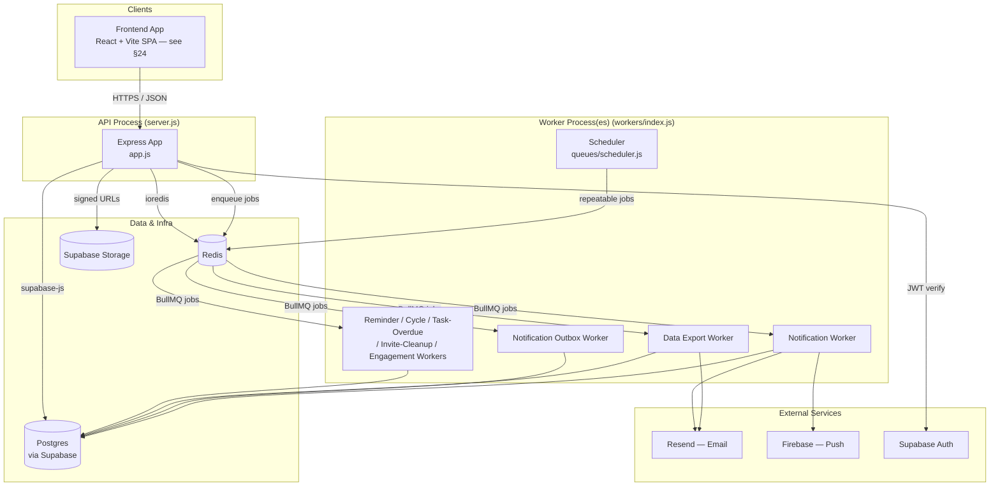

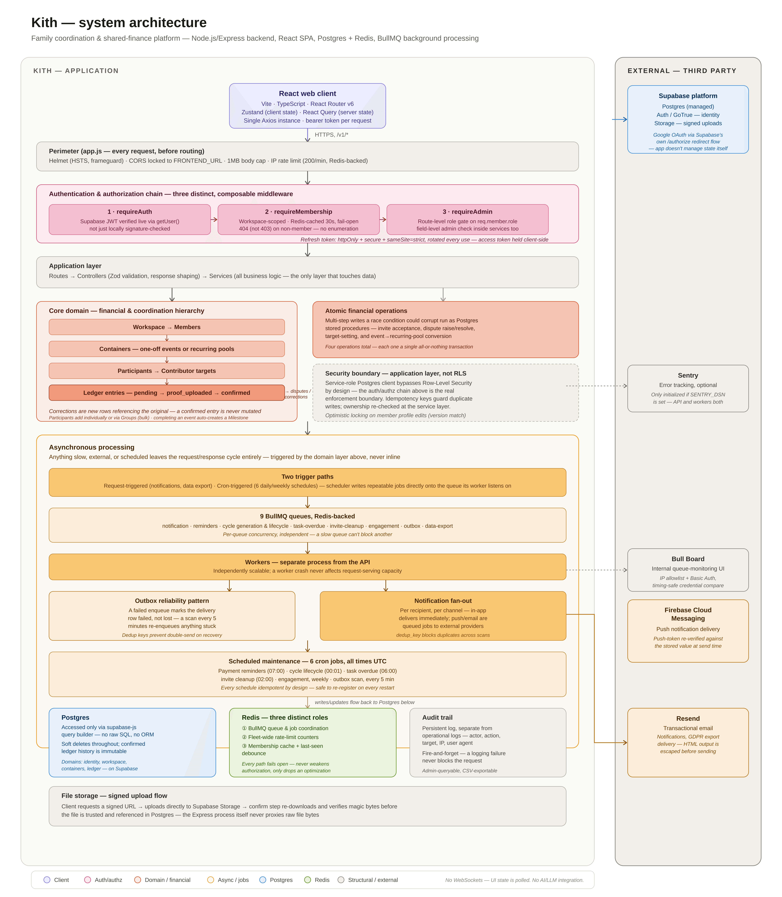
*A single-page reference for the whole system: request perimeter and auth chain at the top, the domain/financial core in the middle, async job processing below it, and every external service (Supabase, Redis, Resend, FCM, Sentry, Bull Board) on the right. Each numbered box in this diagram corresponds to a section elsewhere in this document — it's meant as an orientation map, not a replacement for the detailed sections that follow.*

---

## 3. Architectural Principles

Consistently applied across the codebase and worth naming explicitly:

1. **Thin controllers, fat services.** Every controller in `src/controllers/` follows the same shape: parse the request (validate with Zod, pull `req.params`/`req.user`/`req.member`), call exactly one service function, shape the HTTP response, forward errors to `next()`. All business logic — DB queries, RPC calls, notification dispatch, audit logging — lives in `src/services/`.
2. **One shared implementation per concern, never two.** The codebase actively eliminates duplicate logic: `engagement.service.js` is used by both the dashboard/member-engagement endpoint *and* the background engagement-check worker; `export.service.js`'s CSV builder is shared by the admin and member-scoped task export paths; `utils/pagination.js` and `utils/sorting.js` centralize patterns that would otherwise be copy-pasted per-controller.
3. **Fail closed on money- and access-relevant paths; fail open on convenience paths.** Guards that protect financial integrity (disabling money tracking with existing ledger entries, deleting a container with confirmed entries) throw loudly on query error rather than silently proceeding. Conversely, the Redis membership cache, last-seen debounce, and rate-limiter Redis store all **fail open** — a Redis outage degrades performance, not correctness or security.
4. **Atomicity via Postgres RPCs at genuine race-condition boundaries.** Where a sequence of reads/writes must be atomic (invite acceptance, dispute raise/resolve, contributor-target updates, event→recurring container conversion), the logic is pushed into a Postgres stored procedure invoked via `.rpc(...)`, rather than attempting distributed-transaction logic in application code.
5. **Defense in depth on authorization.** Route-level middleware (`requireAuth`, `requireMembership`, `requireAdmin`, `requireSelfOrAdmin`) establishes coarse-grained access; services re-check fine-grained, data-dependent rules (e.g., "you can only dispute your own entries," "only admins can change contributor_id").
6. **Explicit allow-lists over implicit trust.** Every update endpoint (`updateContainer`, `updateWorkspace`, `updateMember`, `updateTask`, ...) defines an explicit field allow-list rather than spreading `req.body` into an update call — closing mass-assignment risk by construction.
7. **404, not 403, to prevent enumeration.** `requireMembership` deliberately returns 404 (not 403) for a workspace the caller isn't a member of, and invite preview returns a uniform `{ is_valid: false }` shape for "not found," "expired," and "used" — all to avoid leaking which case applies to an unauthenticated prober.

---

## 4. Repository Structure

```
src/
├── app.js                    # Express app assembly (no listen())
├── server.js                 # API-only process entry point
├── start-all.js              # Combined API + workers process (dev/small deploys)
│
├── config/                   # External client singletons
│   ├── supabase.js           #   supabaseAdmin (service role) + supabaseAuth (anon)
│   ├── redis.js               #   ioredis singleton + checkConnection()
│   ├── redis-keys.js          #   central key-naming + TTL constants
│   ├── firebase.js            #   Firebase Admin SDK (push)
│   ├── resend.js              #   Resend client (email)
│   └── database.js            #   thin health-check shim (no query() — see §9)
│
├── constants/
│   └── audit-actions.js      # Frozen AUDIT_ACTIONS enum + human-readable descriptions
│
├── controllers/               # HTTP adapters — parse req, call service, shape res
├── services/                  # Business logic — DB/RPC calls, orchestration
├── middleware/                 # auth, workspace membership, role checks, rate limits
├── routes/                    # Express routers, one per resource
├── validators/                 # Zod schemas
├── utils/                      # pagination, sorting, ILIKE escaping, errors, response envelopes
├── queues/                     # BullMQ queue registry + scheduler
└── workers/                    # BullMQ Worker wiring (thin — logic lives in services/)
```

**Navigation notes for new engineers:**
- To find business logic for a feature, go straight to `services/<feature>.service.js` — controllers are not worth reading first.
- `services/audit.service.js` (write path, fire-and-forget) and `services/audit_log.service.js` (paginated read + CSV export path) are intentionally separate files with similar names, kept apart to avoid mixing a fire-and-forget writer with a paginated reader in one module.
- `services/notification.service.js` (the central *sender*, used by nearly every other service) and `services/notification_inbox.service.js` (a recipient reading their *own* inbox) are likewise deliberately separate concerns.
- Route files carry explicit ordering comments (e.g., static `/summary` before dynamic `/:entryId`) — this is a real Express routing constraint, not a style preference; preserve declaration order when adding routes.

---

## 5. High-Level System Architecture

Kith follows a classic **layered / N-tier architecture** rather than a microservices split — a single Postgres database and a single Redis instance are shared by the API and worker processes, with process-level separation only between "handles HTTP" and "handles background jobs."

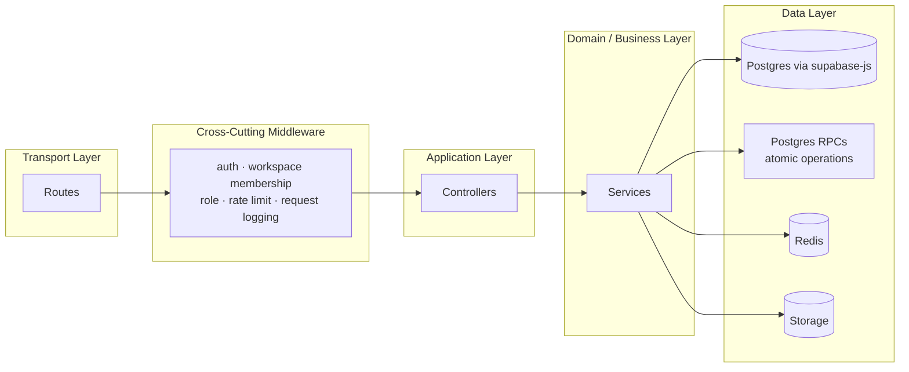

**Why this shape, not microservices:** the domain (household finance + task coordination) has a small number of tightly related entities (workspaces, members, containers, ledger entries, tasks) with cross-cutting concerns (audit, notifications, membership caching) that are cheaper to share as libraries within one process than to split across service boundaries and pay network/consistency costs for. The one place the system *does* decompose is **synchronous vs. asynchronous work** (API vs. workers), which is a genuinely different scaling and failure-mode axis (see §11, §19).

---

## 6. Backend Layer Responsibilities

| Layer | Responsibility | Must NOT contain |
|---|---|---|
| **Routes** (`routes/`) | Wire URL + HTTP verb → middleware chain → controller function. Enforce *declaration-order* correctness (static before dynamic segments). | Business logic, validation logic |
| **Middleware** (`middleware/`) | Cross-cutting concerns applied to many routes: identity (`requireAuth`), tenancy (`requireMembership`), authorization (`requireAdmin`/`requireSelfOrAdmin`), rate limiting, request logging/ID | Resource-specific business rules |
| **Controllers** (`controllers/`) | Parse/validate request body via Zod schemas, extract `req.params`/`req.user`/`req.member`, call one service function, shape the response (`success`/`paginate`/`noContent`), forward errors | DB queries, RPC calls, notification/audit dispatch |
| **Services** (`services/`) | All business logic: Supabase queries, RPC invocation, cross-entity orchestration, audit logging, notification dispatch, queue enqueueing | Express-specific objects (`req`/`res`) — services accept plain parameter objects, making them callable from both controllers and workers |
| **Validators** (`validators/`) | Zod schemas defining the exact accepted shape of request bodies, with custom refinements for cross-field rules (e.g., recurring containers require `recurrence_cadence`) | — |
| **Utils** (`utils/`) | Stateless, dependency-free helpers: pagination math, sort-field whitelisting, ILIKE escaping, typed `AppError` subclasses, response envelope builders | Anything with I/O |
| **Queues/Workers** (`queues/`, `workers/`) | Register BullMQ queues and repeatable schedules; wire each `Worker` to the one service function that does the actual work | Business logic (delegated to `services/`) |

---

## 7. API Architecture

### 7.1 Versioning & resource shape
All routes are mounted under `/v1`. Resources are nested to reflect real ownership:

```
/v1/auth/...                                              (identity, not tenant-scoped)
/v1/public/...                                             (unauthenticated read-only)
/v1/notifications/...                                      (user-scoped, not workspace-scoped)
/v1/workspaces                                              (list/create — no :workspaceId)
/v1/workspaces/:workspaceId/...                              (everything tenant-scoped)
  ├── members, invites, groups, disputes                    (workspace-level resources)
  ├── containers/:containerId/...                             (event or recurring pool)
  │     ├── participants/:participantId/...
  │     ├── ledger/:entryId/...
  │     └── tasks/:taskId/...
  ├── timeline, milestones/:milestoneId/...
  ├── dashboard, overdue-summary, search, audit-log, settings
```

### 7.2 Route composition
`workspace.routes.js` is deliberately split into one small `Router` per resource (`member.routes.js`, `container.routes.js`, `ledger.routes.js`, etc.), each mounted at the same path prefix it would otherwise occupy. This eliminates the fragility of maintaining route-ordering constraints (static-before-dynamic) across dozens of routes in one file. Each sub-router only has to get that ordering right *locally* (e.g., `ledger.routes.js`'s `/summary` before `/:entryId` — about 10 routes, not 80). See ADR-0003 for the full reasoning.

### 7.3 Route mounting order matters
In `app.js`, `/v1/workspaces` (list/create, no `:workspaceId`) is mounted **before** `/v1/workspaces/:workspaceId` for the same reason — Express matches path segments in mount order, and a bare `/v1/workspaces` GET could otherwise be captured by the parameterized router.

### 7.4 Response envelope
All success responses use one of three helpers from `utils/response.js`:
- `success(res, data, statusCode)` → `{ data: ... }`
- `paginate(res, data, total, page, perPage)` → `{ data: ..., meta: { pagination: { page, per_page, total, total_pages } } }`
- `noContent(res)` → HTTP 204

This uniform envelope means every client-side response parser can assume `data` is always present, and paginated endpoints are always distinguishable by the presence of `meta.pagination`.

### 7.5 Idempotency
`POST /containers/:containerId/ledger` (creating a ledger entry) supports an `X-Idempotency-Key` header. When present, `ledger.service.js#createEntry` looks up any existing entry with that key + workspace before inserting, and returns the existing row with `idempotent: true` (HTTP 200) instead of creating a duplicate (HTTP 201). This is distinct from, and takes precedence over, the separate **duplicate-detection heuristic** (same container + contributor + amount within a 10-minute window) that applies when no idempotency key is supplied — that heuristic can be bypassed with `?force=true`, but the idempotency-key path cannot (by design — it's meant to protect against network retries, not to be a user-facing "I meant it" override).

---

## 8. Authentication & Authorization

Kith layers **three distinct, composable checks**, applied by different middleware at different points in the route chain:

1. **Authentication** (`requireAuth`, `middleware/auth.js`) — verifies a Supabase JWT via `supabaseAdmin.auth.getUser(token)`, attaches `req.user = { id, email, full_name }`.
2. **Tenancy / membership** (`requireMembership`, `middleware/workspace.js`) — verifies the authenticated user is an **active** member of the `:workspaceId` in the URL, attaches `req.member` (with `id`, `role`, `displayName`, `isProxy`) and `req.workspace`.
3. **Role-based authorization** (`requireAdmin`, `requireSelfOrAdmin`, `middleware/role.js`) — gates specific routes to admins, or to "the resource owner or an admin."

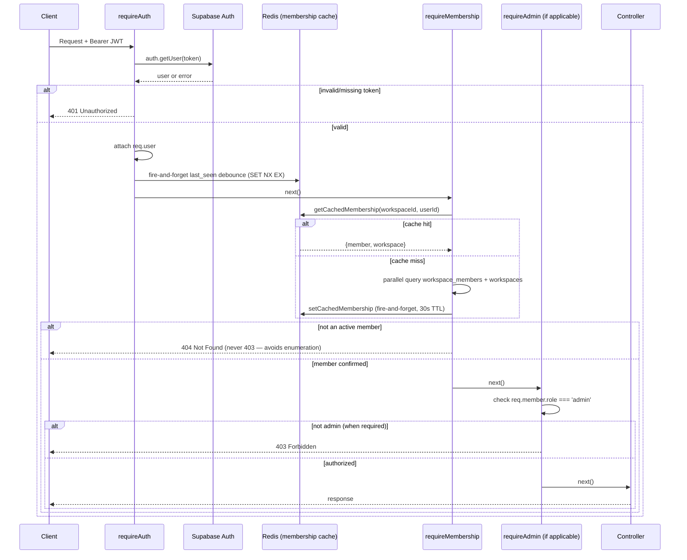

### 8.1 Identity provider
Authentication is fully delegated to **Supabase Auth** (GoTrue). The backend never stores or verifies passwords directly — `supabaseAuth.auth.signInWithPassword` / `.signUp` / `.refreshSession` are used for the anon-key client, and `supabaseAdmin.auth.admin.*` for privileged operations (session revocation, direct password updates). Google OAuth is supported via Supabase's `/authorize` redirect flow, with an explicit allow-list check (`isAllowedGoogleRedirect`) on the `redirect_to` parameter to prevent open-redirect abuse.

### 8.2 Two distinct "change my password" flows, deliberately not merged
- **Recovery-link flow** (`POST /auth/reset-password`) — only usable with a JWT whose `amr` (Authentication Methods Reference) claim contains `recovery`, checked by decoding the JWT payload in `isRecoverySession()`. This is *not* a generic "I have a valid token, let me set any password" endpoint.
- **Logged-in change flow** (`POST /auth/change-password`) — requires the caller to also supply and verify their `current_password` via a real `signInWithPassword` call before the change is permitted, so a stolen (but still valid) access token alone cannot be used to hijack an account by changing its password.

### 8.3 Membership cache — an explicit, bounded staleness trade-off
`requireMembership` runs on **every** route under `/v1/workspaces/:workspaceId`. To avoid two Postgres round-trips (`workspace_members` + `workspaces`) on every single request, the combined result is cached in Redis for `TTL.MEMBERSHIP_CACHE_SECONDS` (30 seconds). Authorization-relevant fields (`role`, `is_active`) are part of the cached payload, so this is a real security-relevant trade-off — documented explicitly in `membership-cache.service.js` as an accepted product decision, bounded by:
- **Active invalidation** on every write path that changes role/active-status/proxy-management (`invalidateMembership` called from `member.service.js#updateMember` and `#deleteMember`).
- A **hard ceiling of 30 seconds** even if an invalidation call is ever missed.
- **Fail-open** on Redis errors — a cache miss or Redis outage just means "query Postgres like before," never a wrongly-granted or wrongly-denied request.

### 8.4 Role model
Two roles exist at the workspace-member level: `admin` and `member`. There is no workspace-level "owner" distinct from admin — the "last admin" invariant is enforced procedurally instead (see §8.5). A member can additionally be a **proxy** (`is_proxy`), representing someone (e.g., a young child, or a relative without their own account) whose contributions/tasks are recorded *by* another member (`proxy_managed_by`, an active admin) on their behalf — every such action is separately logged to a `proxy_actions` table (see `ledger.service.js#createEntry`).

### 8.5 Structural invariants enforced in the service layer, not the database
- **Cannot demote or remove the last active admin** of a workspace — checked in `member.service.js#updateMember` (role change) and `#deleteMember` (removal) by counting active admins before allowing the change.
- **Field-level authorization inside a route-level-authorized endpoint**: `PATCH /members/:memberId` is gated at the route by `requireSelfOrAdmin()` (self or admin may call it at all), but `member.service.js#updateMember` then separately enforces that only an admin may touch `ADMIN_ONLY_FIELDS` (`role`, `is_proxy`, `proxy_managed_by`, `is_active`, `admin_notes`, `relationship_category`) — a member editing their own record cannot smuggle in a role change.

### 8.6 Authorization matrix (representative — not exhaustive)

| Action | Authenticated | Active Member | Admin | Self-or-Admin |
|---|:---:|:---:|:---:|:---:|
| View workspace, containers, tasks (own) | ✓ | ✓ | | |
| Create/delete container, group, invite | ✓ | ✓ | ✓ | |
| Confirm a ledger entry / resolve dispute | ✓ | ✓ | ✓ | |
| Update own member profile fields | ✓ | ✓ | | ✓ |
| Change another member's role | ✓ | ✓ | ✓ | |
| View public container summary | | | | |
| Preview an invite | | | | |
| Accept an invite | ✓ | | | |

---

## 9. Database Design

### 9.1 Access pattern
Kith uses **Supabase's Postgres** exclusively through the `supabase-js` query builder (`supabaseAdmin.from(...)`) — there is no raw SQL query layer, no ORM (Sequelize/Prisma/etc.), and no connection-pool management code, because Supabase's client handles that. `config/database.js` is a **thin shim** retained only for the `/health` endpoint's connectivity probe (`SELECT id FROM users LIMIT 1`) — all real DB operations happen directly in controllers/services via `supabaseAdmin.from()`.

Two Supabase clients exist, with different privilege levels:
- **`supabaseAdmin`** (service-role key) — bypasses Row-Level Security entirely. Used for essentially all application logic, since authorization is already enforced by the middleware chain (§8) before any service function runs.
- **`supabaseAuth`** (anon key) — used only for user-facing Auth SDK calls (`signIn`, `signUp`, `resetPassword`) where Supabase's own Auth service — not RLS — is the security boundary. The app fails loud at startup (`process.exit(1)`) if the service-role key is missing, and only warns (not fails) if the anon key is missing, since auth endpoints degrading gracefully is preferable to the whole app refusing to boot.

### 9.2 Core schema
The following tables are referenced consistently enough across services to document their shape and relationships here.

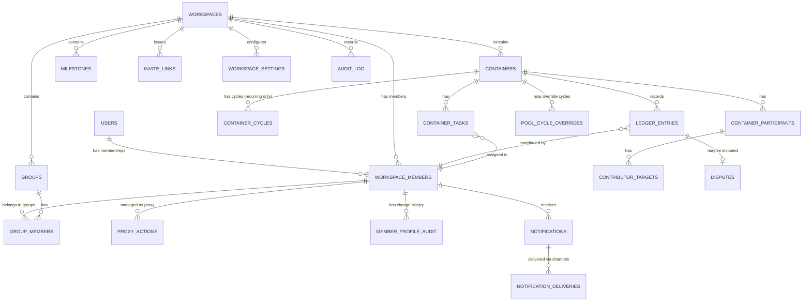

Key observations about the schema design:
- **Soft deletes are the norm**, not the exception: `containers`, `workspaces`, `workspace_members`, `milestones`, `container_tasks`, `groups` (implicitly, via hard delete for groups specifically) all carry a `deleted_at` column, consistently filtered with `.is('deleted_at', null)`. `workspace_members` deletion is additionally conditional — see §9.4.
- **`ledger_entries.status`** is a state machine: `pending → proof_uploaded → confirmed`, with `disputed` and `confirmed`→correction as parallel/branching states. Corrections are modeled as **new, separate `ledger_entries` rows** with `entry_type: 'correction'` and `corrects_entry_id` pointing at the original — the original confirmed entry is never mutated, preserving an immutable financial audit trail.
- **`contributor_targets`** distinguishes a container-level target (`cycle_id: null`) from a per-cycle target (`cycle_id` set) for recurring pools — both `getSummary` and `cycle_generation.service.js` explicitly filter on this distinction.
- **`dedup_key`** on `notifications` with an `onConflict: 'dedup_key', ignoreDuplicates: true` upsert is the mechanism preventing duplicate notifications (e.g., a reminder scan re-running on the same day for the same target).

### 9.3 Atomicity via Postgres RPCs
Rather than emulate transactions with multiple sequential JS calls (which cannot be made atomic through `supabase-js`), the following operations are implemented as **Postgres stored procedures**, invoked via `.rpc(...)`:

| RPC | Called from | Prevents |
|---|---|---|
| `upsert_primary_contact` | `auth.service.js#upsertContact` | Two concurrent "set as primary" calls both succeeding for the same contact type |
| `replace_user_contacts_atomic` | `auth.service.js#updateContacts` | Losing contact methods if a delete succeeds but a subsequent upsert fails, with no rollback |
| `convert_event_to_recurring_atomic` | `container.service.js#convertToRecurring` | An orphaned recurring container with no participants if the insert-then-upsert sequence fails partway |
| `raise_dispute_atomic` | `dispute.service.js#raiseDispute` | Dispute row and ledger-entry status update diverging |
| `resolve_dispute_atomic` | `dispute.service.js#resolveDispute` | Same, for resolution |
| `set_contributor_target_atomic` | `participant.service.js#setTarget` | Three sequential, non-transactional writes leaving target history inconsistent |
| `create_workspace_with_admin` | `workspace.service.js#createWorkspace` | Workspace created without its founding admin membership row |

This is a deliberate, consistent pattern: **application code owns orchestration and business rules; the database owns atomicity guarantees that application code cannot provide over a REST-style client.**

### 9.4 Deletion semantics are context-dependent, not uniform
`member.service.js#deleteMember` implements three distinct outcomes based on state and an explicit `force` flag:
- Member has confirmed ledger entries + `force=true` → **rejected** (`BusinessRuleError`) — financial history cannot be discarded.
- Member has no confirmed entries + `force=true` → **hard delete** (row removed).
- Otherwise (default) → **soft delete** (`deleted_at` set, `is_active: false`) — preserves referential integrity for historical ledger/task records that reference the member.

`container.service.js#deleteContainer` similarly refuses (422) to soft-delete a container that has any **confirmed** ledger entries — the same "financial history is immutable once confirmed" principle applied at a different entity level.

---

## 10. Redis & Caching Strategy

Redis (`ioredis`, one singleton connection via `config/redis.js`) serves **three genuinely different purposes**, each with its own key namespace (`config/redis-keys.js` + per-feature prefixes) so they don't collide operationally:

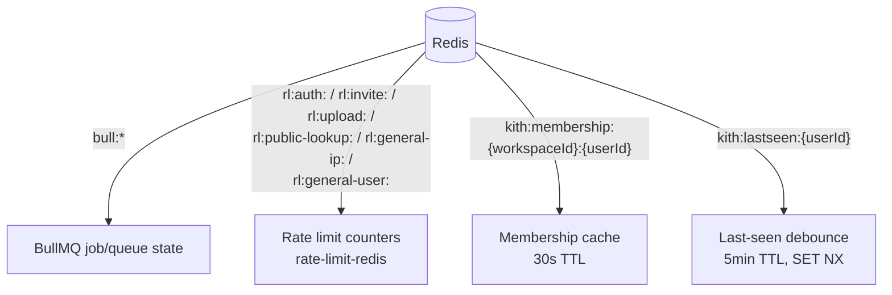

### 10.1 Rate limiting — two limiters, deliberately keyed differently
This is one of the more carefully-designed decisions in the codebase (see ADR-0006 for the full reasoning): a rate limiter is only as correct as its position in the middleware chain relative to auth — a limiter intended to be per-user has to be mounted *after* auth resolves, or `req.user` is never populated at the point its key generator runs. The design here uses two limiters with different, correctly scoped mount points:

| Limiter | Mounted | Key | Purpose |
|---|---|---|---|
| `generalLimiter` | Globally, pre-auth, in `app.js` | IP | Baseline defense-in-depth for every request, authenticated or not |
| `userGeneralLimiter` | Inside `workspace.routes.js`, after `requireAuth` | `req.user.id` | Real per-user throttling for workspace-scoped traffic (protects against one heavy user without penalizing others behind the same NAT) |
| `authLimiter` | Auth endpoints | IP | 5/min — brute-force protection where no identity exists yet |
| `inviteLimiter` | Invite accept | user (post-auth) | 10/hour |
| `uploadLimiter` | Upload-URL generation | user (post-auth) | 20/hour |
| `publicLookupLimiter` | Invite preview, public container view | IP | 30/min — tuned specifically against token-space enumeration, tighter than the 200/min general baseline |

All limiters share one Redis-backed store factory (`buildStore`) so limits are consistent across every instance behind a load balancer — a limiter falls back to an **in-memory** store only if Redis is genuinely unavailable at startup, with an explicit warning logged (rate limits then stop being shared across instances, a known and accepted degradation).

### 10.2 Membership cache
Covered in §8.3. Bounded 30-second staleness in exchange for removing two DB round-trips from the hottest middleware in the system (`requireMembership` runs on essentially every authenticated, tenant-scoped request).

### 10.3 Last-seen debounce
`auth.js#shouldUpdateLastSeen` uses a Redis `SET key value EX 300 NX` claim so that, across an entire fleet of API instances, only the first request from a given user in any 5-minute window triggers a `last_seen_at` write. This gives true single-writer-per-window behavior fleet-wide, rather than one write per instance behind a load balancer. Like the membership cache, it fails open: if Redis is unavailable, the write is simply skipped for that request rather than blocking auth.

### 10.4 BullMQ's use of Redis
BullMQ stores all queue/job state in Redis under its own internal key scheme (`maxRetriesPerRequest: null` and `enableReadyCheck: false` are set specifically because BullMQ requires this connection configuration). This is architecturally a fourth Redis "role" but is fully owned by BullMQ internals rather than application code, so it's called out separately from the three above.

---

## 11. Background Jobs & Scheduling

### 11.1 Queue registry
`queues/index.js` maintains a single source of truth for valid queue names (`QUEUE_NAMES`), with `getQueue(name)` throwing on any name not in that list — this exists specifically to prevent "typo-based queue proliferation" (a queue silently created under a misspelled name that nothing listens to).

| Queue | Job(s) | Worker | Purpose |
|---|---|---|---|
| `notification-queue` | `deliver-push`, `deliver-email` | `notification.worker.js` | Actual push/email delivery (concurrency 10, rate-limited to 50/sec) |
| `reminder-queue` | `reminder-scan` (daily 07:00 UTC) | `background.workers.js` | Upcoming/overdue payment reminders, admin overdue summaries, cycle-closing-soon notices |
| `cycle-generation-queue` | `generate-cycles` | `background.workers.js` | Generates future billing cycles for recurring pools |
| `cycle-lifecycle-queue` | `cycle-lifecycle` (daily 00:01 UTC) | `background.workers.js` | Opens due cycles, closes expired ones, carries forward unpaid balances |
| `task-overdue-queue` | `task-overdue-check` (daily 06:00 UTC) | `background.workers.js` | Marks pending tasks past due date as `overdue`, notifies assignee + admins |
| `invite-cleanup-queue` | `invite-cleanup` (daily 02:00 UTC) | `background.workers.js` | Deletes expired, never-used invite links |
| `engagement-check-queue` | `engagement-check` (weekly, Sun 06:00 UTC) | `background.workers.js` | Recomputes `last_active_at` from ledger/task activity |
| `notification-outbox-queue` | `notification-outbox-scan` (every 5 min) | `background.workers.js` | Re-enqueues stuck notification deliveries (see §14.3) |
| `data-export-queue` | `export-user-data` | `data_export.worker.js` | GDPR data export generation + email delivery |

### 11.2 Scheduler mechanics
`queues/scheduler.js` registers BullMQ **repeatable jobs directly into the queue the corresponding worker actually listens on**, by construction: one `Queue` instance per *target* queue, `jobId: scheduled:${jobName}` as a stable ID so restarts don't accumulate duplicate schedules, and stale repeatable jobs with the same name are actively removed before re-registering. See ADR-0013 for the full rationale behind this design.

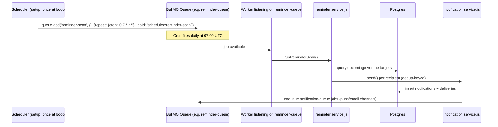

### 11.3 Reliability pattern: outbox / safety-net re-delivery
`notification.service.js#_sendToRecipient` enqueues a delivery job for each external channel (push/email). If `queue.add()` itself throws (Redis blip, etc.), the delivery row is marked `failed` rather than left in an ambiguous state — and separately, `notification_outbox_scan` runs every 5 minutes and re-enqueues **any** delivery stuck in `pending` or `failed` for more than 5 minutes, closing the gap where a transient enqueue failure would otherwise silently drop a notification. This is a textbook **transactional outbox** pattern, adapted for a system without a message broker with native at-least-once delivery guarantees baked into the write path itself.

### 11.4 Worker topology: separate process vs. combined process
- **Production topology** (`server.js` + `workers/index.js` run as separate processes/containers): the API can be scaled horizontally independent of worker throughput, and a worker crash cannot take down request-serving capacity (or vice versa).
- **Dev/small-deployment topology** (`start-all.js`): identical `createXWorker()` factory functions are reused, wired into one process with one shared graceful-shutdown handler. No logic is duplicated between the two entry points — both simply call the same factories from `workers/background.workers.js`, `workers/notification.worker.js`, and `workers/data_export.worker.js`.

---

## 12. Real-Time Communication

**No WebSocket or other real-time push transport exists in this backend.** There is no `socket.io`, `ws`, or Server-Sent Events implementation anywhere in `src/`, and `package.json` lists no such dependency. All "real-time-feeling" behavior visible from the API surface — unread notification counts, in-app notifications — is delivered via:
- **Polling-friendly endpoints**: `GET /v1/notifications/count` is designed as a lightweight badge poll, intended to be called on a regular interval by the client rather than pushed to.
- **Native push notifications** via Firebase Cloud Messaging for mobile/web push (not an in-app WebSocket channel).

This is mirrored on the frontend side (§24): `useNotificationCount` polls `GET /v1/notifications/count` on a 30-second `refetchInterval` via React Query, with no WebSocket or Supabase Realtime subscription in the frontend. A supplementary realtime channel, if one is added in the future, would be a natural extension point — see §24.7.

---

## 13. File Storage

All binary content (ledger proofs, task proofs, milestone/cover photos, avatars, GDPR export CSVs) is stored in **Supabase Storage**, accessed through `services/storage.service.js`.

### 13.1 Upload flow — signed URL, not direct-through-API upload
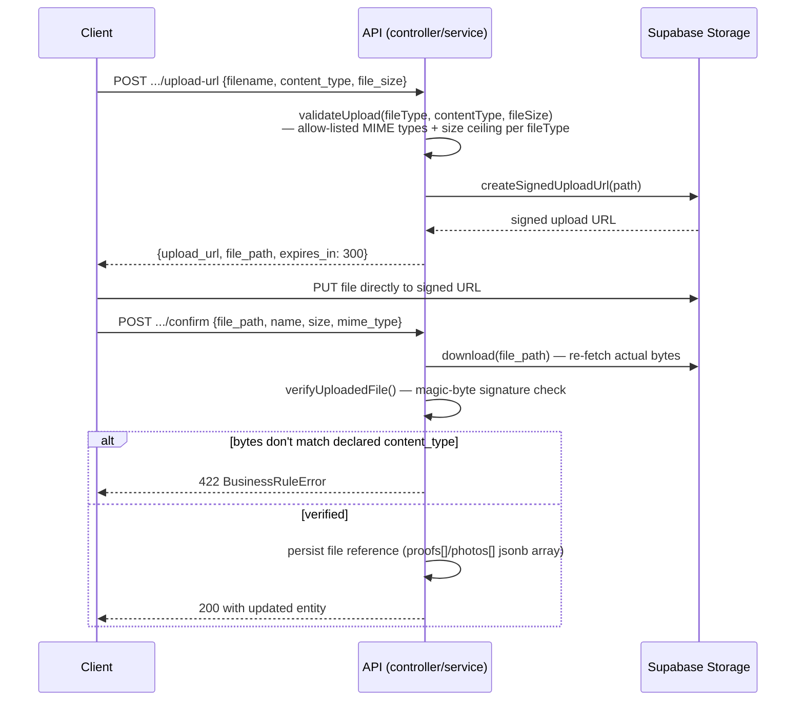

This two-step (signed URL → client uploads directly → confirm) pattern keeps large file bodies off the API process entirely — the Express server never buffers file bytes (its JSON body limit is 1MB, per `app.js`), and upload bandwidth doesn't compete with API request-handling capacity.

### 13.2 Defense against declared-type spoofing
The client-declared `content_type`/`file_size` are validated at upload-URL generation time, but the actual uploaded bytes are independently verified too. `verifyUploadedFile()` re-downloads the file at confirm-time and checks its first bytes against a known magic-byte signature table (JPEG `FF D8 FF`, PNG's 8-byte signature, GIF, PDF `%PDF`, and a dedicated WEBP check since its `WEBP` marker sits at byte offset 8, not 0). This hooks into a "confirm" step that **every** upload flow in the app already has (ledger proofs, task proofs, milestone photos) — no storage-provider webhook or extra infrastructure is needed. It's gated by `FILE_VERIFICATION_ENABLED` (default: on) since it downloads the full file to check signature bytes, a real cost at scale worth tuning under load. See ADR-0015 for the full design rationale.

### 13.3 Path structure & size/type limits
Paths are namespaced `workspaces/{workspaceId}/{folder}/{timestamp}-{random}.{ext}` or `users/{userId}/{folder}/{...}`, with `folder` scoped per-use (`proofs/{entryId}`, `task-proofs/{taskId}`, `covers/{containerId}`, `milestones/{milestoneId}`, `avatars`, `workspace-avatars`, `outcome/{containerId}`). Per-`fileType` MIME allow-lists and size ceilings (5MB avatars, 10MB proofs/photos, 50MB outcome files) are centralized in `MAX_SIZES`/`ALLOWED_TYPES` in `storage.service.js` rather than duplicated per call site.

---

## 14. Notification Architecture

This is one of the more elaborate subsystems in the codebase, deliberately built around a **template registry + multi-channel fan-out + outbox reliability** pattern.

### 14.1 Template registry
`notification.service.js#TEMPLATES` is a single object mapping notification `type` → `{ title, body, channels[], urgent? }`, with `{placeholder}` interpolation via `renderTemplate()`. Every notification in the system — contribution submitted/confirmed/disputed, task assigned/completed/overdue, invite accepted, payment/overdue reminders, cycle lifecycle events, admin announcements, member removal — is defined once here. Two templates (`overdue_summary_admin`, `cycle_closing_soon`) were added to the registry ahead of their sending logic; `reminder.service.js` sends both today, reusing data already fetched for the overdue-reminder scan rather than issuing extra queries.

### 14.2 Fan-out and channel resolution
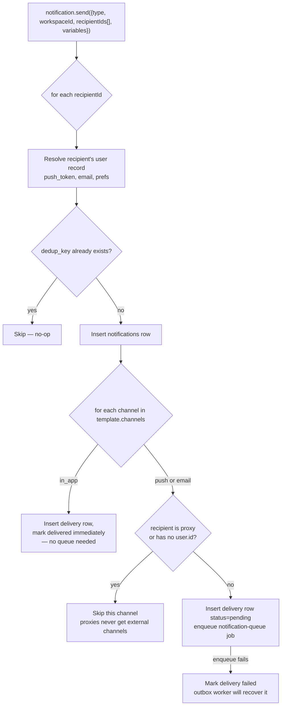

Deduplication (`dedup_key`, built from type + participant/container/due-date/cycle-id) prevents, e.g., a reminder scan that re-runs or overlaps from creating duplicate reminders for the same target on the same day — enforced at the database level via `upsert(..., { onConflict: 'dedup_key', ignoreDuplicates: true })`, not just in application logic, so it holds even under concurrent job execution.

### 14.3 Delivery worker and the outbox safety net
`notification_delivery.service.js#deliverNotification` (run by `notification.worker.js`, concurrency 10, rate-limited to 50/sec) handles the actual FCM/Resend call, with:
- **Idempotency check** — skips if the delivery row is already `delivered` (defends against BullMQ redelivering a job after a crash mid-processing).
- **Push-token rotation check** — re-verifies the recipient's current `push_token` still matches the one captured when the job was enqueued, skipping (not failing) if it's rotated, since sending to a stale token is pointless, not an error.
- **HTML escaping** on all user-controlled interpolated strings (container names, task titles, admin announcement text) before building email bodies — since these ultimately originate from user input, unescaped interpolation would be a stored-XSS-via-email vector.
- **Re-throw on failure** so BullMQ's own retry/backoff (3 attempts, exponential, from `notification.service.js`'s enqueue call) applies.

The `notification-outbox-queue` (§11.3) is the final backstop: anything stuck `pending`/`failed` for 5+ minutes gets re-enqueued, independent of whether the original failure was a queue-enqueue failure or a delivery failure.

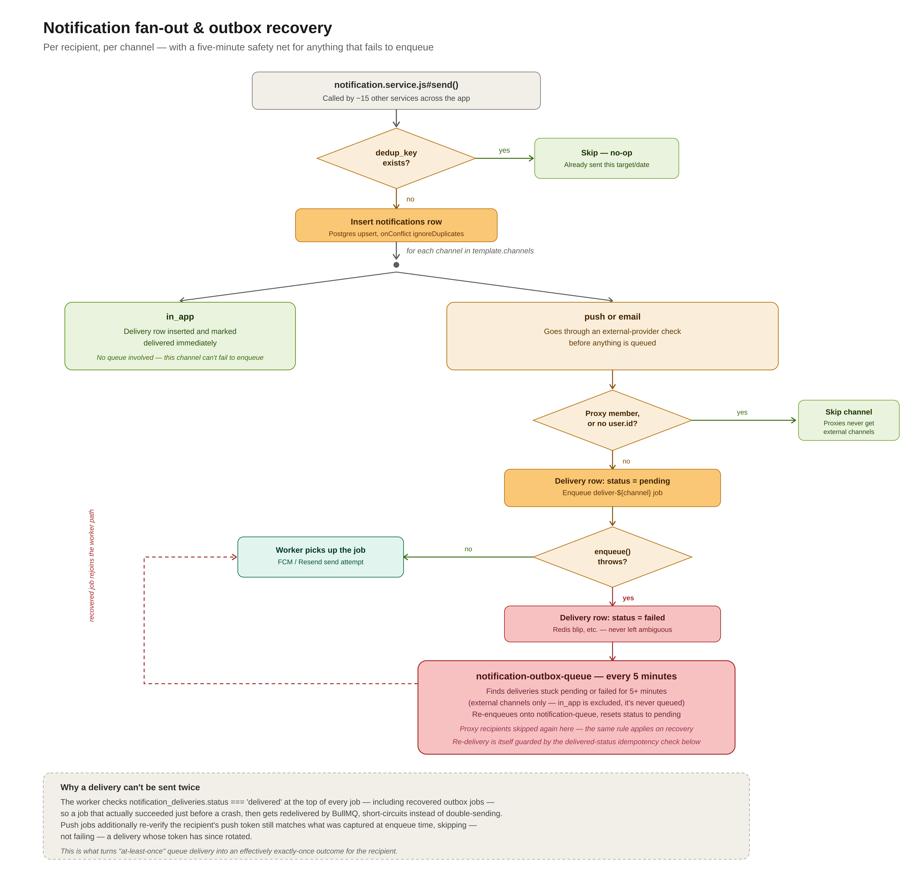
*The same fan-out as the flowchart above, annotated with the specific failure mode the outbox queue exists to close: a `queue.add()` call that throws before a job is ever created. The dashed line shows a recovered delivery rejoining the normal worker path, still protected by the same delivered-status idempotency check.*

### 14.4 Recipient inbox vs. sender — a deliberate file split
`notification_inbox.service.js` (list, unread count, mark-read, mark-all-read — a recipient managing their *own* notifications) is intentionally a separate file from `notification.service.js` (the system-wide sender used by ~15 other services). They share a table but not a concern, and merging them would make `notification.service.js` — already imported by nearly every other service in the codebase — carry inbox-management code that has nothing to do with sending. See ADR-0014 for the full reasoning.

---

## 15. AI / External Service Integrations

**No AI or LLM integration exists in this backend.** The external services actually integrated are:

| Service | Client | Used for |
|---|---|---|
| Supabase (Postgres + Auth + Storage) | `@supabase/supabase-js` | System of record, identity, object storage |
| Redis | `ioredis` | Caching, rate limiting, BullMQ backing store |
| Resend | `resend` | Transactional email (notifications, GDPR export delivery) |
| Firebase Admin (Cloud Messaging) | `firebase-admin` | Push notifications |
| Sentry | `@sentry/node` | Error tracking (initialized conditionally on `SENTRY_DSN`, before any other module, in both `server.js` and `start-all.js`) |

If the product roadmap calls for AI features (e.g., smart reminders, natural-language task creation), none of the current scaffolding assumes or precludes this — it would be a new service module following the same pattern as `resend.js`/`firebase.js` (lazy-initialized client singleton, `null`-safe if unconfigured).

---

## 16. Error Handling Strategy

### 16.1 Typed error hierarchy
`utils/errors.js` defines an `AppError` base class and semantic subclasses — `ValidationError` (400), `UnauthorizedError` (401), `ForbiddenError` (403), `NotFoundError` (404), `ConflictError` (409), `BusinessRuleError` (422), `RateLimitError` (429) — each with a fixed `statusCode` and machine-readable `code`. Services throw these directly (`throw new NotFoundError('Container not found')`); controllers never construct HTTP status codes themselves.

### 16.2 Centralized handling
Every controller wraps its logic in `try { ... } catch (err) { next(err); }` and does nothing else — all translation to an HTTP response happens in one place, `middleware/errorHandler.js`, mounted last in `app.js`:

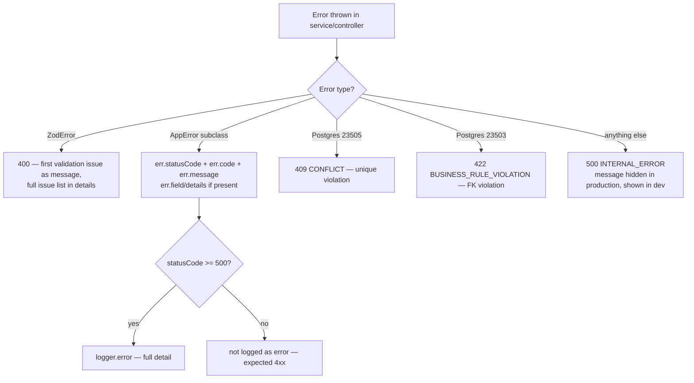

This means a raw Postgres constraint violation that leaks past a service's own guards still produces a sensible, uniform API error rather than a raw driver error reaching the client — a genuine defense-in-depth layer beneath the explicit `BusinessRuleError` checks in each service.

### 16.3 Environment-aware message exposure
Unhandled (truly unexpected) errors return a generic `"An internal error occurred"` message in production but the real `err.message` in development — the stack trace is always logged server-side regardless of environment, only the *client-facing* message is redacted in production.

---

## 17. Logging & Observability

### 17.1 Structured logging
`utils/logger.js` (Winston) uses two distinct formats: colorized, human-readable single-line output in development; structured JSON in production (`combine(timestamp(), errors({stack:true}), json())`) — the production format is what a log aggregator (CloudWatch, Datadog, etc.) would ingest.

### 17.2 Request correlation
`middleware/requestLogger.js` generates a `req.requestId` (via `crypto.randomBytes`) on every request, echoes it back as an `X-Request-Id` response header, and includes it in every subsequent log line for that request — including the error handler's 5xx logs. This is the mechanism that lets an engineer correlate a client-reported error with the exact server-side log lines for that request.

### 17.3 What gets logged on every request
`requestLogger` logs method, path, status, duration, `user_id`, `workspace_id`, and `workspace_member_id` on the response `finish` event, at a level derived from status code (`error` for 5xx, `warn` for 4xx, `info` otherwise) — giving basic per-request observability without a dedicated APM tool.

### 17.4 Error tracking
Sentry (`@sentry/node`) is initialized conditionally (only if `SENTRY_DSN` is set) at the very top of both process entry points, before any other module is required — deliberately, since later modules (including the logger itself) might otherwise error before Sentry is capturing.

### 17.5 Health check
`GET /health` runs `checkDb()` and `checkRedis()` in parallel and reports `ok` (200) only if both succeed, `degraded` (503) otherwise — suitable for a load balancer or orchestrator liveness/readiness probe.

---

## 18. Security Architecture

This section consolidates security-relevant decisions referenced individually elsewhere in this document. The full security policy, including vulnerability reporting and versioning, is in [SECURITY.md](SECURITY.md).

| Concern | Mechanism | Location |
|---|---|---|
| Transport security headers | `helmet()` with explicit HSTS, frameguard (`deny`), `referrerPolicy: no-referrer` | `app.js` |
| CORS | Locked to `FRONTEND_URL` origin only, `credentials: true`; app refuses to boot without `FRONTEND_URL` set (no wildcard fallback) | `app.js`, `server.js` |
| SQL/ILIKE injection | `%`/`_`/`\` escaped before building ILIKE patterns, shared via one `utils/ilike.js` helper across every search call site | `utils/ilike.js` |
| Mass assignment | Explicit field allow-lists on every update path — never `{...req.body}` into a DB update | `*.service.js` update functions |
| Workspace enumeration | `requireMembership` returns 404, not 403, for non-members; invite preview returns a uniform `is_valid: false` shape regardless of *why* it's invalid | `middleware/workspace.js`, `invite.service.js` |
| Token-space enumeration | `publicLookupLimiter` (30/min/IP) specifically tuned tighter than the general baseline for unauthenticated lookup endpoints (invite preview, public container view) | `middleware/rateLimiter.js` |
| Open redirect (OAuth) | `redirect_to` only honored if it matches `FRONTEND_URL` origin or an explicit allow-listed deep-link scheme | `auth.service.js#isAllowedGoogleRedirect` |
| Password-change hijack via stolen token | `change-password` requires re-verifying `current_password`; `reset-password` requires a JWT with `amr: recovery` specifically, not just any valid session | `auth.service.js` |
| File-type spoofing | Magic-byte verification of uploaded file contents against declared MIME type | `storage.service.js#verifyUploadedFile` |
| Stored-content XSS (email) | HTML-escaping of all interpolated user-controlled strings before building email bodies | `notification_delivery.service.js`, `data_export.service.js` |
| Admin dashboard access | IP allow-list (exact match or real IPv4 CIDR match, not substring match) + HTTP Basic Auth compared with `crypto.timingSafeEqual` (not `!==`, closing a timing side-channel) | `app.js` (Bull Board mounting) |
| Rate limiting correctness | Split pre-auth (IP-keyed) vs. post-auth (user-keyed) limiters, since a limiter mounted before `requireAuth` can never actually key by user (see §10.1) | `middleware/rateLimiter.js` |
| Sensitive column exposure | `bank_details` deliberately **not** selected in `requireMembership`'s workspace query, since nothing in the app reads it — avoiding fetching a sensitive JSONB column into every single workspace-scoped request for zero consumers | `middleware/workspace.js` |
| Secrets in code | All external credentials (`SUPABASE_SERVICE_ROLE_KEY`, `RESEND_API_KEY`, `FIREBASE_SERVICE_ACCOUNT`, etc.) sourced from environment variables only; service-role key errors are fatal at boot | `config/*.js`, `server.js` |

**Row-Level Security (RLS) note:** because the backend exclusively uses the Supabase **service-role** client (which bypasses RLS) for nearly all operations, RLS policies (if configured in the Supabase project) are not the primary authorization boundary for this application — the middleware chain (§8) is. This is architecturally sound *as long as* the service-role key never reaches a client directly, which the code respects (the anon-key client is used only for the narrow set of user-facing Auth SDK calls).

---

## 19. Scalability Strategy

### 19.1 Horizontal scaling of the API tier
The API process is stateless (no in-memory session or cache that isn't also in Redis) and can be scaled horizontally behind a load balancer without any code changes — this is precisely what motivated moving rate limiting (§10.1) and the last-seen debounce (§10.3) off in-memory storage and onto Redis: an in-memory implementation of either would silently break (multiply its effective limit, or multiply its write volume) the moment a second instance is added.

### 19.2 Decoupling synchronous and asynchronous work
Anything that doesn't need to complete before the HTTP response is sent — notification delivery, cycle generation, CSV-heavy data exports, cleanup scans — is pushed to BullMQ rather than executed inline in the request handler. This keeps request latency bounded by database/API-only work, and lets worker throughput scale independently (more worker replicas, or higher `concurrency` per worker) without touching the API tier.

### 19.3 Read-side query shaping
Every list endpoint uses `.range(offset, offset + perPage - 1)` with `perPage` hard-capped at 100 (`utils/pagination.js`) — an unbounded `?per_page=999999` cannot be used to force an expensive full-table fetch. Sort fields are similarly allow-listed per endpoint (`utils/sorting.js`) rather than accepting an arbitrary client-supplied column name, which would otherwise both be an injection surface and an unindexed-sort performance risk.

### 19.4 Batch-fetch over N+1
Several services explicitly replace an N+1 query pattern with a batched fetch:
- `engagement.service.js#fetchEngagementData` — one query for ledger entries and one for tasks **across all requested member IDs**, building in-memory `Map`s, instead of 2 queries *per member*. This single implementation is shared by both `member.service.js#getMemberEngagement` (API) and `engagement_check.service.js` (background worker).
- `cycle_generation.service.js#generateCycles` — fetches *all* `pool_cycle_overrides` and participants for a container once upfront into lookup `Map`s/`Set`s before the cycle-generation loop, instead of querying per-participant-per-cycle.
- `container.service.js#listContainers` / `dashboard.service.js` — participant counts and confirmed-ledger totals are computed from a single query with nested `select()` relations (`container_participants(id), ledger_entries(base_amount, status)`), aggregated in application code, rather than N follow-up queries per container.

### 19.5 Queue-level scaling knobs
Per-worker `concurrency` is tuned per job's I/O profile — `notification-queue` at 10 (many small, fast deliveries, additionally capped at 50/sec via BullMQ's `limiter` to respect FCM/Resend rate limits), `data-export-queue` at 2 (I/O heavy, deliberately conservative), `cycle-generation-queue` at 5. These are the first values an operator would tune under load, without any code change.


---

## 20. Performance Optimizations

Beyond the scalability mechanisms in §19 (which are about *not making things worse* as load grows), several concrete optimizations exist:

1. **Membership cache** (§8.3, §10.2) — removes 2 DB round-trips from the single most frequently executed middleware in the system.
2. **Explicit column selection** — `loadDbUser` selects a fixed, hot-path-appropriate column list rather than `select('*')`, with an explicit comment instructing future engineers to *add* a column here rather than issue a separate per-controller query.
3. **Parallel independent queries** — `dashboard.service.js#getDashboardData` issues 6 independent Supabase queries (members, containers, pools, targets, activity, unread count) plus a conditional 7th (pending confirmations, admin-only) via a single `Promise.all`, rather than sequentially.
4. **Debounced non-critical writes** — `last_seen_at` (§10.3) trades minute-level precision for eliminating write amplification under bursty request patterns.
5. **Compression** — `compression()` middleware applied globally in `app.js` for all JSON responses.
6. **Explicit server timeouts tuned for the deployment topology** — `keepAliveTimeout` (65s) is deliberately set relative to a typical load balancer's idle timeout, with `headersTimeout` (66s) kept above it per Node's own requirement, avoiding a race where a load balancer reuses a connection Node has already begun closing.

---

## 21. Data Flow for Key Features

### 21.1 Recording and confirming a contribution (ledger entry)

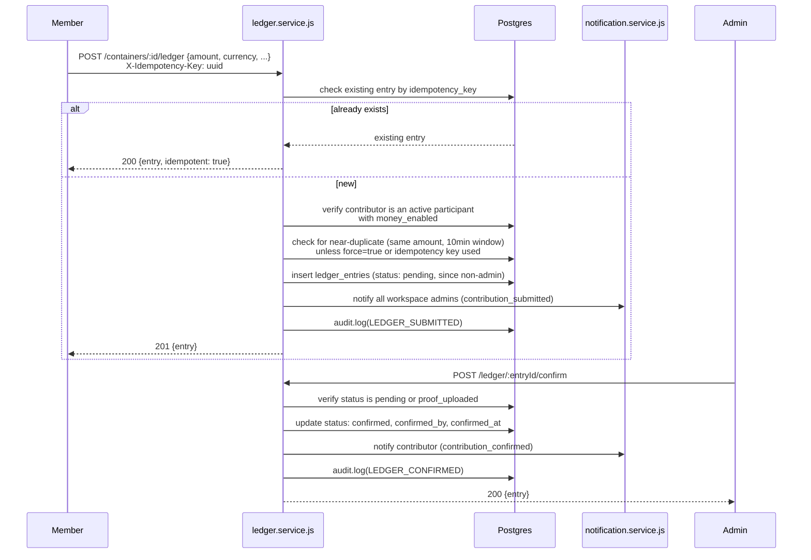

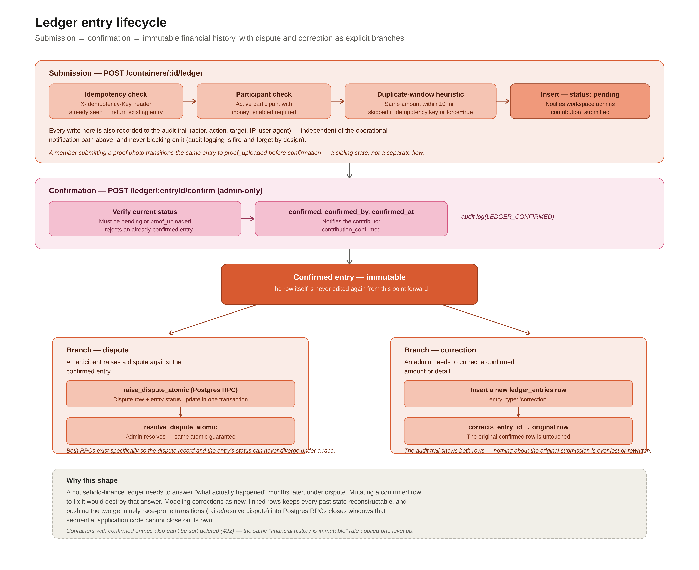
*The same submission→confirmation flow as the sequence diagram above, redrawn to emphasize what happens *after* confirmation — the entry becomes immutable, and a dispute or a correction are the only two ways its effective state can subsequently change, each going through its own atomic Postgres RPC (§9.3).*

### 21.2 Recurring pool cycle lifecycle
1. **Generation** (`cycle_generation.service.js`, triggered on container creation and daily maintenance): computes future cycle date ranges from `recurrence_cadence`, applies any `pool_cycle_overrides` (pause/skip/adjust), and upserts per-participant `contributor_targets` scoped to each cycle.
2. **Opening** (`cycle_lifecycle.service.js#openDueCycles`, daily): cycles whose `cycle_start` has arrived move `upcoming → open`; each participant is notified with **their own** target amount.
3. **Closing** (`cycle_lifecycle.service.js#closeDueCycles`, daily): cycles past `cycle_end` move `open → closed`; if the container has `carry_forward_unpaid` enabled, any participant's shortfall (target − confirmed) is inserted as a new `entry_type: 'carry_forward'` ledger entry pre-attributed to the *next* open/upcoming cycle, itself pre-confirmed since it represents a system-computed balance rather than a new member action.
4. Closing a cycle re-triggers cycle generation (extends the generation horizon), keeping the "always ~3 months of future cycles exist" invariant maintained without a separate long-running scan.

A diagram of this full lifecycle, plus the three admin override types layered on top of it, is in [BACKGROUND_JOBS.md §5.3–5.4](BACKGROUND_JOBS.md#53-cycle-generation-queue).

### 21.3 GDPR data export
`POST /auth/data-export` (rate-unlimited beyond the general per-user limiter) enqueues a `data-export-queue` job with the user's ID and their currently-active workspace IDs, then returns immediately ("queued... emailed within 24 hours"). The worker (`data_export.service.js#processDataExport`) resolves the user's `workspace_members` rows **once** and reuses that ID list for both the ledger-entry and task queries. Two CSVs (contributions, tasks) are generated and emailed as attachments via Resend; nothing is written to Storage or left downloadable via a link, minimizing the export's own data-retention footprint.

---

## 22. Request Lifecycle

A single authenticated, tenant-scoped, admin-only request (e.g., `PATCH /v1/workspaces/:workspaceId/settings`) traverses:

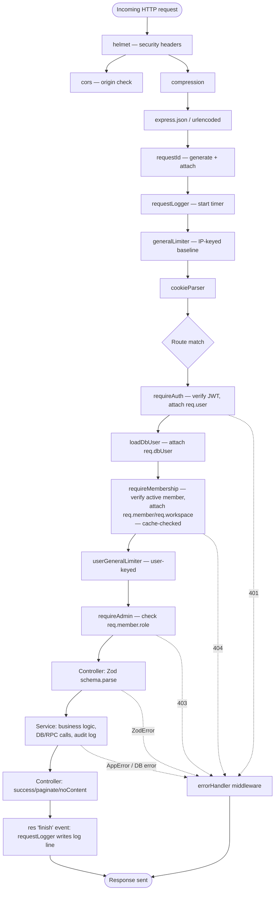

Every arrow after `ROUTE` can short-circuit straight to `errorHandler` via `next(err)` — the chain is a strict pipeline, not a fan-out, so a failure at any stage stops all subsequent stages from running (no partial side effects from, e.g., a controller executing after a failed auth check).

---

## 23. Deployment Architecture

Two supported topologies, directly evidenced by the codebase's two entry points:

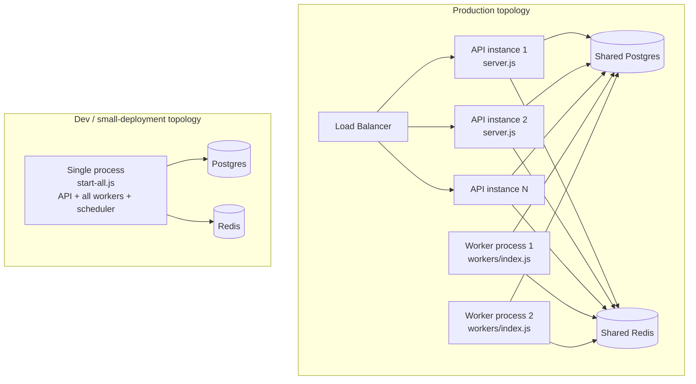

- **`server.js`** — API only. Runs pre-flight DB/Redis connectivity checks, fails fast if the DB check fails (Redis failure only warns — the API can serve some traffic degraded, per §10's fail-open design), then binds to `PORT`.
- **`workers/index.js`** — worker fleet only. Validates required env vars with raw `console.error` (deliberately *not* the Winston logger, since the logger itself might depend on unvalidated env vars), instantiates all 9 workers, registers lifecycle listeners (`completed`/`failed`/`error`/`stalled`) per worker, runs the scheduler, and implements graceful shutdown with a 10-second force-exit timeout on `SIGTERM`/`SIGINT`/`uncaughtException`.
- **`start-all.js`** — combines both for environments where running two separate processes isn't worth the operational overhead (e.g., early-stage deployment on a single small instance). Reuses the exact same worker-factory functions as `workers/index.js`.

Both `server.js` and `start-all.js` validate a required-env-var list and `process.exit(1)` immediately if anything is missing, writing directly to `process.stderr` rather than through the logger (same reasoning — the logger shouldn't be assumed safe to use before env validation completes).

**Bull Board** (`/admin/queues`), an optional queue-monitoring dashboard, mounts only if `BULL_BOARD_USERNAME`/`BULL_BOARD_PASSWORD` are set, gated by IP allow-list + Basic Auth (§18).


---

## 24. Frontend Architecture

This section covers the frontend at the stack/architecture level rather than documenting every page-level component and all of `components/ui/*`.

### 24.1 Stack

A **React 18 + TypeScript** single-page app built with **Vite 5**, using **React Router v6** (`createBrowserRouter`, nested routes, lazy-loaded pages via `React.lazy`/`Suspense`). Styling is **Tailwind CSS 3** on a custom design-token theme (brand `primary` color, semantic `text`/`border`/`surface` tokens, status colors, custom shadows, `Plus Jakarta Sans` typeface) plus **Radix UI** primitives (dialog, dropdown-menu, select, tabs, tooltip) for accessible headless components, `lucide-react` for icons, and `react-hot-toast` for toasts.

### 24.2 State

Two categories of state are kept deliberately separate:

- **Client state — Zustand**, in three stores: `authStore` (session/user/memberships, persisted), `workspaceStore` (active workspace + membership, persisted), `uiStore` (transient UI flags, not persisted).
- **Server state — TanStack React Query v5** for all data fetched from the API (queries, mutations, infinite queries), with a shared `queryClient` (60s stale time, no retry on 401/403/404) and Devtools enabled in development.

Forms use **React Hook Form** + **Zod**, with schemas written to mirror the backend's own Zod validation — kept in sync by convention and code review rather than a shared generated source, the same discipline applied to the backend's own shared-enum approach (see ADR-0016).

### 24.3 API integration

A single **Axios** instance (`lib/axios.js`) centralizes all backend calls:

- Attaches the bearer token from `authStore` to every outgoing request.
- Unwraps the backend's `{ data, meta }` response envelope into a flat shape.
- On a `401`, attempts one token refresh (using the stored refresh token) and replays the original request; if that also fails, clears the auth store and hard-redirects to `/login?reason=session_expired`.

Domain-specific API calls are grouped into service modules (`services/auth.service.js` and siblings for workspace/notification/etc.), each a thin wrapper returning `.then(r => r.data)`.

**`@supabase/supabase-js`** is used narrowly — only to retrieve the OAuth session (`supabase.auth.getSession()`) in the `/auth/callback` handler — with `persistSession: false`, since session persistence is handled by `authStore` instead.

### 24.4 Route protection

Guards compose as nested layout routes rather than per-page checks:

`ProtectedRoute` (session exists) → `ProfileGuard` (backend user profile loaded, fetching it via `getMe()` if missing) → `WorkspaceGuard` (an active workspace is resolved, fetching it if only an ID is cached) → `AdminRoute` (role check via `useIsAdmin`, reading `workspaceStore.member.role`).

This mirrors the backend's own layered `requireAuth` → `requireMembership` → `requireAdmin` middleware chain (§3, point 5) conceptually, but is enforced only client-side — the frontend guard chain is a UX convenience, not a security boundary; the backend middleware remains the actual enforcement point if a route were reached directly.

### 24.5 Boot sequence and auth flows

`App.tsx` runs an async bootstrap before rendering the router: if a persisted session exists, it calls `getMe()`, hydrates `authStore`, and auto-selects the workspace if the user has exactly one membership. A hard 3-second timeout force-removes the splash screen regardless of outcome, so a slow or hanging `getMe()` call degrades to an unauthenticated-looking boot rather than an indefinite splash.

Post-authentication redirect logic (0 memberships → create workspace; 1 → auto-select and go to dashboard; 2+ → workspace picker) is implemented independently in `LoginPage`, `SignupPage`, and `CallbackPage` (the OAuth callback) rather than shared in one place — `SignupPage` additionally layers in invite-token handling from either `localStorage` (a pending invite saved before signup) or a `?invite=` query param.

### 24.6 Project structure

```
src/
├── components/   # UI primitives + layout components (AppLayout, AuthLayout, PublicLayout)
├── constants/    # e.g. queryKeys
├── hooks/        # useAuth, useDebounce, useIsAdmin, useMember, useNotifications, useWorkspace, ...
├── lib/          # axios, supabase, toast, queryClient, cn
├── pages/        # route-level components, grouped by domain (auth, workspace, containers, members, ...)
├── router/       # route table + guards + path constants
├── services/     # API service modules, one per backend resource
├── store/        # Zustand stores (authStore, workspaceStore, uiStore)
├── types/        # shared TS types (models, api)
├── utils/        # helpers (errors, ...)
├── App.tsx       # QueryClientProvider + boot/session-restore + RouterProvider
├── main.tsx      # ReactDOM entry point
└── index.css     # Tailwind directives + global base styles
```

### 24.7 Natural extension points

- A realtime channel (e.g., a direct Supabase Realtime subscription) could supplement the notification-count polling noted in §12, for lower-latency unread-count updates.
- Consolidating the duplicated post-auth redirect logic (§24.5) into one shared location would remove the current three-call-site duplication.
- Formal frontend test coverage is a natural next investment, paired with the backend's own `jest` configuration.

---

## 25. Configuration & Environment Variables

Environment variables read via `process.env.*` across the codebase:

| Variable | Required | Used by | Purpose |
|---|:---:|---|---|
| `SUPABASE_URL` | ✓ | `config/supabase.js`, `server.js`, `start-all.js`, `workers/index.js` | Supabase project URL |
| `SUPABASE_SERVICE_ROLE_KEY` | ✓ | `config/supabase.js` | Admin client — bypasses RLS |
| `SUPABASE_ANON_KEY` | | `config/supabase.js` | Auth-only client; app boots without it but auth endpoints are disabled |
| `REDIS_URL` | ✓ | `config/redis.js` | BullMQ + rate limiting + caches |
| `FRONTEND_URL` | ✓ | `app.js` (CORS), `auth.service.js` (redirect URLs, email links) | CORS origin allow-list, OAuth/reset-link redirect target |
| `ALLOWED_DEEPLINK_SCHEMES` | | `auth.service.js` | Comma-separated mobile deep-link schemes allowed as OAuth redirect targets |
| `PORT` | | `server.js`, `start-all.js` | HTTP listen port (default 3000) |
| `NODE_ENV` | | `errorHandler.js`, cookie config, logger | Production-vs-dev branching (cookie `secure` flag, error message exposure, log format) |
| `LOG_LEVEL` | | `utils/logger.js` | Winston log level (default `info`) |
| `SENTRY_DSN` | | `server.js`, `start-all.js` | Error tracking; Sentry disabled entirely if unset |
| `FIREBASE_SERVICE_ACCOUNT` | | `config/firebase.js` | JSON service-account credentials; push disabled if unset |
| `RESEND_API_KEY` | | `config/resend.js` | Email disabled if unset |
| `EMAIL_FROM` | | `notification_delivery.service.js`, `data_export.service.js` | From-address for outbound email (defaults to `Kith <noreply@kith.app>`) |
| `STORAGE_BUCKET_NAME` | | `storage.service.js` | Supabase Storage bucket (default `kith-files`) |
| `FILE_VERIFICATION_ENABLED` | | `storage.service.js` | Toggle for magic-byte upload verification (default: on) |
| `IDEMPOTENCY_ENABLED` | | `ledger.service.js` | Toggle for the idempotency-key check on ledger entry creation (default: on) |
| `ADMIN_IP_WHITELIST` | | `app.js` | CIDR/IP allow-list for Bull Board (default `127.0.0.1,::1`) |
| `BULL_BOARD_USERNAME` / `BULL_BOARD_PASSWORD` | | `app.js` | Bull Board Basic Auth; dashboard not mounted at all if either is unset |
| `API_BASE_URL` | | `server.js`, `start-all.js` | Logged at boot only (cosmetic) |

Every required variable is validated **before** the app is constructed (`validateEnvironment()` runs before `require('./app')`), so a misconfiguration fails at process boot with a clear message rather than surfacing as a mysterious runtime error on the first request that touches the missing config.

---

## 26. Engineering Trade-offs

Explicit trade-offs made in this codebase, worth a reviewer's attention:

1. **Service-role Postgres access everywhere, RLS not the enforcement boundary.** Fast to develop against, and correct *as long as* the service-role key stays server-side (it does) and the middleware chain is never bypassed (route registration order + consistent middleware application is what guarantees this — there's no independent, defense-in-depth authorization check at the database layer). A determined attacker who found a route missing its `requireMembership`/`requireAdmin` call would have no RLS backstop. The mitigation is architectural discipline (§3, point 5) rather than a second enforcement layer.
2. **30-second membership cache staleness, accepted by design.** A role change or removal takes up to 30 seconds to propagate to a *different* device/session than the one that made the change (the device making the change gets it invalidated immediately). Explicitly documented as acceptable given the alternative cost (2 DB queries on every tenant-scoped request).
3. **Idempotency-key uniqueness is workspace-scoped, not global**, and duplicate-window detection (10 minutes) is a heuristic, not a guarantee — a legitimate contribution submitted twice, 11 minutes apart, with no idempotency key, will create two entries. This is a reasonable default for a household-finance app (false positives on a *real* second contribution would be more harmful than an occasional true duplicate needing manual correction) but is worth flagging as a conscious choice, not an oversight.
4. **File verification cost vs. security.** Re-downloading every uploaded file to check its magic bytes is a real bandwidth/latency cost at scale, explicitly made toggleable (`FILE_VERIFICATION_ENABLED`) rather than removed, trusting a future operator to make an informed call under real load rather than the codebase pre-deciding it away.
5. **No distributed transaction layer; atomicity is either "one Postgres RPC" or "best-effort sequential with logged failure."** Every place where true multi-step atomicity matters uses an RPC (§9.3). Everywhere else (e.g., inserting a milestone as a side effect of completing a container) failures are logged but don't roll back the primary operation — a deliberate choice that a container completing successfully matters more than its celebratory milestone side-effect always succeeding, but it does mean these secondary effects can occasionally be silently missing without an alert firing.
6. **Single shared Redis instance for three different workloads** (BullMQ, rate limiting, application cache). Simpler operationally than three separate Redis deployments, but means a Redis capacity/latency problem affects job processing, rate limiting, and caching simultaneously — there's no isolation between them. Given all three are designed to fail open or degrade gracefully (§3, point 3), this is a reasonable simplification, but a future high-scale deployment might want to split BullMQ onto a dedicated Redis instance since job-queue Redis usage patterns (long-lived sorted sets, blocking ops) differ meaningfully from cache/rate-limit usage patterns (short TTL key-value).

---

## 27. Future Evolution Points

Natural extension points the current architecture already anticipates or makes easy:

- **New notification types** — add one entry to `TEMPLATES` in `notification.service.js`; the fan-out, dedup, delivery, and outbox-retry machinery all apply automatically.
- **New background job** — add the queue name to `QUEUE_NAMES` (`queues/index.js`), add a schedule entry to `SCHEDULED_JOBS` (`queues/scheduler.js`) if it's recurring, write one service function, wire one `Worker` in `workers/`. No other file needs to change.
- **New file-upload type** — add one entry each to `MAX_SIZES`/`ALLOWED_TYPES` in `storage.service.js`; the signed-URL generation, size/type validation, and (if desired) magic-byte verification all apply without new code.
- **Splitting BullMQ onto its own Redis instance** — `config/redis.js` already centralizes the connection; this would mean introducing a second `getRedis()`-equivalent scoped to BullMQ specifically and updating `queues/index.js`/worker construction to use it, without touching rate-limiter or cache code.
- **Layering in RLS as a defense-in-depth database-layer check (§26, point 1)** — could be added as a redundant check without changing application code, since the service-role client would need to be swapped for a per-request-scoped client carrying the user's JWT — a larger change, but one the current schema (which already has consistent `workspace_id`/`deleted_at` columns) is well-shaped for.
- **Horizontal scheduler partitioning** — not needed at current scale, but if the job catalog grows substantially, `setupScheduler()`'s single-invocation-at-boot model would want revisiting (e.g., a leader-election pattern) to avoid redundant (if harmless) repeatable-job registration across many worker replicas.
- **Localizing notification copy** — the `notification.service.js` template registry currently holds English-only strings; moving this to a proper i18n resource layer would be a natural addition alongside `preferred_language`, which is already captured on the user record.
- **Audit-log archival policy** — `audit_log` grows without an archival job today; a scheduled archive/rollup job (similar in shape to `invite_cleanup` or the notification outbox scan) would be a natural bounded-growth addition.

---

*This document reflects the current state of the backend, plus a frontend stack overview (§24).*
