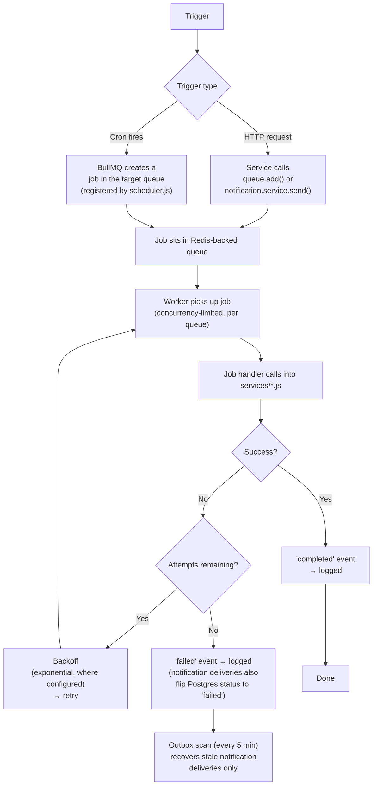

# Background Jobs & Asynchronous Processing Architecture

**Project:** Kith — Family Coordination Platform Backend
**Scope:** Queues, workers, scheduler, Redis coordination, and every background job that ships in this codebase.
**Audience:** Engineers operating, extending, or reviewing this system.

> This document describes what is implemented in the codebase today. Every job, queue, and Redis usage pattern listed below can be cross-referenced against source (`src/queues/`, `src/workers/`, `src/services/`, `src/config/redis.js`, `src/middleware/`). Section 15 separately calls out planned future work.

---

## 1. Overview

Kith's API (`app.js`/`server.js`) is a synchronous Express request/response service. Anything that is slow, external, bulk, or time-driven is pushed out of the request path and into background processing, built on **BullMQ** (Redis-backed queues) plus a small set of **cron-scheduled scans**.

Three categories of work live outside the request/response cycle:

1. **Deferred work triggered by a request** — e.g. a user submits a contribution, and notifying admins happens after the HTTP response, not during it (`ledger.service.js#createEntry` → `notification.service.js#send` → BullMQ).
2. **Scheduled maintenance** — daily/weekly/five-minute scans that don't correspond to any single user action (reminders, cycle lifecycle transitions, overdue detection, cleanup).
3. **Bulk/slow user-initiated work** — GDPR data exports, which would otherwise block an HTTP request for the time it takes to query and email a CSV.

This keeps HTTP handlers fast and makes slow/unreliable operations (email delivery, push notification delivery, multi-table aggregation) retryable independent of the request that triggered them.

---

## 2. Architecture

```mermaid
flowchart LR
    subgraph API["HTTP API (app.js)"]
        REQ[Controller/Service]
    end

    subgraph SCHED["Scheduler (queues/scheduler.js)"]
        CRON[6 cron-registered\nrepeatable jobs]
    end

    subgraph REDIS["Redis (config/redis.js)"]
        BULLMQ[(BullMQ queue data)]
        RL[(Rate limit counters)]
        CACHE[(Membership cache)]
        DEBOUNCE[(last_seen debounce keys)]
    end

    subgraph QUEUES["9 BullMQ Queues (queues/index.js)"]
        Q1[notification-queue]
        Q2[reminder-queue]
        Q3[cycle-generation-queue]
        Q4[cycle-lifecycle-queue]
        Q5[task-overdue-queue]
        Q6[invite-cleanup-queue]
        Q7[engagement-check-queue]
        Q8[notification-outbox-queue]
        Q9[data-export-queue]
    end

    subgraph WORKERS["9 BullMQ Workers"]
        W1[notification.worker.js]
        W2[background.workers.js\n(6 workers)]
        W3[data_export.worker.js]
    end

    REQ -- "enqueue" --> Q1
    REQ -- "enqueue" --> Q9
    CRON -- "add repeatable job into" --> Q2 & Q3 & Q4 & Q5 & Q6 & Q7 & Q8

    QUEUES <-- "job storage/coordination" --> BULLMQ
    W1 -- "consumes" --> Q1
    W2 -- "consumes" --> Q2 & Q3 & Q4 & Q5 & Q6 & Q7 & Q8
    W3 -- "consumes" --> Q9

    API -- "rate limit checks" --> RL
    API -- "membership cache" --> CACHE
    API -- "last_seen debounce" --> DEBOUNCE
```

**Key structural fact:** the scheduler does **not** run jobs on its own queue and forward them. Each cron entry in `SCHEDULED_JOBS` (`queues/scheduler.js`) registers its repeatable job directly on the same queue name the corresponding worker listens to (e.g. `reminder-scan` is added to `reminder-queue`, and `createReminderWorker()` listens on `reminder-queue`). This design deliberately avoids the alternative of a separate scheduler-only queue that workers would need to additionally subscribe to — one queue name is the single source of truth for both registration and consumption.

---

## 3. Background Job Infrastructure

### 3.1 Two deployment topologies

The codebase supports two ways to run background processing, both wired from the same underlying pieces:

| Entry point | What it starts | Use case |
|---|---|---|
| `server.js` | HTTP API only | Production: API as its own process/container |
| `workers/index.js` (`npm run worker`) | All 9 workers + scheduler, no HTTP server | Production: worker fleet as its own process/container(s) |
| `start-all.js` (`npm start`) | HTTP API **+** all 9 workers **+** scheduler, one process | Local dev / small deployments |

`package.json`'s `main`/`start` script points at `start-all.js`, but `server.js` and `workers/index.js` remain fully independent and are the intended split for real horizontal scaling (see §9).

### 3.2 Worker startup

Both `start-all.js` and `workers/index.js` construct the same 9 `Worker` instances and call `setupScheduler()` once at startup. `workers/index.js` additionally validates required env vars (`SUPABASE_URL`, `SUPABASE_SERVICE_ROLE_KEY`, `REDIS_URL`) before importing anything else, since the logger itself may depend on those vars.

Each worker registers `completed`, `failed`, and `error` listeners (plus `stalled` in `workers/index.js`) that log via the shared Winston logger (`utils/logger.js`) — see §10.

### 3.3 Scheduler startup

`setupScheduler()` (`queues/scheduler.js`):

1. Iterates `SCHEDULED_JOBS` (6 entries).
2. For each, opens a `Queue` instance on the **target** queue name.
3. Removes any existing repeatable job with the same `jobName` in that queue (`queue.getRepeatableJobs()` → `removeRepeatableByKey()`), so restarting the process doesn't accumulate duplicate cron registrations.
4. Adds the repeatable job with `{ repeat: { cron }, jobId: 'scheduled:<jobName>' }`. The stable `jobId` is a second layer of duplicate protection.

`setupScheduler()` is idempotent by design — safe to call on every process start, including repeated deploys.

### 3.4 Job registration (queue registry)

`queues/index.js` maintains `QUEUE_NAMES`, a fixed allowlist of 9 strings. `getQueue(name)` throws `Unknown queue: "<name>"` for anything not in that list — a deliberate guard against typo-based queue proliferation (e.g. accidentally creating `remidner-queue`). **To add a new queue, it must first be added to `QUEUE_NAMES`.**

Queue instances are cached in a module-level `Map` and reused for the life of the process (`getQueue`), and `closeQueues()` gracefully closes all open queue connections on shutdown.

### 3.5 Distributed locking

There is **no BullMQ-level distributed lock primitive** (no `Mutex`/`Lock` abstraction) in this codebase. Concurrency safety is instead achieved through:

- **BullMQ's own job-claim semantics** — a job can only be picked up by one worker at a time; this is BullMQ's built-in guarantee, not custom code.
- **Redis `SET ... NX EX`** for the `last_seen_at` debounce (`middleware/auth.js#shouldUpdateLastSeen`) — a true cross-instance single-writer claim, described in detail in §7.
- **Stable `jobId`s** for repeatable scheduler jobs, preventing duplicate cron registrations across restarts.
- **Postgres atomic RPCs** (not Redis) for multi-step business transactions that must not race — e.g. `raise_dispute_atomic`, `resolve_dispute_atomic`, `set_contributor_target_atomic`, `convert_event_to_recurring_atomic`, `upsert_primary_contact`, `replace_user_contacts_atomic`. These aren't background-job concerns per se, but are the mechanism this codebase uses wherever a lock might otherwise be reached for.

### 3.6 Retry strategy

Retry configuration is set **per `queue.add()` call site**, not globally. See §8 for the full breakdown by job.

### 3.7 Dead job / failure recovery

There is no BullMQ dead-letter queue configured. Instead:

- `notification.service.js#_sendToRecipient`: if `queue.add()` itself throws (Redis unavailable, etc.) when enqueuing an external-channel delivery, the `notification_deliveries` row is marked `'failed'` in Postgres rather than left silently unenqueued. The **notification outbox scan** (§5.8) is the recovery mechanism — it scans for `pending`/`failed` deliveries older than 5 minutes and re-enqueues them.
- `container.service.js#createContainer` / `#convertToRecurring`: if the initial cycle-generation enqueue fails, it's logged and recovery falls to the daily `cycle-gen-maintenance` cron job rather than a retry queue.
- Failed BullMQ jobs (all queues) are retained via `removeOnFail: false` where explicitly set (notification queue) and are visible/inspectable via **Bull Board** (see §10).

---

## 4. Job Lifecycle



Two trigger paths exist:

- **Request-triggered**: an authenticated API call causes a service to call `getQueue(name).add(...)` (data export) or `notification.service.js#send()` (which internally enqueues per-channel delivery jobs).
- **Cron-triggered**: `setupScheduler()` registers a BullMQ repeatable job directly on the target queue; when the cron fires, BullMQ creates a real job on that queue with no scheduler process needing to be running at fire time (the repeatable-job schedule lives inside Redis/BullMQ itself, registered once at startup).

---

## 5. Job Catalog

All 9 queues, in the order declared in `queues/index.js`. Every job below is cross-referenced against its worker wiring (`background.workers.js`, `notification.worker.js`, `data_export.worker.js`) and its service implementation.

### 5.1 `notification-queue`

| | |
|---|---|
| **Purpose** | Deliver a single notification to a single recipient over a single external channel (push or email). In-app notifications are **not** queued — they're written directly to Postgres as `'delivered'` inside `notification.service.js#_sendToRecipient`. |
| **Trigger** | Any call to `notification.service.js#send()` from anywhere in the app (ledger confirmations, disputes, task assignments, invites, announcements, etc. — see the `TEMPLATES` registry in `notification.service.js` for the full list of 16 notification *types*, each mapped to one or more channels). |
| **Job name pattern** | `deliver-${channel}` (e.g. `deliver-push`, `deliver-email`) |
| **Worker** | `notification.worker.js` → `deliverNotification()` in `notification_delivery.service.js` |
| **Concurrency** | 10, rate-limited to 50 jobs/second (`limiter: { max: 50, duration: 1000 }`) |
| **Inputs** | `notification_id`, `delivery_id`, `channel`, recipient push token/email/prefs, `title`, `body`, `reference_type`, `reference_id`, `workspace_id` |
| **Outputs** | FCM push send (via `config/firebase.js`) or Resend email send (via `config/resend.js`); updates `notification_deliveries.status` to `delivered`/`skipped`/`failed` |
| **Retry** | `attempts: 3`, exponential backoff, `delay: 5000`; `removeOnComplete: { age: 86400 }`, `removeOnFail: false` (failed jobs retained for inspection) |
| **Idempotency** | Checks `notification_deliveries.status === 'delivered'` at the top of the handler and short-circuits — safe against duplicate/re-run job execution. Push jobs also re-verify the recipient's current `push_token` against the token captured at enqueue time, skipping delivery if it has rotated. |
| **Frequency** | Continuous, event-driven |

### 5.2 `reminder-queue`

| | |
|---|---|
| **Purpose** | Daily scan that sends four categories of reminders: upcoming payment due dates, overdue payments, admin overdue summaries, and "cycle closing soon" reminders for recurring pools. |
| **Trigger** | Cron: `0 7 * * *` (daily 07:00 UTC), job name `reminder-scan` |
| **Worker** | `background.workers.js#createReminderWorker` → `runReminderScan()` in `reminder.service.js` |
| **Concurrency** | 1 |
| **Inputs** | None (job data is `{}`) — queries `contributor_targets`, `container_cycles` directly |
| **Outputs** | Calls `notification.service.js#send()` for each recipient (which itself fans out into `notification-queue` jobs) |
| **Retry** | Not explicitly configured on this job's `queue.add()` call (uses BullMQ defaults). Per-recipient failures inside the scan are individually caught and logged so one bad target doesn't fail the whole scan/retry the entire batch. |
| **Idempotency** | Each `notification.service.js#send()` call includes a `dedupKey` scoped to `scanDate` (e.g. `payment_reminder:${target.id}:${scanDate}`, `overdue_reminder:...`, `overdue_summary_admin:...`, `cycle_closing_soon:...`), enforced via a Postgres `upsert(..., { onConflict: 'dedup_key', ignoreDuplicates: true })` in `notification.service.js`. This is what actually prevents duplicate reminders, not BullMQ retry semantics. |
| **Frequency** | Daily |

### 5.3 `cycle-generation-queue`

| | |
|---|---|
| **Purpose** | Generates upcoming billing/contribution cycles for recurring containers (pools), including per-participant target amounts, honoring pause/skip/adjust overrides. |
| **Trigger** | Two sources: (1) cron `cycle-gen-maintenance`, `0 3 * * *` daily, with `{ generate_months_ahead: 3 }`; (2) directly enqueued from `container.service.js#createContainer` and `#convertToRecurring` when a recurring container is first created/converted. |
| **Worker** | `background.workers.js#createCycleGenerationWorker` → `generateCycles()` in `cycle_generation.service.js` |
| **Concurrency** | 5 |
| **Inputs** | `container_id`, `generate_months_ahead` |
| **Outputs** | Upserts rows into `container_cycles` and `contributor_targets` |
| **Retry** | `attempts: 3` on the request-triggered enqueue calls; the daily cron job uses BullMQ defaults |
| **Idempotency** | `container_cycles` upsert uses `onConflict: 'container_id,cycle_start', ignoreDuplicates: true`; `contributor_targets` upsert uses `ignoreDuplicates: true`. Safe to re-run for the same container/date range. All override lookups (`pool_cycle_overrides`) are batch-fetched once per run into in-memory `Set`/`Map` structures rather than queried per-cycle-per-participant. |
| **Frequency** | Daily (maintenance) + on-demand (container creation/conversion) |

### 5.4 `cycle-lifecycle-queue`

| | |
|---|---|
| **Purpose** | Opens cycles whose start date has arrived (`upcoming` → `open`), closes cycles whose end date has passed (`open` → `closed`), and — for containers with `carry_forward_unpaid` enabled — inserts `carry_forward` ledger entries for each participant's outstanding balance into the next cycle. |
| **Trigger** | Cron: `1 0 * * *` (daily 00:01 UTC), job name `cycle-lifecycle` |
| **Worker** | `background.workers.js#createCycleLifecycleWorker` → `runCycleLifecycle()` in `cycle_lifecycle.service.js` |
| **Concurrency** | 1 |
| **Inputs** | None — computes `today` internally |
| **Outputs** | Updates `container_cycles.status`; inserts `ledger_entries` (type `carry_forward`, `status: 'confirmed'`, `recorded_by`/`confirmed_by: null` to indicate a system-generated entry); sends `cycle_started` notifications (each participant's own target, resolved individually); enqueues `cycle-generation-queue` jobs for each closed cycle's container so the next cycle is generated. |
| **Retry** | Not explicitly set on the cron `queue.add()` call (BullMQ defaults) |
| **Idempotency** | Cycle status transitions are naturally idempotent (querying `WHERE status = 'upcoming' AND cycle_start <= today` — already-opened cycles won't match again). Carry-forward entry insertion is deduplicated by running once per cycle-close — a re-run against an already-closed cycle would not re-match the `status = 'open'` filter, so this is safe under normal single-run-per-day operation. |
| **Frequency** | Daily |


*Cycle generation (§5.3) and cycle lifecycle (§5.4) drawn as one continuous process, since they cooperate to keep a pool's cycle horizon perpetually populated with no manual step: on-demand generation at container creation, a nightly maintenance job as a fallback if that enqueue silently fails, and the nightly open/close sweep that both applies carry-forward and re-triggers generation to extend the horizon. The bottom section shows why `pause_pool` takes effect immediately while `skip_member`/`adjust_target` are deferred to the next generation pass — pausing corrects the cycle record directly, while the other two only have something to modify once per-participant targets actually exist for that cycle.*

**Full workflow demonstration.** The video below shows this exact lifecycle running against a real recurring pool — creation, immediate cycle generation, a full month of contributions against an open cycle, an admin override, and the nightly close carrying an unpaid balance forward as a new, system-attributed ledger entry:

<video src="./media/recurring-pool-automation-demo.mp4" controls width="720" poster="./media/cycles-list-breakdown.png"></video>

**The "Set It and Forget It" Recurring Pool** — demonstrates recurring pool creation with a monthly cadence, per-participant targets, automatic cycle generation, a cycle opening and later closing on schedule, an unpaid balance carrying forward as a new system-generated ledger entry, and the pool continuing to run with no manual step in between. This is the long-running automation described across this section made concrete; a matching screenshot of the resulting cycle breakdown is in [PRODUCT_OVERVIEW.md §13](./PRODUCT_OVERVIEW.md#13-participants--contribution-targets).

### 5.5 `task-overdue-queue`

| | |
|---|---|
| **Purpose** | Marks `pending` tasks past their `due_date` as `overdue` and notifies the assignee plus workspace admins. |
| **Trigger** | Cron: `0 6 * * *` (daily 06:00 UTC), job name `task-overdue-check` |
| **Worker** | `background.workers.js#createTaskOverdueWorker` → `runTaskOverdueCheck()` in `task_overdue.service.js` |
| **Concurrency** | 1 |
| **Inputs** | None |
| **Outputs** | Updates `container_tasks.status = 'overdue'`; sends `task_overdue` notifications |
| **Retry** | BullMQ defaults on the cron enqueue |
| **Idempotency** | Update query filters `WHERE status = 'pending' AND due_date < today`, so tasks already marked `overdue` are excluded from subsequent runs automatically. Notification-level dedup via `dedupKey: 'task-overdue:${task.id}:${today}'`. |
| **Frequency** | Daily |

### 5.6 `invite-cleanup-queue`

| | |
|---|---|
| **Purpose** | Deletes expired, never-used workspace invite links. |
| **Trigger** | Cron: `0 2 * * *` (daily 02:00 UTC), job name `invite-cleanup` |
| **Worker** | `background.workers.js#createInviteCleanupWorker` → `runInviteCleanup()` in `invite_cleanup.service.js` |
| **Concurrency** | 1 |
| **Inputs** | None |
| **Outputs** | `DELETE FROM invite_links WHERE expires_at < now() AND used_at IS NULL` |
| **Retry** | BullMQ defaults |
| **Idempotency** | Trivially idempotent — deleting already-deleted rows matches nothing |
| **Frequency** | Daily |

### 5.7 `engagement-check-queue`

| | |
|---|---|
| **Purpose** | Recomputes `workspace_members.last_active_at` from the most recent of: existing `last_active_at`, latest confirmed ledger contribution, latest completed task — for every non-proxy active member across all workspaces. |
| **Trigger** | Cron: `0 6 * * 0` (weekly, Sunday 06:00 UTC), job name `engagement-check` |
| **Worker** | `background.workers.js#createEngagementCheckWorker` → `runEngagementCheck()` in `engagement_check.service.js` |
| **Concurrency** | 1 |
| **Inputs** | None |
| **Outputs** | Conditional `UPDATE workspace_members SET last_active_at = ...` (only when the computed value is newer, via `.or('last_active_at.is.null,last_active_at.lt.${latest}')`) |
| **Retry** | BullMQ defaults |
| **Idempotency** | The conditional update means re-running against unchanged data is a no-op. Uses the shared `fetchEngagementData()` helper from `engagement.service.js` — the same 2-query batched fetch used by the on-demand `GET /members/engagement` endpoint, so both call sites stay in lockstep. |
| **Frequency** | Weekly |

### 5.8 `notification-outbox-queue`

| | |
|---|---|
| **Purpose** | Safety net for the notification pipeline. Finds `notification_deliveries` rows stuck in `pending` or `failed` (external channels only — `in_app` is excluded, since those are written synchronously and never queued) for more than 5 minutes, and re-enqueues them onto `notification-queue`. |
| **Trigger** | Cron: `*/5 * * * *` (every 5 minutes), job name `notification-outbox-scan` |
| **Worker** | `background.workers.js#createNotificationOutboxWorker` → `runNotificationOutboxScan()` in `notification_outbox.service.js` |
| **Concurrency** | 1 |
| **Inputs** | None |
| **Outputs** | Re-adds jobs to `notification-queue` (`deliver-${channel}`, `attempts: 3`, exponential backoff `delay: 5000`); resets the delivery's status back to `pending` |
| **Retry** | BullMQ defaults on the cron job itself; per-delivery re-enqueue failures are caught and logged individually so one bad row doesn't block the rest of the batch (`limit(50)` per scan) |
| **Idempotency** | Proxy-member recipients are explicitly skipped (proxies never receive external-channel notifications by design). Re-enqueuing a delivery that later succeeds via the original path is guarded by `notification_delivery.service.js`'s own idempotency check (`status === 'delivered'` short-circuit — see §5.1). |
| **Frequency** | Every 5 minutes |

### 5.9 `data-export-queue`

| | |
|---|---|
| **Purpose** | GDPR data export — builds a full CSV export of a user's ledger contributions and task assignments across every workspace they belong to, and emails it as attachments. |
| **Trigger** | `POST /v1/auth/data-export` (authenticated, request-triggered — not scheduled) |
| **Job name** | `export-user-data` |
| **Worker** | `data_export.worker.js` → `processDataExport()` in `data_export.service.js` |
| **Concurrency** | 2 (deliberately low — I/O heavy: downloads user profile + all ledger/task rows + sends an email with attachments) |
| **Inputs** | `userId`, `userEmail`, `workspaceIds` (resolved from the user's active memberships at request time, in `auth.service.js#requestDataExport`) |
| **Outputs** | Two CSV attachments (`kith-contributions-<date>.csv`, `kith-tasks-<date>.csv`) emailed via Resend |
| **Retry** | `attempts: 2`, exponential backoff, `delay: 10000` |
| **Idempotency** | Not explicitly deduplicated — re-running the same export job would re-send the email. Acceptable for this job's semantics (a user-requested, infrequent, non-mutating export); a duplicate email is a nuisance, not a correctness bug. |
| **Frequency** | On-demand, per user request |

---

## 6. Scheduler

### 6.1 Registered cron schedules

All six live in `queues/scheduler.js#SCHEDULED_JOBS`:

| Job name | Target queue | Cron | Meaning |
|---|---|---|---|
| `reminder-scan` | `reminder-queue` | `0 7 * * *` | Daily 07:00 UTC |
| `cycle-lifecycle` | `cycle-lifecycle-queue` | `1 0 * * *` | Daily 00:01 UTC |
| `task-overdue-check` | `task-overdue-queue` | `0 6 * * *` | Daily 06:00 UTC |
| `invite-cleanup` | `invite-cleanup-queue` | `0 2 * * *` | Daily 02:00 UTC |
| `engagement-check` | `engagement-check-queue` | `0 6 * * 0` | Weekly, Sunday 06:00 UTC |
| `cycle-gen-maintenance` | `cycle-generation-queue` | `0 3 * * *` | Daily 03:00 UTC, `{ generate_months_ahead: 3 }` |
| `notification-outbox-scan` | `notification-outbox-queue` | `*/5 * * * *` | Every 5 minutes |

(`data-export-queue` and `notification-queue` have no cron entry — both are purely request-triggered, as documented in §5.1 and §5.9.)

### 6.2 Startup behavior

`setupScheduler()` runs once at process startup (called from `start-all.js`, `workers/index.js`, or standalone via `node src/queues/scheduler.js`). It is safe to call repeatedly — see §3.3 for the duplicate-prevention mechanism (stale-job removal + stable `jobId`).

Running `node src/queues/scheduler.js` directly registers the schedules and then keeps the process alive (an open Redis connection is required to maintain BullMQ's repeatable-job keys) — this standalone mode exists mainly for manual/debugging use; in normal operation the worker process (`workers/index.js` or `start-all.js`) calls `setupScheduler()` itself.

### 6.3 Adding a new scheduled job

1. Add the queue name to `QUEUE_NAMES` in `queues/index.js`.
2. Write the job's business logic as a new `services/<name>.service.js` function (following the existing pattern — see any file in §5).
3. Add a `Worker` for that queue in `background.workers.js` (or a new dedicated worker file if it doesn't fit the "background" grouping), wired to the service function.
4. Add the worker instance to the `workers` array (and matching `workerNames` entry) in **both** `start-all.js` and `workers/index.js` — these two files currently duplicate this wiring and must be kept in sync manually.
5. Add an entry to `SCHEDULED_JOBS` in `queues/scheduler.js` with a unique `jobName`, the target queue name (matching the worker in step 3), and a cron expression.

---

## 7. Redis Usage

Redis (`config/redis.js`, `ioredis` client, `maxRetriesPerRequest: null` and `enableReadyCheck: false` — both required by BullMQ) backs four distinct concerns in this codebase. Nothing else in the app touches Redis directly outside these four.

### 7.1 Queue coordination (BullMQ)

The primary use. Every `Queue` and `Worker` instance shares the single Redis connection from `getRedis()`. This is what stores job payloads, tracks job state, and coordinates which worker instance claims which job across a horizontally-scaled worker fleet.

### 7.2 Rate limiting

`middleware/rateLimiter.js` uses `rate-limit-redis` (`RedisStore`) so rate-limit counters are shared across every API instance behind a load balancer, rather than each instance keeping an independent in-memory counter. Six distinct limiters are defined, each with its own Redis key prefix (`rl:auth:`, `rl:invite:`, `rl:upload:`, `rl:public-lookup:`, `rl:general-ip:`, `rl:general-user:`) — see ADR-0006 for the full IP-vs-user-keying rationale. This falls back to an in-memory store (with a warning logged) if the Redis client is unavailable at startup.

### 7.3 Membership cache

`services/membership-cache.service.js` caches the `{ member, workspace }` payload that `middleware/workspace.js#requireMembership` computes on every workspace-scoped request, keyed `kith:membership:${workspaceId}:${userId}` (see `config/redis-keys.js`), TTL 30 seconds (`TTL.MEMBERSHIP_CACHE_SECONDS`). This removes two Postgres round trips from the hot path of nearly every authenticated endpoint. Explicitly invalidated (not just left to expire) on any write that changes a cached field (role, is_active, is_proxy, proxy_managed_by) via `invalidateMembership()`, called from `member.service.js#updateMember` and `#deleteMember`. `invalidateWorkspace()` (used on workspace deletion) uses Redis `SCAN` rather than `KEYS` to avoid blocking Redis on large keyspaces. Fails open on any Redis error — a cache miss/error just means "fetch from Postgres," never a wrongly-granted or wrongly-denied request.

### 7.4 `last_seen_at` debounce (distributed claim)

`middleware/auth.js#shouldUpdateLastSeen` uses `SET kith:lastseen:${userId} 1 EX 300 NX` (`TTL.LAST_SEEN_DEBOUNCE_SECONDS` = 5 minutes) as a genuine cross-instance single-writer claim: only the one request across the **entire fleet** that successfully sets the key (i.e., the key didn't already exist) proceeds to write `last_seen_at` to Postgres. This gives true single-writer-per-window behavior fleet-wide rather than one write per instance per window. Fails open — if Redis is unavailable, the write is simply skipped for that request rather than blocking auth.

### 7.5 What Redis is **not** used for

- No pub/sub.
- No Redis-backed distributed lock library (no Redlock, no `SET NX` used for anything beyond the single debounce case above).
- No Redis Streams.
- No dedicated dead-letter storage in Redis (BullMQ's own failed-job retention is used instead — see §3.7 and §10).

---

## 8. Reliability

### 8.1 Retry / backoff summary

| Job / call site | Attempts | Backoff |
|---|---|---|
| `notification-queue` deliveries (`notification.service.js`, `notification_outbox.service.js`) | 3 | Exponential, 5000ms base |
| `data-export-queue` (`auth.service.js#requestDataExport`) | 2 | Exponential, 10000ms base |
| `cycle-generation-queue` (request-triggered, `container.service.js`) | 3 | BullMQ default (none specified beyond attempts) |
| All 6 scheduler-registered cron jobs | BullMQ default | BullMQ default |

Where no `attempts`/`backoff` is explicitly set, BullMQ's defaults apply (a single attempt, no automatic retry) — this is the case for the daily/weekly cron jobs themselves (the *job that runs the scan*, not the notifications the scan sends, which do have explicit retry via `notification.service.js`).

### 8.2 Duplicate prevention

Three distinct mechanisms, used for three distinct problems:

- **Postgres `dedup_key` unique constraint** (`notifications` table, `onConflict: 'dedup_key', ignoreDuplicates: true`) — prevents the same logical notification (e.g. "overdue reminder for target X on date Y") from being created twice, even across repeated scan runs or retried jobs.
- **BullMQ stable `jobId`** (`scheduled:${jobName}`) — prevents the scheduler from registering duplicate repeatable-job schedules across process restarts.
- **Redis `SET NX`** — prevents duplicate `last_seen_at` writes across concurrent requests/instances within the debounce window.

### 8.3 Failure recovery

- **Notification deliveries**: the outbox scan (§5.8) is the sole automated recovery path, and only for external channels older than 5 minutes.
- **Cycle generation**: falls back to the next daily `cycle-gen-maintenance` run if the on-demand enqueue fails at container-creation time.
- **Everything else**: relies on BullMQ's own retry (where configured) plus the job simply running again on its next scheduled cron tick.

### 8.4 Idempotency by job

Covered per-job in §5. In summary: dedup-key-based (reminders, outbox re-enqueue), upsert-with-ignoreDuplicates-based (cycle generation), natural-query-filter-based (cycle lifecycle, task overdue, invite cleanup, engagement check), status-check-based (notification delivery), and not-deduplicated-by-design (data export, where a duplicate is low-cost).

### 8.5 Timeout handling

No explicit per-job timeout is configured on any `Worker` (BullMQ's `lockDuration` defaults apply). HTTP-level timeouts (`server.keepAliveTimeout`/`headersTimeout`) are unrelated to background jobs and only govern the HTTP server itself.

### 8.6 Crash recovery

BullMQ's job-lock mechanism (Redis-backed) is what allows a job claimed by a worker that then crashes to eventually be reclaimed and retried by another worker (or the same worker on restart) once its lock expires — this is BullMQ's built-in behavior, not custom code in this repo. Graceful shutdown (`start-all.js`, `workers/index.js`) calls `worker.close()` on `SIGTERM`/`SIGINT` with a 10-second forced-exit fallback, allowing in-flight jobs to finish rather than being abruptly killed under normal shutdown.

---

## 9. Scaling

### 9.1 Horizontal scaling model

Because all queue/job state lives in Redis (not in-process), any number of `workers/index.js` processes can run concurrently against the same Redis instance — BullMQ's job-claim mechanism ensures each job is picked up by exactly one worker instance. This is the rationale for splitting `server.js` (API) from `workers/index.js` (workers) in production rather than always running `start-all.js`.

### 9.2 Per-queue concurrency

Concurrency is tuned per queue, not globally:

| Queue | Concurrency |
|---|---|
| `notification-queue` | 10 (+ rate limit: 50/sec) |
| `cycle-generation-queue` | 5 |
| `data-export-queue` | 2 (I/O heavy, deliberately conservative) |
| All other queues (reminder, cycle-lifecycle, task-overdue, invite-cleanup, engagement-check, notification-outbox) | 1 |

Running multiple worker **processes** multiplies these numbers (e.g. 3 worker processes × concurrency 10 on `notification-queue` = up to 30 concurrent notification deliveries fleet-wide).

### 9.3 Coordination across instances

- BullMQ itself handles job-claim coordination — no additional application code is needed for "don't process the same job twice."
- The rate limiter (§7.2) and membership cache (§7.3) are both explicitly designed to be correct under multiple API instances sharing one Redis.
- The `last_seen_at` debounce (§7.4) is the other explicitly multi-instance-aware piece of Redis usage in the codebase.

### 9.4 Worker isolation

Each of the 9 workers is its own independent BullMQ `Worker` instance listening on its own queue — a slow or backed-up `cycle-generation-queue` cannot block `notification-queue` processing, since they're separate Redis-backed queues consumed independently. Within a single Node process, all workers share the process's event loop, so CPU-bound work in one handler can still delay others in the same process — running workers across multiple processes (as `workers/index.js` is designed to support) mitigates this.

---

## 10. Monitoring

### 10.1 Implemented

- **Structured logging** (`utils/logger.js`, Winston): every worker's `completed`/`failed`/`error` events (and `stalled`, in `workers/index.js`) are logged with `{ queue, jobId, error, duration/attempts }` context. Production format is JSON; dev format is human-readable with colorized level + timestamp.
- **Bull Board** (`app.js`): a queue-monitoring dashboard mounted at `/admin/queues`, gated behind IP allowlisting (exact-match or CIDR, via `ADMIN_IP_WHITELIST`) **and** HTTP Basic Auth (constant-time comparison via `crypto.timingSafeEqual`, guarding against a timing side-channel). Only mounts if both `BULL_BOARD_USERNAME` and `BULL_BOARD_PASSWORD` are set; if it fails to load for any other reason, a warning is logged and the rest of the app continues to boot. This is the primary tool for inspecting queue depth, job status, and failed-job payloads/stack traces.


*All 9 queues from the catalog in §5, visible in one live dashboard — job counts here reflect each queue's cron just having fired (most show 1 job) and the notification-outbox queue mid-recovery-cycle (1 active, 1 waiting).*
- **Per-job structured logs** inside service functions (e.g. `container.service.js` logging when a cycle-generation enqueue fails and noting the fallback path), giving operational context beyond generic worker events.
- **Sentry** (`@sentry/node`, initialized in `server.js`/`start-all.js` if `SENTRY_DSN` is set, `tracesSampleRate: 0.1`) — captures unhandled exceptions/rejections process-wide, including inside worker processes, though it is not queue-job-aware (no per-job Sentry transactions/breadcrumbs are created).

### 10.2 Planned

- Queue-depth or job-duration **metrics** export (Prometheus, StatsD, etc.) — Bull Board gives point-in-time visibility today; a scraped, time-series view is a planned addition.
- Alerting (PagerDuty, Slack webhook, etc.) on job failure, elevated queue depth, or scheduler non-execution.
- A dedicated dead-letter queue or failed-job re-drive tooling beyond Bull Board's manual retry button and the notification-specific outbox scan.

---

## 11. Performance Considerations

- **Response-time improvement**: any endpoint that triggers a notification (contribution submitted, task assigned, dispute raised, etc.) returns to the client as soon as the Postgres write + `queue.add()` call completes — actual push/email delivery (network calls to FCM/Resend) happens entirely off the request path.
- **Bulk operations moved off the request path**: the GDPR data export (`POST /v1/auth/data-export`) would otherwise require the HTTP request to stay open for however long it takes to query every ledger entry and task across every workspace a user belongs to, build two CSVs, and send an email with attachments — instead the endpoint just enqueues and returns immediately with a 200 message that the export is "queued" and "will be emailed within 24 hours."
- **Batched queries over N+1 patterns**: `cycle_generation.service.js` batch-fetches all `pool_cycle_overrides` for a container once per run into `Set`/`Map` lookups, rather than querying per-cycle-per-participant. `engagement.service.js#fetchEngagementData` similarly does exactly 2 queries regardless of member count, shared by both the weekly cron job and the on-demand engagement API endpoint.
- **No job batching within a single BullMQ job**: each notification recipient/channel gets its own individual job (rather than, say, one job per notification event that fans out internally) — this trades a higher job count for finer-grained retry/idempotency (a single recipient's failed push doesn't block or retry every other recipient's delivery for the same event).
- **Concurrency tuned to workload shape** — see §9.2. I/O-heavy, low-frequency work (data export) gets low concurrency; high-frequency, lightweight work (notification delivery) gets higher concurrency plus an explicit rate limit to avoid overwhelming FCM/Resend.

---

## 12. Error Handling

- **Retry conditions**: governed entirely by each `queue.add()` call's `attempts`/`backoff` config (§8.1) — a thrown error inside a job handler causes BullMQ to retry up to the configured attempt count, then mark the job `failed`.
- **Permanent failures**: once retries are exhausted, the job is marked `failed` in BullMQ (inspectable via Bull Board) and, for notification deliveries specifically, the corresponding `notification_deliveries.status` is also set to `'failed'` in Postgres — this is what makes the row visible to the outbox scan for later recovery.
- **Logging**: every `catch` block in the job-handling services logs via the shared Winston logger with enough context to trace back to the originating entity (e.g. `{ containerId, error: err.message }`, `{ deliveryId, channel, error: err.message }`) — never a bare `console.log` in the service layer (the one deliberate exception being `auth.service.js#login`'s verbose `[LOGIN]` trace logging, intentional diagnostic tracing for a historically flaky flow, not a background-job concern).
- **Cleanup**: `removeOnComplete: { age: 86400 }` on notification jobs prunes completed jobs after 24 hours to bound Redis memory growth; `removeOnFail: false` deliberately retains failed jobs indefinitely for inspection (no automated pruning of failed jobs exists — an operator using Bull Board is the implied cleanup mechanism).
- **Recovery**: see §8.3 — the outbox scan is the only automated cross-job recovery mechanism; everything else recovers either via BullMQ's own retry or via the job's next scheduled cron run.

---

## 13. Environment Variables

Variables that affect background processing, background-job-adjacent infrastructure, or are validated at worker-process startup.

| Variable | Required | Purpose |
|---|---|---|
| `REDIS_URL` | Yes (validated at startup in `server.js`, `start-all.js`, `workers/index.js`) | Connection string for the shared `ioredis` client backing BullMQ, rate limiting, membership cache, and the `last_seen_at` debounce |
| `SUPABASE_URL` | Yes | Postgres/Supabase endpoint every service (including all job handlers) reads/writes against |
| `SUPABASE_SERVICE_ROLE_KEY` | Yes | Service-role key used by `supabaseAdmin` — the client every background service uses (bypasses RLS) |
| `FRONTEND_URL` | Yes | Used to build links inside notification/email bodies (e.g. workspace/invite URLs) and OAuth redirects |
| `FIREBASE_SERVICE_ACCOUNT` | No | JSON service account credentials for FCM; if unset, push delivery is disabled and push jobs are marked `'skipped'` (not failed) — see `config/firebase.js` and `notification_delivery.service.js` |
| `RESEND_API_KEY` | No | API key for Resend; if unset, email delivery (notifications **and** data export) is disabled and logs a warning rather than throwing — see `config/resend.js` |
| `EMAIL_FROM` | No | From-address for outbound email; defaults to `Kith <noreply@kith.app>` if unset |
| `IDEMPOTENCY_ENABLED` | No | Not job-queue related, but affects `ledger.service.js`'s idempotency-key checking (defaults to enabled; `false` disables it with a startup warning logged) |
| `FILE_VERIFICATION_ENABLED` | No | Not job-queue related, but affects `storage.service.js#verifyUploadedFile`'s magic-byte verification step (defaults to enabled) |
| `SENTRY_DSN` | No | If set, initializes Sentry error tracking in both the API and worker processes |
| `NODE_ENV` | No | Affects log format (`utils/logger.js`) and disables all rate limiters entirely when set to `test` (`rateLimiter.js`'s `skip` function) |
| `BULL_BOARD_USERNAME` / `BULL_BOARD_PASSWORD` | No (both required together) | Gates the `/admin/queues` Bull Board dashboard; if either is unset, Bull Board is not mounted at all |
| `ADMIN_IP_WHITELIST` | No | Comma-separated IPs/CIDR ranges allowed to reach `/admin/queues`; defaults to `127.0.0.1,::1` if unset |

---

## 14. Operational Guide

### 14.1 Start workers (production, split-process topology)

```bash
# API process
node src/server.js

# Worker process (separate container/process) — starts all 9 workers + scheduler
node src/workers/index.js
# or: npm run worker
```

### 14.2 Start everything in one process (local dev / small deployments)

```bash
npm start
# runs: node src/start-all.js
# starts HTTP API + all 9 workers + scheduler in one process
```

```bash
npm run dev
# same as above, via nodemon, for local iteration
```

### 14.3 Register/refresh cron schedules only

```bash
node src/queues/scheduler.js
```
Useful for confirming schedule registration without running the full worker fleet. Requires `REDIS_URL` and will hang the process open (by design) to keep the Redis connection alive for the repeatable-job keys.

### 14.4 Restart workers

Standard process restart (`SIGTERM`/`SIGINT`) triggers graceful shutdown in both `start-all.js` and `workers/index.js`: each open worker's `.close()` is awaited (with a 10-second forced-exit ceiling), allowing in-flight jobs to complete rather than being killed mid-execution. Re-running `setupScheduler()` on the next startup is safe (§3.3) — no manual cleanup of BullMQ repeatable jobs is needed before restarting.

### 14.5 Deploy / scale workers

- Multiple `workers/index.js` processes can be run concurrently against the same `REDIS_URL` — BullMQ handles job distribution across them (§9.1). There is no coordination step required beyond pointing every instance at the same Redis.
- Scaling the **scheduler** itself is not a separate concern: `setupScheduler()` is idempotent, so it's safe (and expected) for every worker process to call it on startup — duplicate registrations are actively removed, not just ignored (§3.3).
- Do **not** run `start-all.js` in a horizontally-scaled production deployment if the intent is to independently scale API replicas vs. worker replicas — it couples the two. Use the split `server.js` + `workers/index.js` topology for that.

### 14.6 Debug a failed job

1. Open Bull Board at `/admin/queues` (requires `BULL_BOARD_USERNAME`/`PASSWORD` set and your IP allowlisted via `ADMIN_IP_WHITELIST`).
2. Locate the queue and failed job; Bull Board shows the stored payload and the error/stack trace from the last failed attempt.
3. Cross-reference with application logs (`request_id`/`jobId`/`deliveryId` fields are consistently included — see §10.1) for the full error context and any upstream service logs from before the job was enqueued.
4. For notification-specific failures, also check the `notification_deliveries` table directly (`status`, `error_message`, `retry_count`, `last_attempt_at`) — this is the authoritative record independent of whether the BullMQ job itself is still inspectable.
5. Bull Board supports manually retrying a failed job from the UI.

---

## 15. Roadmap

Planned enhancements to the background job system:

- **Metrics/alerting**: export queue-depth, job-duration, and failure-rate metrics to a time-series system, plus alerting for a scheduled job silently failing to run (e.g. if the scheduler process itself crashes). Planned approach: Prometheus counters/histograms per queue (depth, processing time, failure count) plus an alert on "no successful `X-scan` job completion in the last N expected intervals."
- **Dead-letter queue / systematic re-drive**: today only notification deliveries have an automated recovery path (the outbox scan). A generic dead-letter pattern — e.g. BullMQ's `removeOnFail` retention plus a scheduled sweep that re-drives failed jobs across *all* queues, not just notifications — would extend the same reliability pattern to cycle generation, cycle lifecycle, and the other cron jobs.
- **Per-job timeouts**: an explicit lock duration/timeout tuned to expected job runtime, per queue, rather than relying entirely on BullMQ's default lock expiry.
- **Hardened idempotency for cycle-lifecycle carry-forward inserts**: a DB-level uniqueness constraint (e.g. on `(cycle_id, contributor_id, entry_type='carry_forward')`) as an additional guarantee beyond the current status-filter timing, for the edge case of a manual re-run against a cycle that hasn't yet transitioned out of `open`.
- **A shared worker registry**: `start-all.js` and `workers/index.js` both independently construct the same 9-worker array and `workerNames` list. Extracting this into a single shared `workers/registry.js` (analogous to `queues/index.js`) would remove the manual-sync requirement noted in §6.3, step 4.
- **Structured per-job tracing in Sentry**: wiring `Sentry.setContext`/breadcrumbs into each worker's job handler would add job-aware context (custom transactions/tags per BullMQ job) for faster failed-job triage.
