# PRODUCT_OVERVIEW.md
### The Complete Product Intelligence Document for Kith

> **Document purpose:** This is not an architecture document, an API reference, or a developer guide. It is the definitive explanation of what Kith *does*, what problems it solves, and how people experience it — written so a hiring manager, product manager, designer, or investor can understand the entire product.

---

## Table of Contents

1. [Executive Summary](#1-executive-summary)
2. [Product Vision](#2-product-vision)
3. [Core Concepts & Domain Model](#3-core-concepts--domain-model)
4. [High-Level System Overview](#4-high-level-system-overview)
5. [Feature Inventory](#5-feature-inventory)
6. [Authentication & Account System](#6-authentication--account-system)
7. [User Profiles & Contacts](#7-user-profiles--contacts)
8. [Workspace System (Families)](#8-workspace-system-families)
9. [Membership System](#9-membership-system)
10. [Groups](#10-groups)
11. [Invitations](#11-invitations)
12. [Containers — Events & Recurring Pools](#12-containers--events--recurring-pools)
13. [Participants & Contribution Targets](#13-participants--contribution-targets)
14. [The Ledger — Financial Contribution Tracking](#14-the-ledger--financial-contribution-tracking)
15. [Disputes & Corrections](#15-disputes--corrections)
16. [Tasks](#16-tasks)
17. [Milestones & Timeline](#17-milestones--timeline)
18. [Dashboard](#18-dashboard)
19. [Search](#19-search)
20. [Notifications](#20-notifications)
21. [Audit Log & Activity Feed](#21-audit-log--activity-feed)
22. [Data Export (GDPR)](#22-data-export-gdpr)
23. [File & Media Management](#23-file--media-management)
24. [Public / Unauthenticated Surfaces](#24-public--unauthenticated-surfaces)
25. [Background Jobs & Scheduling](#25-background-jobs--scheduling)
26. [Redis Usage & Caching](#26-redis-usage--caching)
27. [External Services](#27-external-services)
28. [Security Features](#28-security-features)
29. [Business Rules Reference](#29-business-rules-reference)
30. [Complete End-to-End User Flows](#30-complete-end-to-end-user-flows)
31. [Feature Relationships — How It All Connects](#31-feature-relationships--how-it-all-connects)
32. [System Lifecycle — A Day in the Life of the Backend](#32-system-lifecycle--a-day-in-the-life-of-the-backend)
33. [Product Strengths](#33-product-strengths)
34. [Product Roadmap](#34-product-roadmap)
35. [Appendix — Glossary & Terminology](#35-appendix--glossary--terminology)

---

## 1. Executive Summary

**Kith is a family financial and logistical coordination platform.** It exists to solve a problem every extended family eventually runs into: money and responsibility are shared across a group of people who are not a company, don't use business tools, and don't want the overhead of one. Splitting the cost of a parent's medical care, running a rotating "susu"-style savings pool, organizing who buys what for a wedding, or simply making sure grandma's birthday gift gets bought and paid for — these are all coordination problems that families currently solve with group chats, spreadsheets, and goodwill. Kith turns that into a structured, auditable, permission-aware system.

At its center are three ideas:

- A **Workspace** is a family. It has members, money, settings, and a shared history.
- A **Container** is something the family is coordinating — a one-time **event** (a funeral, a graduation, a wedding) or a **recurring pool** (a monthly contribution rotation, an ongoing care fund). Containers can track money, tasks, or both.
- The **Ledger** is the system of record for every contribution, correction, and dispute — the part of the product that has to be trustworthy, because it is tracking real money between real relatives.

Around this core sits everything a coordination tool needs to actually work day to day: invitations to bring family members in, proxy membership for relatives who aren't tech-literate (an elderly parent, a child), groups for organizing subsets of the family, a notification system that reaches people by push/email/in-app, a full audit trail for accountability, a dashboard that answers "what's outstanding right now," and background automation that keeps recurring pools rolling forward without anyone having to remember to open the app.

Kith is built as a multi-tenant backend (one deployment serves many independent family workspaces), API-first, with a clear separation between **HTTP concerns** (routes/controllers), **business logic** (services), and **infrastructure** (Supabase/Postgres, Redis, BullMQ queues, Firebase push, Resend email).

---

## 2. Product Vision

Families are informal organizations that increasingly need formal tools. A company has a ledger, an org chart, permissions, and an audit trail because money and responsibility are shared among people who need mutual accountability without necessarily having complete mutual trust — and every extended family eventually hits the same need, just without any of the tooling. Kith's vision is to give families that tooling without asking them to become a business.

Concretely, the product is built around a small number of durable beliefs:

- **Money between family members should be trackable without being awkward.** A ledger entry, a proof photo, and an admin confirmation replace "did you send that already?" text threads.
- **Not everyone in a family uses apps the same way.** Proxy members let an admin act on behalf of a child, an elderly relative, or anyone who isn't going to install and learn a new tool — without excluding them from the system that tracks their contributions and obligations.
- **Coordination should survive turnover in attention.** A recurring monthly family pool shouldn't need one person to remember to open a cycle, chase down late payers, and close it out by hand every month — the system should do that on a schedule.
- **Disagreements need a process, not just a chat thread.** When someone disputes a contribution, that shouldn't be a WhatsApp argument — it should be a stateful, auditable workflow with a resolution.
- **Admins need visibility without becoming full-time bookkeepers.** A dashboard, an overdue summary, and an audit log mean one person can run the family's shared finances without spreadsheets.

---

## 3. Core Concepts & Domain Model

Understanding Kith means understanding six nouns and how they nest inside each other. Everything else in the product is a verb applied to these nouns.

| Concept | What it is | Real-world analogy |
|---|---|---|
| **Workspace** | A family's private space in Kith. Has a name, a base currency, a visibility setting, and a set of members. | The "company" in a business SaaS product — the top-level tenant. |
| **Workspace Member** | A person's membership within one workspace. A single human (one `users` row) can be a member of multiple workspaces (e.g., their own nuclear family and their in-laws' family), and each membership is a separate identity with its own role, display name, and proxy status. | An employee's record in a specific company — same person, different "seat" per organization. |
| **Container** | A thing the family is coordinating: either a one-off **event** (wedding, funeral, graduation) or a **recurring pool** (monthly susu, ongoing care fund). Containers optionally track money (`enable_money`), tasks (`enable_tasks`), or both. | A "project" or "budget line" the family has opened. |
| **Container Participant** | A workspace member's involvement in one specific container — separate from container-level ledger/task settings, because not everyone participating in an event necessarily owes money or has tasks. | Being "on" a specific project, with your own target/budget for that project. |
| **Ledger Entry** | A single financial record: a contribution, an expense, a correction, or a system-generated carry-forward. This is the immutable-once-confirmed record of money movement. | A journal entry in an accounting system. |
| **Group** | A named, reusable subset of workspace members (e.g., "The Cousins," "Immediate Family") used to quickly add the same set of people to multiple containers. | A distribution list or a saved audience segment. |

**Nesting, visually:**

```
Workspace ("The Adeyemi Family")
│
├── Workspace Members (Mom [admin], Dad, Aunt Grace, Baby Kayode [proxy])
│
├── Groups ("Cousins", "US-based relatives")
│
├── Containers
│   ├── Event: "Mom's 60th Birthday"
│   │     ├── Participants (subset of members, each with a money/task target)
│   │     ├── Ledger Entries (each participant's contributions)
│   │     ├── Tasks ("Book venue", "Order cake")
│   │     └── Milestone (auto-created on completion)
│   │
│   └── Recurring Pool: "Monthly Family Support Fund"
│         ├── Cycles (auto-generated monthly/weekly/quarterly/yearly windows)
│         │     └── Per-cycle Contributor Targets
│         ├── Participants
│         └── Ledger Entries (tagged to a specific cycle)
│
├── Milestones & Timeline (family history: births, graduations, completed events)
├── Invite Links (bring new members in)
├── Notifications (per-member inbox + push/email delivery)
└── Audit Log (every consequential action, forever)
```

**Two additional cross-cutting ideas** worth understanding up front because they shape almost every permission check in the system:

- **Admin vs. Member role.** Every workspace member has a `role` of `admin` or `member`. Admins can create containers, manage membership, confirm ledger entries, resolve disputes, and see workspace-wide financial detail. Members largely see and act only on their own participation.
- **Proxy membership.** A workspace member can be flagged `is_proxy`, meaning they don't (or can't) use the app themselves — a baby, a very elderly relative, someone without a smartphone. Proxy members can still be participants, have targets, and have contributions recorded for them, but only an admin can record on their behalf, and they never receive push/email notifications (only admins acting for them do).

---

## 4. High-Level System Overview

Kith runs as a single Node.js/Express API (with an optional combined single-process mode for smaller deployments) backed by:

- **Supabase (Postgres)** as the system of record for every entity — users, workspaces, members, containers, ledger entries, disputes, tasks, milestones, notifications, audit log, invites, groups.
- **Supabase Auth** for identity — email/password and Google OAuth, JWT-based sessions with refresh tokens.
- **Supabase Storage** for all uploaded files — proof-of-payment images/PDFs, task completion proofs, milestone photos, cover photos, avatars — via signed upload/download URLs, never proxied through the app server.
- **Redis** for three distinct jobs: BullMQ's queue backing store, rate-limiting counters, and a short-lived membership/authorization cache.
- **BullMQ** for background job processing across nine queues (notifications, reminders, cycle generation, cycle lifecycle, task overdue detection, invite cleanup, engagement checks, data export, and a notification-outbox safety net), each with its own worker.
- **Firebase Cloud Messaging** for push notifications (web, iOS, Android).
- **Resend** for transactional email (password resets, contribution-disputed alerts, admin announcements, GDPR data export delivery).
- **Sentry** for error tracking in production.

A request to the API flows through a consistent pipeline: security headers (Helmet) → CORS → compression → JSON parsing → request ID + structured logging → global IP rate limit → cookie parsing → route-specific auth (`requireAuth` validates the Supabase JWT) → workspace membership check (`requireMembership`, cached in Redis for 30 seconds) → per-user rate limit → role check (`requireAdmin` / `requireSelfOrAdmin` where relevant) → controller → service (business logic + database access) → response envelope (`{ data }` or `{ data, meta }` for paginated lists) → centralized error handler for anything that throws.

Every consequential write (creating a container, confirming a ledger entry, resolving a dispute, removing a member, etc.) is paired with two side effects that make the system feel alive rather than transactional: an **audit log entry** (for accountability and the activity feed) and, where relevant, a **notification** to the people who need to know.

---

## 5. Feature Inventory

A flat list of every user-facing capability, organized by domain. Each is expanded into its own section later in this document.

**Identity & Access**
- Email/password signup with email verification
- Google OAuth sign-in
- Login, logout (single-device and all-devices)
- Password reset (forgot-password email flow) and in-app password change
- Session refresh via long-lived refresh token cookie
- Profile management (name, bio, country, timezone, language, avatar)
- Multiple contact methods per user (WhatsApp, phone, Telegram, Signal, social handles) with a designated primary
- Push notification token registration
- Notification preference toggles (push / email digest)
- GDPR-style data export (async, emailed as CSV attachments)

**Family (Workspace) Management**
- Create a workspace (family), each with its own base currency and family "type"
- List all workspaces a user belongs to (workspace switcher)
- View/update workspace profile (name, description, avatar, visibility)
- Workspace-level settings (reminder message templates, notification cadence, invite message template)
- Soft-delete a workspace
- Admin broadcast announcements to all members (or role-filtered)

**Membership**
- List, search, and filter members (by role, by proxy status)
- Add a member directly (including proxy members with a designated admin manager)
- Edit member profile fields (self-service for some fields, admin-only for others)
- Remove a member (soft-delete, or hard-delete if no confirmed financial history)
- Last-admin protection (can't demote/remove the only remaining admin)
- Per-member profile change history (audit trail of who changed what)
- Per-member contribution summary (lifetime paid, per-container breakdown)
- Member engagement scoring (active / quiet / inactive, based on real activity)

**Groups**
- Create/rename/delete named groups of members
- Add/remove members from a group
- Bulk-add an entire group as participants to a container in one action

**Invitations**
- Admin-generated invite links (7-day expiry, single-use)
- Public invite preview (no login required) showing workspace name, inviter, and active containers
- Accept an invite (creates membership, notifies admins)
- List and revoke outstanding invites
- Automatic cleanup of expired, unused invites

**Containers (Events & Recurring Pools)**
- Create an event container (one-off, has a date) or a recurring pool (ongoing, has a cadence)
- Enable money tracking, task tracking, or both, independently
- Update container details and settings
- Complete an event (captures an outcome note/files, auto-creates a milestone)
- Convert a completed/active event into a recurring pool (atomic conversion, preserves history)
- Archive a container
- Soft-delete (blocked if confirmed money has moved) and restore
- Generate a public read-only share link for an event (e.g., a public fundraiser page)
- Per-container financial/participation summary
- Upload cover photos and outcome files

**Recurring Pool Cycles**
- Automatic cycle generation (rolling 3-month horizon, configurable cadence: weekly/monthly/quarterly/yearly/custom)
- Automatic cycle opening and closing on schedule
- Optional carry-forward of unpaid balances into the next cycle
- Per-cycle, per-member admin overrides: pause the whole pool for a cycle, skip a specific member, or adjust a specific member's target for a cycle
- Per-participant cycle-by-cycle payment history view

**Participants & Targets**
- Add participants to a container individually or via a group
- Per-participant money/task enablement (independent of container defaults)
- Set/update a participant's contribution target (amount, currency, due date)
- Full target-change history per participant
- Remove a participant (blocked if they have confirmed ledger history)

**The Ledger**
- Record a contribution or expense (members record their own; admins can record for anyone, including proxies)
- Idempotency-key support to guarantee exactly-once recording on retry/network failure
- Duplicate-submission detection (10-minute window) with an explicit override
- Upload and confirm proof of payment (image or PDF), with real file-signature verification (not just trusting the declared content-type)
- Admin confirmation workflow (pending → proof_uploaded → confirmed)
- Edit or delete entries while still pending
- Post corrections against already-confirmed entries (append-only adjustment, never edits history)
- Per-container and per-workspace ledger summaries
- CSV export of the full ledger (workspace-wide or per-container, date-range filterable)

**Disputes**
- Raise a dispute against a confirmed or pending ledger entry
- Add follow-up notes to an open dispute
- Admin resolution with a required resolution note
- Notifies all workspace admins on raise, notifies the raiser on resolution

**Tasks**
- Create individual tasks or bulk-create up to 50 at once
- Assign/reassign tasks to participants
- Self-service status updates (in_progress / completed) by the assignee
- Admin hard-override of task status
- Admin confirmation of completed tasks
- Upload and confirm completion proof
- Automatic overdue detection and re-notification
- CSV export (admin: all tasks; member: just their own)

**Milestones & Family Timeline**
- Manually record family milestones (births, graduations, weddings, deaths, migrations, custom)
- Automatic milestone creation when an event container is completed
- Combined, reverse-chronological timeline merging milestones and completed events
- Upload milestone photos

**Dashboard & Insights**
- Workspace summary counts (members, admins, proxies)
- Active events list with progress-to-budget
- Recurring pools with current cycle status
- Upcoming contribution deadlines (14-day horizon)
- Admin-only pending confirmations queue
- Recent activity feed (human-readable, derived from the audit log)
- Unread notification count
- Workspace-wide and per-member overdue-balance summaries

**Search**
- Cross-entity search across members and containers within a workspace

**Notifications**
- In-app inbox with unread count, filtering, and mark-as-read/mark-all-as-read
- Push notification delivery (FCM) with token-rotation safety checks
- Email delivery (Resend) for high-importance notification types
- Sixteen distinct notification templates covering the entire product surface
- Deduplication so the same underlying event can't spam a recipient
- Outbox safety net that retries any delivery stuck in a failed/pending state

**Audit & Accountability**
- Append-only audit log covering containers, ledger, disputes, workspace settings, membership, groups, cycles, and tasks
- Paginated, filterable audit log view for admins
- CSV export of the audit log
- Human-readable activity descriptions

**Public Surfaces (No Login Required)**
- Invite preview page
- Shared public container page (e.g., a public fundraiser/event summary), with an owner-controlled toggle for showing/hiding contributor names

---

## 6. Authentication & Account System

### Why it exists
Every other feature in Kith depends on knowing who is asking. Because Kith deals with family finances, the auth system also has to support a case most consumer apps don't: people who are *represented* in the system (proxy members) without ever authenticating themselves at all. Authentication is deliberately built on Supabase Auth rather than a custom implementation, so the app inherits battle-tested session handling and focuses its own logic on the family-specific rules layered on top.

### Sign-up (email + password)
A new user provides email, password, full name, and country of residence. Password policy requires 8–72 characters with at least one uppercase letter and one number. On success, Kith creates the Supabase Auth user *and* a corresponding `users` profile row in the same call. If the profile row fails to write (a rare partial-failure state), the response explicitly flags `profile_setup_required: true` instead of silently returning success — the client is expected to call `/auth/register` to repair it. If Supabase is configured to require email confirmation, the response indicates `pending_verification` and the user gets a verification email instead of an immediate session.

### Email verification
Verification is a Supabase OTP token exchange: the link in the confirmation email carries a `token_hash`, and completing it exchanges that for a real session.

### Login
Standard email/password login returns an access token (short-lived, sent to the client) and a refresh token (set as an `httpOnly`, `secure`, `sameSite=strict` cookie scoped to `/v1/auth/refresh` only — never exposed to JavaScript). Login also returns the user's full profile and their list of workspace memberships in the same response, so the client can render a workspace switcher immediately without a second round-trip. If a profile row doesn't exist yet (e.g., an OAuth-only signup that never called `/register`), the response flags `profile_setup_required`.

### Google OAuth
The client requests a Google authorization URL from Kith, which proxies to Supabase's `/authorize` endpoint. A security-relevant detail: the `redirect_to` parameter is validated against the configured frontend origin or an explicit allow-list of mobile deep-link schemes before being honored — an unvalidated redirect here would be a classic OAuth open-redirect vulnerability. On callback, Kith exchanges the authorization code for a session and upserts the user's profile from their Google metadata (name, avatar).

### Session refresh
The refresh token cookie is exchanged for a new access token via `/auth/refresh`. This is how a client keeps a user logged in across app restarts without re-prompting for credentials.

### Logout
Two flavors: logging out the current session (clears the local refresh cookie, revokes that one Supabase session) versus **logout from all devices** (revokes every session for the user globally) — useful if a device is lost or a password is suspected compromised.

### Password management
Two distinct, intentionally separate flows:
- **Forgot password** (unauthenticated): always responds with the same generic success message regardless of whether the email exists, to prevent attackers from using this endpoint to enumerate registered emails.
- **Change password** (authenticated, from account settings): requires the user's *current* password, verified by attempting a real sign-in with it before allowing the change — this closes a real vulnerability where a stolen access token alone (without the account password) could otherwise be used to lock the legitimate owner out.
- **Reset password** (the actual link-click flow after "forgot password"): is cryptographically restricted to sessions established specifically via the recovery link — the backend inspects the JWT's authentication-methods claim and rejects the request if the token wasn't obtained through the recovery flow, so a regular logged-in session can't accidentally (or maliciously) hit the recovery-only endpoint.

### Profile & preferences
Authenticated users can update their name, bio, country, timezone, avatar, preferred language, and toggle push/email-digest notification preferences independently of any specific workspace.

### Contacts
A user can maintain multiple contact methods (secondary email, WhatsApp, phone, Telegram, Signal, Instagram, Facebook, Twitter/X, LinkedIn, or a custom type), each optionally labeled and one flagged as primary per type. This exists because family coordination often happens outside the app — knowing Aunt Grace's WhatsApp number is part of "her profile" from the family's perspective even though it's not how she logs into Kith.

### Push tokens
Devices register an FCM token with a platform tag (web/iOS/Android). This is what makes push notification delivery possible later.

### Permissions
Nearly everything in this section requires only that the caller *is* the account in question — there's no cross-account access. The one exception is registration/data-export, which are inherently self-only by construction (no `userId` parameter is ever accepted from the request body for these operations; it's always derived from the authenticated JWT).

### Edge cases handled
- Orphaned auth users (Supabase Auth succeeded, profile insert failed) are explicitly surfaced rather than hidden, with a repair path.
- Auth error messages are mapped from Supabase's internal error codes to family-friendly text ("Please verify your email before logging in" instead of a raw GoTrue error).
- Rate limiting: auth endpoints (signup/login/refresh/forgot-password) are capped at 5 requests/minute per IP — tight enough to blunt credential-stuffing and brute force, since no legitimate user needs more than a couple of attempts per minute.

---

## 7. User Profiles & Contacts

*(Covered together with Authentication above, since they share the same underlying `users` table and controller — see Section 6 for full detail on profile fields, contacts, avatars, and preferences.)*

One additional note worth calling out here: **avatar upload** follows the same signed-URL pattern used everywhere else in the app (see [Section 23](#23-file--media-management)) — the client asks the API for a short-lived signed upload URL, uploads directly to storage, then calls back with the resulting path. The API server itself never receives or proxies the image bytes.

---

## 8. Workspace System (Families)

### Why it exists
The workspace is the tenant boundary and the emotional "container" of the product — it's the family itself. Everything else in Kith exists inside exactly one workspace (except a user's own profile, which spans all of theirs).

### Creating a workspace
Any authenticated user can create a workspace, supplying a name, base currency (from a supported list covering major world currencies — GBP, USD, EUR, NGN, KES, GHS, INR, ZAR, and more, reflecting the product's focus on diaspora/international families), an optional "family type" (nuclear, extended, blended, community, association, other), and an optional description. Creation is atomic: a single database transaction creates the workspace row *and* makes the creator its first admin member in the same operation, so there is no possible intermediate state where a workspace exists with zero members.

### Listing workspaces
A user's `/auth/me` and `/workspaces` calls return every workspace they actively belong to, each annotated with their role, display name, and the workspace's currency/avatar — this is what powers a workspace switcher UI, letting one person move between "my family" and "my in-laws" without re-authenticating.

### Workspace settings
Distinct from workspace *profile* (name/avatar/description), workspace **settings** are a flexible key-value store for behavioral configuration: reminder message templates (customizing the wording of due-soon/overdue nudges), notification preferences (how many days before a deadline to remind, how many days overdue before escalating, whether a weekly digest is enabled), and an invite message template. This is intentionally schemaless (`workspace_settings` as key/value rows) so new configurable behaviors can be added without a migration.

### Admin broadcast announcements
An admin can send a message to the whole workspace, or filter it to just admins or just members. This reuses the same notification pipeline as every other notification type, which means an announcement can be delivered in-app, via push, *and* via email simultaneously — it's flagged `urgent` in the template registry, guaranteeing email delivery isn't skipped as it would be for a routine notification.

### Deleting a workspace
Soft-delete only (a `deleted_at` timestamp) — there is no hard-delete path for a workspace, reflecting that a family's shared financial history should never simply vanish, even if the family decides to stop using Kith. Deleting a workspace also proactively clears every cached membership record for that workspace out of Redis, so a deleted workspace can't be accessed through stale cache even for the remainder of the cache's short TTL window.

### Permissions
- Any member can view the workspace and its dashboard.
- Only admins can update workspace profile/settings, delete the workspace, or send announcements.
- Workspace access itself is gated by active membership — see [Section 9](#9-membership-system) for exactly how that's enforced and why a non-member gets a 404 (not a 403).

### Related features
Workspace settings directly shape [reminder notifications](#20-notifications) and the [background reminder scan](#25-background-jobs--scheduling). Workspace visibility (`private`/`public`) is distinct from a container's own public-link feature — a workspace itself doesn't currently have a public page; visibility is a settings field reserved for that kind of use.

---

## 9. Membership System

### Why it exists
Membership is the thing that turns "a family" into "a set of accountable individuals with roles." It's also where Kith solves a real, easily-overlooked problem: **not everyone in a family can be their own user.**

### Roles: admin vs. member
Every membership has exactly one role. Admins can manage the workspace, its members, its containers, and its money. Members largely operate on their own participation — their own tasks, their own ledger entries, their own targets — with read access to workspace-level views like the dashboard and search.

### Proxy members
A membership can be marked `is_proxy = true` and optionally linked to a `proxy_managed_by` admin. This is the mechanism for representing a baby who's a contribution target's "beneficiary" via a relative's payments, or a grandparent who will never install a phone app but whose contributions to the family pool still need to be tracked accurately. Proxy members:
- Can be added as container participants, given targets, and have ledger entries recorded against them.
- Can **never** have a ledger entry recorded by anyone except an admin (a proxy can't "self-submit" a pending contribution, since they aren't the one using the app).
- Every ledger entry recorded on behalf of a proxy is separately logged to a `proxy_actions` table capturing which admin acted and what they did — an extra layer of accountability specifically because proxy actions are, by definition, one person acting on another's behalf.
- Never receive push or email notifications (there's no device or inbox to reach) — only in-app/administrative visibility applies to them.
- Are excluded from engagement scoring (there's no "activity" to measure for someone who never uses the app).

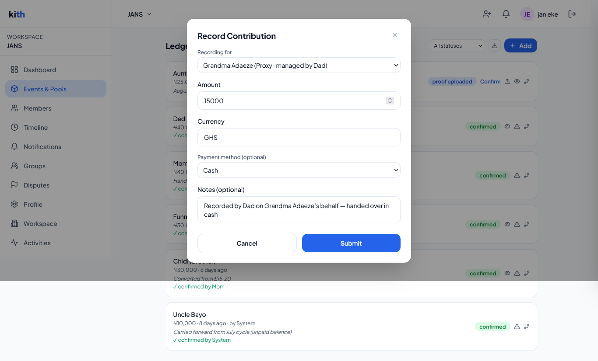
*What it actually looks like when an admin exercises the proxy-recording rule described above — Dad recording ₵15,000 (GHS) in cash on Grandma Adaeze's behalf, with the note documenting who handed the money over. This is the concrete mechanism behind "proxy members can never self-submit."*

### Adding a member
Admins add members directly (as opposed to the invite-link flow, which is self-service for the person joining). A direct-add member has a display name, relationship to the family head, relationship category (blood/marriage/in-law/friend/other), optional date of birth, optional admin notes, and their proxy configuration if applicable. If marked as a proxy managed by another member, that manager must themselves be an active admin — you can't designate a random member as a proxy's manager.

### Editing a member
Field-level authorization, not just endpoint-level: a member can edit their **own** display name, relationship-to-head, and date of birth. Only an admin can change role, proxy status/manager, active status, admin notes, or relationship category — attempting to change an admin-only field as a non-admin fails even if you're editing your own record. Every field-level change is captured in a per-member **profile audit trail** (`member_profile_audit`), recording old value, new value, who changed it, and whether the change came from an admin or the member themselves.

An **optimistic-locking** mechanism (a `version` field carrying the record's last-known `updated_at`) protects against two people editing the same member record at the same moment — if the record has moved on since the client last fetched it, the update is rejected with a clear "refresh and try again" message rather than silently overwriting a concurrent change.

### Removing a member
Two distinct outcomes depending on history and an explicit `force` flag:
- **Soft-delete (default):** marks the member inactive and deleted, but their historical ledger entries, tasks, and audit trail remain intact and attributable.
- **Hard-delete (`force=true`):** only permitted if the member has **no confirmed ledger entries** — you cannot erase someone's record if real money movement is attached to them, even if you explicitly ask to force it.

A **last-admin guard** prevents a workspace from ever being left with zero admins: removing (or demoting) the sole remaining admin is blocked with a clear error asking the caller to promote someone else first.

Removing a member sends them a `member_removed` notification (unless hard-deleted, since there's no one left to notify meaningfully) and proactively invalidates any cached authorization state for that user in that workspace, so a just-removed member can't ride a stale 30-second cache window into continued access.

### Engagement scoring
Each non-proxy member is scored `active` (activity within 30 days), `quiet` (31–90 days), or `inactive` (90+ days), based on the most recent of: their last login, their last confirmed ledger entry, or their last completed task. This is computed identically whether viewed live via the API or recalculated nightly by a background job — both paths share one batched implementation to avoid the classic bug of "the two places that compute the same number don't quite agree."

### Contribution summary
Per-member, per-workspace: total containers they've participated in, total confirmed contributions (count and amount), last contribution date, and a per-container paid-vs-target breakdown. This is the "how has this person actually shown up financially" view — used both for admin oversight and for a member checking their own standing.


*A workspace's full member list: two admins, regular members with per-member engagement status (`success`/`warning`/`archived`), and — at the bottom — two Proxy members, "Baby Kayode" and "Grandma Adaeze," each tagged with the admin who manages them. This is the concrete shape of the proxy-membership model described above.*

### Permissions summary

| Action | Member (self) | Member (other) | Admin |
|---|---|---|---|
| View member list | ✅ (limited fields) | ✅ (limited fields) | ✅ (full fields incl. admin notes, last-active) |
| Edit display name / relationship / DOB | ✅ | ❌ | ✅ |
| Edit role / proxy / active / admin notes | ❌ | ❌ | ✅ |
| View own profile history | ✅ | ❌ | ✅ (any member) |
| View own contribution summary | ✅ | ❌ | ✅ (any member) |
| Remove a member | ❌ (except see last-admin rule) | ❌ | ✅ |
| View engagement scores | ❌ | ❌ | ✅ |

---

## 10. Groups

### Why it exists
Adding the same eight cousins to every event container one-by-one is tedious and error-prone. Groups exist purely to make bulk participant management fast and consistent.

### What a group is
A named, optionally described, admin-managed collection of workspace members — e.g., "Immediate Family," "US Cousins," "Grandkids." A member can belong to any number of groups.

### Creating and managing groups
Admins create a group with an initial member list (optional — can start empty). Adding members later validates every proposed member ID against the workspace's actual active members before inserting, silently skipping invalid IDs and reporting how many were skipped versus how many were newly added versus how many were already present — so a bulk operation never partially fails opaquely.

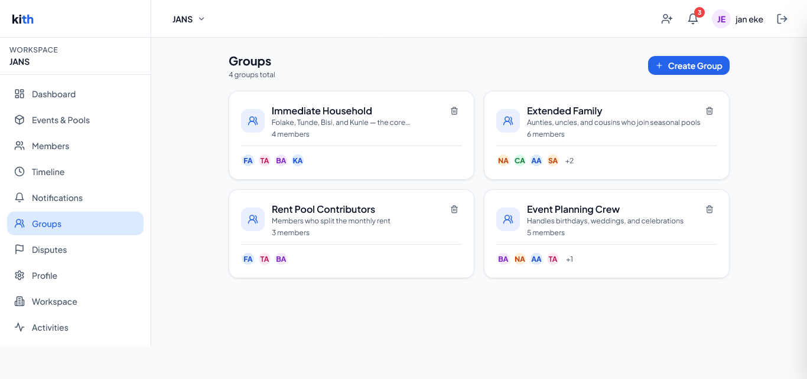
*Four groups covering different overlapping subsets of the same nine-member workspace — the "Rent Pool Contributors" group is a strict subset of "Immediate Household," while "Extended Family" and "Event Planning Crew" pull in different combinations of aunts, uncles, and cousins. This is what makes "add the usual eight people to this year's Christmas fund" a single action.*

### Using a group
The primary payoff: **"add participants from group"** on a container takes a group ID and, in one call, adds every valid member of that group as a participant, with money/task enablement flags applied uniformly. This turns "add the usual eight people to this year's Christmas fund" into a single action instead of eight.

### Permissions
Group management (create/update/delete/add-members/remove-members) is entirely admin-only. Even viewing the group list is currently gated behind membership (any active member can see groups exist), but viewing group *details* (who's in it) requires admin — reflecting that group membership can reveal relationship structure some workspaces may want to keep admin-visible only.

### Business rules
- Member validation on every add operation — you cannot add a member ID that isn't an active member of the same workspace.
- Duplicate-add is a no-op, not an error (upsert with `ignoreDuplicates`), so re-running "add these ten people" after nine were already added just adds the tenth.
- Deleting a group does not affect any container a group's members were already added to as participants — the group is a convenience mechanism at add-time, not a live-synced relationship.

---

## 11. Invitations

### Why it exists
A family can't be built entirely by an admin manually typing in everyone's details — people need to be able to join themselves, ideally by tapping a link a relative sent them in a text message.

### Creating an invite
An admin generates a workspace invite link: a cryptographically random 24-byte token, valid for 7 days, single-use. The response includes a ready-to-share URL (`{frontend}/invite/{token}`).

### Invite preview (public, no login)
Before committing to sign up, a prospective member can view an invite's landing page — workspace name, who invited them, and a preview of up to three active containers — without authenticating. This is deliberately designed to answer "what am I joining?" for a family member who's never heard of Kith before. For security, **every** failure mode (not found, expired, already used) returns the same generic "invalid invite" shape rather than distinct error codes, specifically to prevent invite-token enumeration attacks that could otherwise distinguish "this token doesn't exist" from "this token existed but expired."

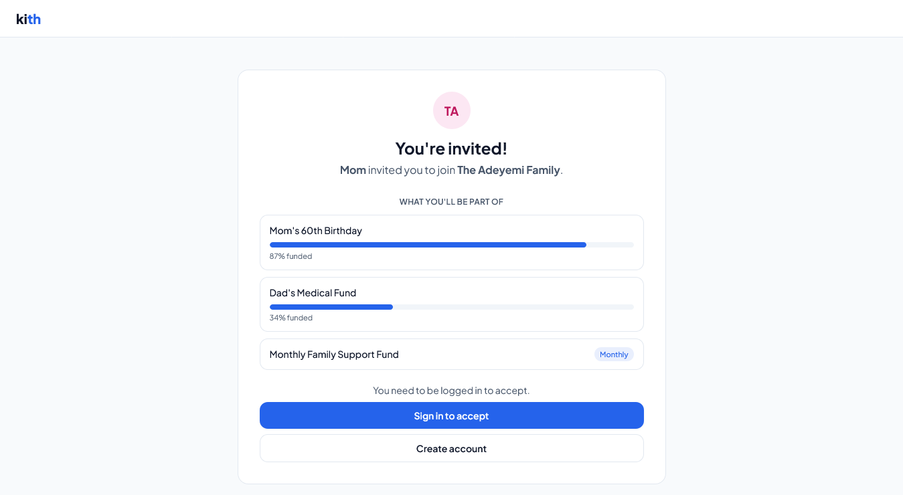
*What a prospective member sees before ever creating an account — the inviting workspace's name, who sent the invite, and a preview of active containers with live funding progress. Nothing here requires authentication.*

### Accepting an invite
Requires authentication (sign up first if needed, then accept). Acceptance is engineered against a real race condition: two browser tabs, or a double-tap, both trying to accept the same invite simultaneously. The claim is done as a single atomic conditional database update (`UPDATE ... WHERE used_at IS NULL`) rather than a check-then-act sequence, so only one of two simultaneous attempts can ever win — the loser gets a clean "already used" error instead of both succeeding and creating duplicate memberships. Accepting creates the new membership (role: member, display name from the user's profile) and notifies all workspace admins that someone joined.

A user who is already an active member of the workspace gets a clear conflict error rather than a silent duplicate membership.

### Managing invites
Admins can list all outstanding invites (with inviter name resolved) and revoke any invite before it's used.

### Automatic cleanup
A nightly background job deletes invite links that have expired *and* were never used — keeping the `invite_links` table from accumulating dead rows indefinitely. Used invites are retained (they're evidence of who invited whom).

### Legacy compatibility
There are two invite-acceptance URL shapes in the codebase (`/v1/invites/:token/accept` and `/v1/public/invites/:token/accept`) — both work identically and route to the same underlying logic; the older one is preserved for backward compatibility with any client still calling it.

### Notifications triggered
- On accept: all active admins receive an `invite_accepted` notification.

### Rate limiting
Invite acceptance is limited to 10/hour per authenticated user (prevents rapid-fire abuse of the accept endpoint), and the public preview endpoint has its own tighter IP-based limit (30/minute) specifically tuned against token-enumeration attempts, separate from the general API rate limit.

---

## 12. Containers — Events & Recurring Pools

### Why it exists
This is the organizing unit for "the thing the family is actually coordinating." Kith deliberately supports two shapes of that under one model, because families genuinely have both kinds of coordination need and treating them as the same underlying entity (with different behavior) lets a family convert one into the other as circumstances change — a one-time event can become an ongoing pool without losing history.

### Event containers
A one-off thing with a specific date: a wedding, a funeral, a graduation, a birthday. Has a name, subtitle, description, event date, an event type/category (celebration, memorial, financial, logistical, other), and optionally a budget target/currency if money tracking is enabled.

### Recurring pool containers
An ongoing thing with a cadence: a monthly family support fund, a rotating susu, an ongoing medical care pool. Has a recurrence cadence (weekly/monthly/quarterly/yearly/custom-days), a start date, an optional end date, and a `carry_forward_unpaid` flag determining whether an unpaid balance rolls into the next cycle or is simply left behind when a cycle closes.

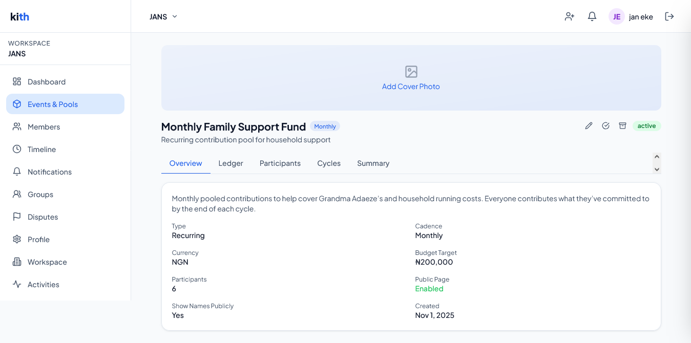
*A recurring pool's own detail page — the tabbed Overview/Ledger/Participants/Cycles/Summary view every container shares, showing the pool's cadence, currency, budget target, and public-sharing settings at a glance.*

### Enabling money and/or tasks
Independently of container type, a container can have `enable_money`, `enable_tasks`, both, or (rare but valid) neither — e.g., a purely logistical event container that's just a shared task list with no financial component (planning who does what for a family reunion, with no pooled money involved).

### Creating a container
Admin-only. Creating a recurring container automatically enqueues an initial cycle-generation job (see [Section 25](#25-background-jobs--scheduling)) so cycles exist before anyone tries to contribute — if that enqueue fails for infrastructure reasons, it's not lost: the nightly cycle-generation maintenance job will pick it up regardless.

### Listing & viewing containers
The list view is enriched per-container with participant counts and confirmed-total-so-far, computed inline rather than requiring a separate call per container. The detail view additionally resolves the container's *current* cycle (for recurring pools) and the calling member's own participation record, so a member opening a container immediately sees "here's what I owe" without a second request.

### Completing an event
Marks an event `completed`, captures an optional outcome description and outcome files (e.g., photos from the event, a final expense breakdown), and — this is a meaningful cross-feature link — **automatically creates a milestone** in the family timeline titled "{container name} completed." All participants are notified. This is why "milestones" and "completed events" are shown merged in the family timeline (see [Section 17](#17-milestones--timeline)) — a completed event *is* a family milestone by default, without anyone having to remember to log it separately.

### Converting an event to a recurring pool
A one-time event can be converted into an ongoing recurring pool — e.g., a family realizes their one-off "help pay for Dad's surgery" fund needs to become an ongoing monthly care fund. This is implemented as a single atomic database transaction (container creation + participant carry-over happen together or not at all), specifically to prevent the failure mode of a new recurring container existing with zero participants because a crash happened between the two steps. The source container remains untouched and linked via `converted_from_id` — nothing about the original event's history is lost or rewritten.

### Archiving, deleting, restoring
- **Archive**: soft state change from active/completed to archived — reversible, doesn't affect data.
- **Delete**: soft-delete (sets `deleted_at`), but **blocked** if the container has any confirmed ledger entries — you cannot make real financial history disappear by deleting its container.
- **Restore**: un-deletes a soft-deleted container.

### Public sharing
A container can generate a public share token, producing a URL anyone can view without logging in — showing name, subtitle, event date, budget progress, and (only if the container owner has explicitly enabled `public_show_names`) a list of contributors and their paid/pending status. This is designed for the "share a fundraiser link with extended family who aren't even in the workspace yet" use case. Contributors who are individually flagged `exclude_from_public` are omitted from the public contributor list even when names are otherwise shown — giving individual participants an opt-out from a container-level setting.

### Container summary
A rich, per-container financial rollup: for each participant, their current target, confirmed/pending totals, outstanding balance, and a computed status (`paid`, `partial`, `pending`, `overdue`, or `no_target`). Non-admins viewing this summary see only their **own** detailed row — everyone else's row is reduced to just name/role/status, protecting the privacy of individual contribution amounts from peer-level visibility while still letting a member see "who's paid and who hasn't" at a glance.

### Business rules
- Disabling money tracking on a container that already has ledger entries is blocked.
- Container-level `public_token` generation doesn't require money to be enabled — a purely informational public event page is valid.
- Cover photos and outcome files both go through the same signed-upload-then-confirm flow as every other file in the system (see [Section 23](#23-file--media-management)).

### Related features
Containers are the anchor point for [Participants](#13-participants--contribution-targets), the [Ledger](#14-the-ledger--financial-contribution-tracking), [Tasks](#16-tasks), and cycles. Completing one creates a [Milestone](#17-milestones--timeline). The [Dashboard](#18-dashboard) surfaces active containers and their progress. [Search](#19-search) indexes containers by name.

---

## 13. Participants & Contribution Targets

### Why it exists
A workspace member being "in the family" and a workspace member being "involved in this specific fundraiser" are different facts. Participants model the second one — and crucially, carry their *own* target, separate from any other participant's, because family contributions are essentially never equal (a working adult child and a retired grandparent are not expected to contribute the same amount to the same fund).

### Adding participants
Admins add participants either individually (with per-participant money/task enablement and an optional initial target) or in bulk from a [Group](#10-groups). Every proposed member is validated against real, active workspace membership before insertion; invalid IDs are silently skipped and reported back rather than causing the whole batch to fail. Participants cannot be added to a container that's already completed or archived.

### Per-participant configuration
Independent of the container's own `enable_money`/`enable_tasks` flags, each participant has their own `money_enabled`/`tasks_enabled` — so a container can have money enabled overall while a specific participant (say, someone only helping with logistics, not money) is excluded from the financial side.

### Setting a target
A target is an amount, currency, and optional due date. Setting a new target is implemented as a single atomic database operation (via a stored procedure) that both retires the previous target (marking it no longer current) and inserts the new one — not two separate writes — closing a race window where a concurrent read could otherwise see either no current target or two simultaneously-current targets. Every change is preserved in a full **target history**, viewable per-participant.

### Removing a participant
Blocked if the participant has any confirmed ledger entries — the same "can't erase real financial history" principle applied at container-deletion prevents it here too.

### Cycle-specific targets (recurring pools)
For a recurring container, a participant can have a *different* target per cycle (e.g., an admin override adjusts one person's contribution for one specific month without changing their standing target going forward). The per-participant "cycle targets" view shows, cycle by cycle, what was expected, what was confirmed, and a computed status (paid/partial/pending/overdue/skipped).


*Three consecutive cycles of the same recurring pool: Cycle 9 closed at 95% funded, Cycle 10 is open with a live participant breakdown — note Uncle Bayo's ₦10,000 carried forward from the prior cycle, shown inline — and Cycle 11 sits upcoming with zero collected. This is the automatically-generated 3-month horizon described in [Background Jobs & Scheduling](#25-background-jobs--scheduling).*

### Admin cycle overrides
Three override types an admin can apply to a specific upcoming or open cycle:
- **Pause the whole pool** for that cycle (marks the cycle `skipped` — no one owes anything that period).
- **Skip one member** for that cycle (everyone else still owes their normal target).
- **Adjust one member's target** for that cycle only (doesn't change their default going-forward target).

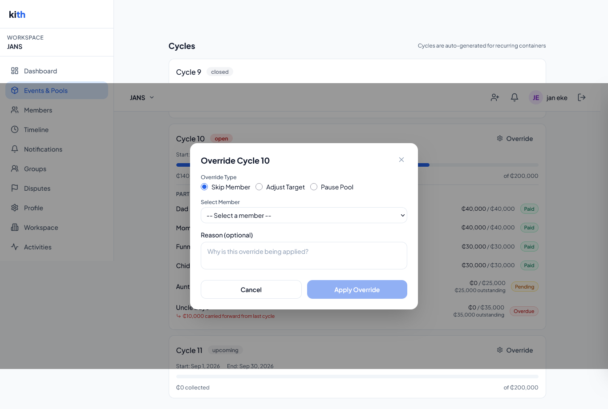
*The override dialog an admin sees when applying one of the three exception types to a specific cycle — the same three options described above, applied directly against the cycle shown in the screenshot before it.*

### Permissions
Participant management (add/update/remove/set-target/overrides) is admin-only. Viewing one's own participation, target history, and cycle targets is available to any member for their own record; the participant *list* itself is admin-only (it reveals everyone's targets and statuses together).

---

## 14. The Ledger — Financial Contribution Tracking

### Why it exists
This is the trust-critical core of the product. Every dollar a family member says they contributed has to be recorded in a way that (a) can be verified, (b) can't silently be lost to a network hiccup or double-submitted by an anxious double-tap, and (c) creates an audit trail robust enough to settle a real disagreement between relatives.

### Recording a contribution or expense
A member records their own contribution; an admin can record on behalf of *any* participant, including proxy members (who can never self-record — see [Section 9](#9-membership-system)). Entries carry an original amount/currency (what was actually paid, in whatever currency that happened to be) and a base amount (converted to the workspace's base currency for consistent aggregation), plus an optional payment method and note.

**Idempotency.** Clients are expected to send an `X-Idempotency-Key` header (a UUID generated once per submission attempt) on every contribution POST. If that exact key has already produced an entry, the same entry is returned instead of a duplicate being created — this is what makes it safe for a mobile client to retry a submission after a flaky network response without any risk of double-charging the record. Idempotency is a genuine safety net, not just an optimization: it's what allows "did that actually go through?" retries to be truly free of side effects.

**Duplicate detection.** Independent of idempotency keys, if a contributor submits the *same amount* to the *same container* within a 10-minute window, the second attempt is blocked with a clear "possible duplicate" error (pointing at the existing entry) unless explicitly overridden with `?force=true`. This catches the human error of literally re-submitting a payment because someone forgot they already logged it, which idempotency keys alone wouldn't catch (a fresh submission has a fresh key).


*The 10-minute duplicate-detection heuristic surfacing in the UI — it names the existing entry it's comparing against and explains the likely cause (a slow connection or a double-tap) rather than just rejecting outright, while still leaving a genuine second contribution ("Submit anyway") unblocked.*

**Status lifecycle.** A member's own submission starts `pending`. An admin's own direct entry is auto-`confirmed` (an admin recording something is treated as already-verified). A pending entry can move to `proof_uploaded` once a proof file is attached, and then to `confirmed` once an admin reviews and confirms it — or directly from `pending` to `confirmed` if an admin confirms without requiring a proof upload step.

### Proof of payment
A contributor (or an admin on their behalf) can upload a photo or PDF as evidence of payment. Crucially, the system doesn't just trust the client's declared file type — see [Section 23](#23-file--media-management) for the real byte-signature verification step that runs before a "confirmed" proof is trusted.

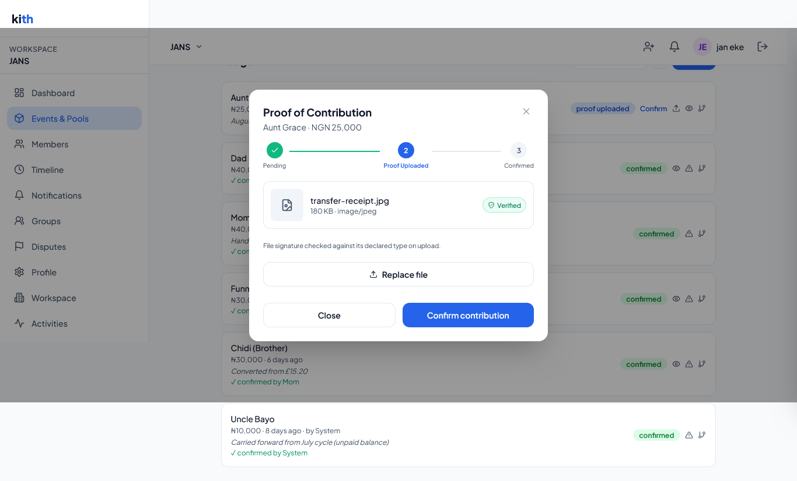
*The proof-of-payment modal an admin sees when reviewing a pending entry: the three-stage status stepper described above, the uploaded file with its post-upload verification result ("Verified" — the magic-byte check from [§23](#23-file--media-management) already ran and passed), and the confirm action.*

### Confirming an entry
Admin-only action moving a `pending`/`proof_uploaded` entry to `confirmed`, notifying the contributor that their payment was acknowledged.


*The full lifecycle in one diagram — submission through confirmation to an immutable confirmed entry, with dispute and correction modeled as the only two branches off it. A fuller architectural treatment is in [ARCHITECTURE.md §21.1](ARCHITECTURE.md#211-recording-and-confirming-a-contribution-ledger-entry).*

### Editing and deleting
Only entries still in `pending` status can be edited or deleted, and only by the original contributor or an admin — once an entry is confirmed, it becomes effectively immutable; the only way to adjust a confirmed entry's numbers is a **correction** (see [Section 15](#15-disputes--corrections)), never a silent edit. This is a deliberate design choice: confirmed financial history should never just change underneath someone.

### Ledger summaries and export
Per-container and per-workspace summaries roll up confirmed/pending/disputed counts and totals. A full CSV export (workspace-wide, optionally filtered to one container and/or a date range) is available to admins for reconciliation, tax records, or sharing with family members who want the raw numbers.

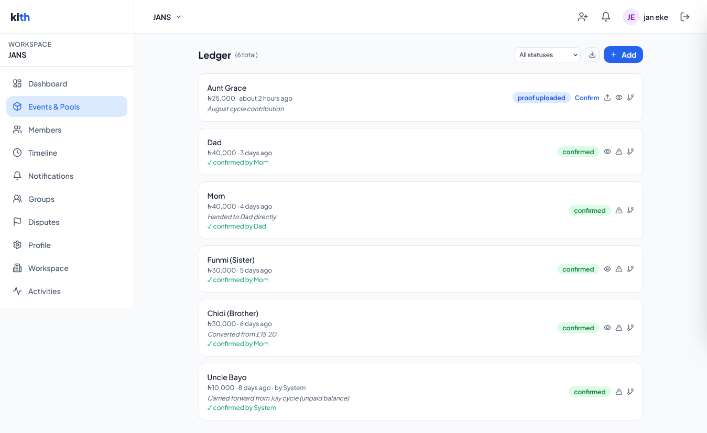
*Six entries spanning nearly every status and provenance the ledger supports in one container — proof-uploaded, member-submitted and admin-confirmed, a same-admin direct entry, a converted-currency contribution, and the carried-forward balance confirmed by "System" rather than a person.*

### Business rules
- A contributor must actually be an active **participant** of the container, with `money_enabled`, before any entry can be recorded for them.
- Proxy members can only have entries recorded by an admin.
- A cycle ID on an entry (for recurring pools) must actually belong to the container being contributed to.
- Every entry recording notifies the relevant admins (on submission) or the contributor (on confirmation) — see [Section 20](#20-notifications).

### Related features
Ledger data feeds the [Dashboard's](#18-dashboard) overdue summaries and pending-confirmations queue, the [Container Summary](#12-containers--events--recurring-pools), per-[Member](#9-membership-system) contribution summaries, [cycle lifecycle](#25-background-jobs--scheduling) carry-forward calculations, and the [Data Export](#22-data-export-gdpr) job.

---

## 15. Disputes & Corrections

### Why it exists
Money between relatives is emotionally loaded. "I already paid that" or "that's not what I agreed to contribute" needs somewhere to go that isn't a group chat argument — a structured, admin-adjudicated process with a permanent record of how it was resolved.

### Raising a dispute
Any contributor can raise a dispute against their own confirmed or pending ledger entry (admins can raise one against any entry), providing a reason. Raising a dispute is implemented atomically: the dispute row is created *and* the underlying ledger entry's status flips to `disputed` in the same database transaction, so there's no window where a dispute exists but the entry still shows as confirmed (or vice versa). All active workspace admins are notified immediately, flagged as an `urgent`-channel notification (in-app, push, *and* email) given the sensitivity of a financial disagreement.

### Adding notes
Either the person who raised the dispute or an admin can append notes to an open dispute as the conversation develops — building a timestamped, attributed thread of the resolution discussion that lives with the dispute permanently.

### Resolving a dispute
Admin-only, requires a resolution note of at least 10 characters (preventing a bare "resolved" with no explanation). Like raising, resolution is atomic — the dispute's status and the underlying ledger entry's status update together. The person who originally raised the dispute is notified of the resolution.

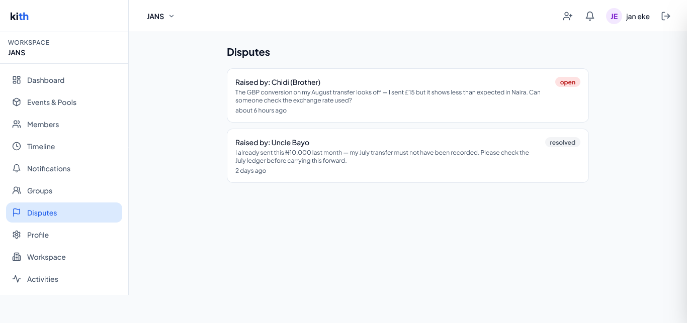
*The workspace-level dispute list an admin sees — an open dispute awaiting review and a resolved one for reference, both showing who raised them and why. This is the entry point into the single-dispute detail view below.*

### Corrections
A **correction** is the mechanism for adjusting a *confirmed* ledger entry's recorded numbers without ever editing or deleting the original — it's a new, linked ledger entry (`entry_type: 'correction'`) referencing the entry it corrects, with its own amount, currency, and a mandatory explanatory note (minimum 10 characters). This preserves a complete, honest history: anyone looking at the ledger later sees both what was originally recorded *and* the correction that followed, rather than a silently altered number. Corrections can only be applied to confirmed entries — a pending or proof-uploaded entry should simply be edited or deleted directly instead, since nothing has been "confirmed" yet to correct.

### Permissions

| Action | Contributor (own entry) | Any Member | Admin |
|---|---|---|---|
| Raise a dispute | ✅ | ❌ (unless own) | ✅ (any entry) |
| Add a note | ✅ (if raiser) | ❌ | ✅ |
| Resolve a dispute | ❌ | ❌ | ✅ |
| Post a correction | ❌ | ❌ | ✅ |
| View own disputes | ✅ | — | ✅ (all) |

### Related features
Disputes are surfaced in the [Audit Log](#21-audit-log--activity-feed) and trigger [Notifications](#20-notifications). A disputed entry's amounts are excluded from "confirmed" totals wherever aggregates are computed until resolved.

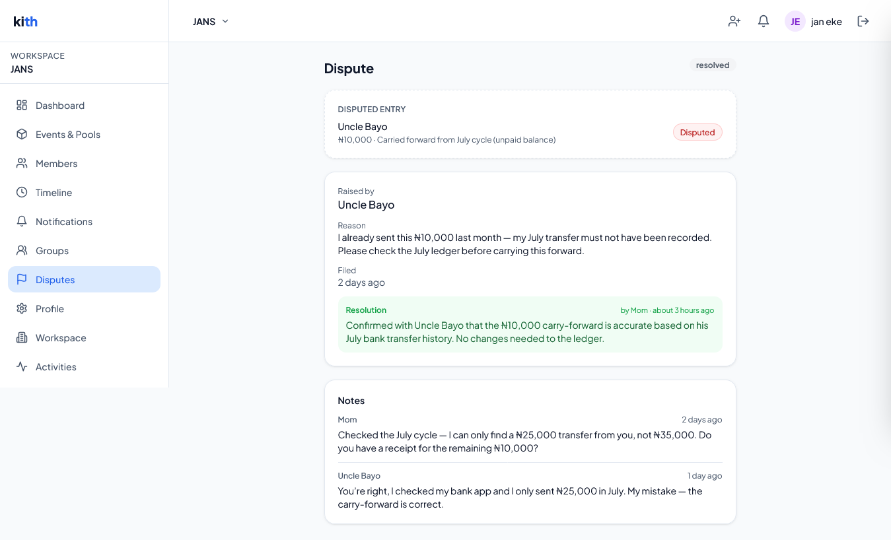
*A resolved dispute end to end: Uncle Bayo disputes a ₦10,000 carried-forward balance he believes was already paid, Mom investigates via the notes thread — asking for specifics, getting a correction from Uncle Bayo himself — and the resolution note documents the outcome. A permanent record of both the disagreement and how it was actually settled, exactly as described above.*

This single flow touches the ledger's immutability guarantee, the RBAC model, the notification system, and the audit trail all at once, which is why it's referenced again from [ARCHITECTURE.md §21.1](ARCHITECTURE.md#211-recording-and-confirming-a-contribution-ledger-entry) rather than duplicated here.

---

## 16. Tasks

### Why it exists
Not every family coordination need is financial — someone still has to book the venue, order the cake, or pick up Grandma from the airport. Tasks give containers a lightweight to-do layer that shares the same participant/permission model as money, so "who's responsible for what" lives next to "who owes what" instead of in a separate app.

### Creating tasks
Admins create individual tasks (title, description, optional assignee, optional due date) or bulk-create up to 50 at once (e.g., pasting in an entire event-planning checklist). An assignee must already be a participant in the container. Bulk creation isolates per-item failures — if task #14 in a batch of 30 has an invalid assignee, the other 29 still succeed, and the response reports exactly which index failed and why, rather than the whole batch rolling back over one bad row.

### Status lifecycle
`pending → in_progress → completed`, with an automatic `overdue` state applied by a nightly background sweep to any still-pending task past its due date. The assignee can move their own task between `in_progress` and `completed` — that's the *only* status transition a non-admin is allowed to make directly; every other field (title, description, reassignment, due date, sort order) is admin-only. This split exists so an assignee can honestly report their own progress without being able to quietly reassign work away from themselves or rewrite the task's requirements.

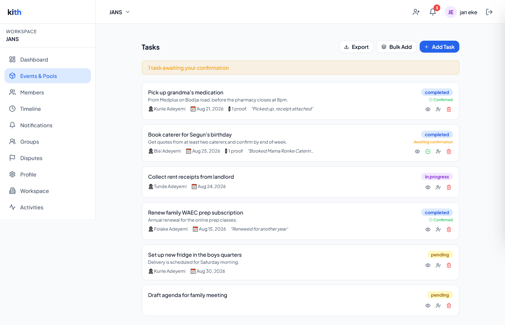
*A container's full task list spanning the whole lifecycle at once — confirmed, awaiting confirmation, in progress, and pending — with a completion note and a proof attachment visible on the finished items. The "1 task awaiting your confirmation" banner at the top is the same signal that feeds the dashboard's pending-confirmations queue.*

### Reassignment
Admin-only, and blocked once a task is already `in_progress` or `completed` — you can't yank a task away from someone mid-flight; the status must be reset first if a genuine reassignment is needed after work has started.

### Admin override & confirmation
An admin can hard-override a task's status directly (with an optional note) for edge cases the normal flow doesn't cover, and can formally **confirm** a task that's already marked `completed` by its assignee — a lightweight "yes, I've verified this was actually done" step, guarded against double-confirmation.

### Completion proof
Like ledger entries, a task can have a photo/PDF proof of completion attached, verified against its real file signature before being trusted (see [Section 23](#23-file--media-management)).

### Overdue detection
A nightly job flips any `pending` task past its due date to `overdue` and notifies both the assignee and all workspace admins — this is what makes "did anyone notice this slipped?" not depend on a human checking.

### Export
CSV export is available to both admins (every task in the container) and members (their own tasks only) — sharing the same underlying CSV builder so both paths produce identically-formatted output.

### Permissions

| Action | Assignee | Other Member | Admin |
|---|---|---|---|
| View own task | ✅ | ❌ | ✅ |
| Set status to in_progress/completed | ✅ | ❌ | ✅ |
| Edit title/description/due date/assignee | ❌ | ❌ | ✅ |
| Reassign | ❌ | ❌ | ✅ (if not started) |
| Confirm completion | ❌ | ❌ | ✅ |
| Delete | ❌ | ❌ | ✅ |

### Related features
Task assignment and completion both trigger [Notifications](#20-notifications) (`task_assigned`, `task_completed`, `task_overdue`, `task_confirmed`). Task completion feeds [Member engagement scoring](#9-membership-system). A dedicated task widget on the [Dashboard](#18-dashboard) is a planned addition — see [Section 34](#34-product-roadmap).

---

## 17. Milestones & Timeline

### Why it exists
A family's shared history — births, graduations, weddings, deaths, migrations — is worth remembering as a first-class part of the product, not just a side effect of financial containers. The Timeline is Kith's answer to "what has this family actually been through together," and it deliberately blends two sources so nobody has to double-enter the same life event once as a "milestone" and again as a "completed event."

### Recording a milestone
Admins can manually log a milestone: a title, a date, a description, and a type (birth, graduation, wedding, death, migration, achievement, or custom). Milestone photos can be attached via the same signed-upload-then-confirm flow used everywhere else.

### Automatic milestones from completed events
Completing an event container ([Section 12](#12-containers--events--recurring-pools)) automatically creates a corresponding milestone — so a wedding fundraiser, once marked complete, appears in the family timeline without anyone re-typing "we had the wedding" as a separate entry.

### The combined timeline
The `/timeline` endpoint merges completed containers and manually-logged milestones into a single reverse-chronological feed. Pagination here solves a subtle correctness problem: because the feed merges *two different underlying tables* with potentially very different item counts on any given page, a single shared "load the next 20 before this date" cursor could skip items if one source runs out before the other. The implementation instead tracks **two independent cursors** (one per source), so paging through a merged, unevenly-distributed timeline never silently drops an item that simply hadn't been "used" yet from whichever source was momentarily behind.

### Permissions
Any active member can view the timeline. Creating, editing, and deleting milestones is admin-only.

### Related features
Directly tied to [Container completion](#12-containers--events--recurring-pools). Feeds the general sense of the family's shared narrative that the [Dashboard](#18-dashboard) and product as a whole are trying to preserve.

---

## 18. Dashboard

### Why it exists
An admin running a family's shared finances shouldn't need a spreadsheet on the side to know what's outstanding right now. The dashboard is the single "what does this family need my attention on today" view — assembled from nearly every other subsystem in one call.

### What it shows
- **Workspace summary**: active member count, admin count, proxy count.
- **Active events**: every active event container, each with participant count, confirmed total vs. budget target, days-until-event, and progress percentage.
- **Recurring pools**: every active recurring container with its current open/upcoming cycle.
- **Upcoming deadlines**: every contribution target due within the next 14 days, resolved down to the contributor's actual name and the container's actual name (not just raw IDs).
- **Pending confirmations** *(admin only)*: the ten oldest ledger entries still awaiting admin confirmation, across the whole workspace — this is the actionable "things waiting on you" queue.
- **Recent activity**: the ten most recent audit log entries, rendered as human-readable descriptions ("Aunt Grace confirmed a contribution") rather than raw action codes.
- **Unread notification count**: for the calling member specifically.

### Overdue summary
A separate, admin-only endpoint computes — across every active, money-enabled container in the workspace — which members have a **past-due** target with an outstanding (unpaid) balance, grouped per member with a breakdown by container. This is the "who do I need to follow up with" view, distinct from the dashboard's forward-looking "what's coming due" list.

### Design notes
The dashboard assembles its payload from a single batched set of parallel queries rather than one query per widget, and pre-resolves display names (for targets/deadlines) in a small number of additional batched lookups rather than one lookup per item — the kind of detail that matters because this is the screen a family admin looks at most often, so it needs to load fast even as a workspace's container/member count grows.

### Permissions
Every active member sees the dashboard; the pending-confirmations widget and the overdue-summary endpoint are admin-only (they expose workspace-wide financial detail beyond what a regular member should see about others' contributions).

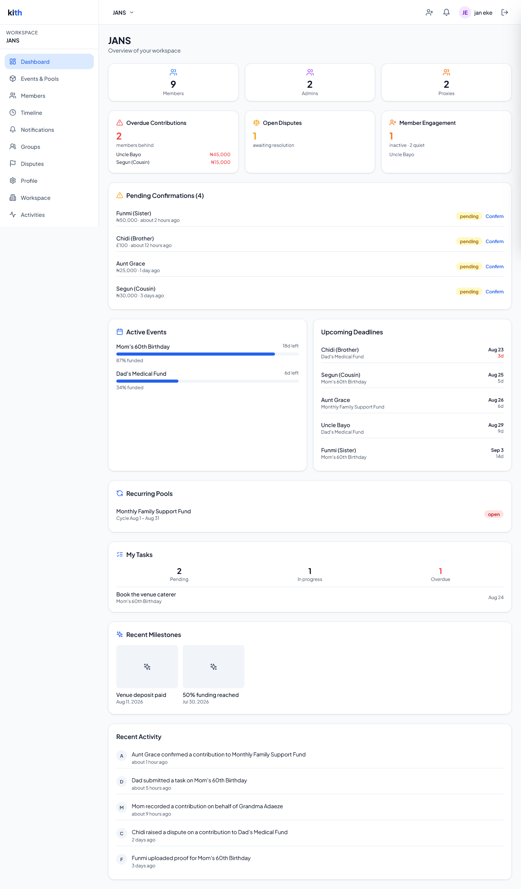
*The dashboard in a real workspace ("JANS"), assembled from nearly every subsystem described in this document: overdue balances, an open dispute, pending confirmations awaiting admin action, active events with budget progress, a recurring pool's current cycle, personal tasks, recent milestones, and a human-readable activity feed — all on one screen.*

---

## 19. Search

### Why it exists
As a workspace accumulates members, groups, and containers over months or years, "scroll and find it" stops working. Search gives a fast way to jump straight to a specific person or container by name.

### What's searchable
Active workspace members (by display name) and non-deleted containers (by name), within the calling workspace only — search never crosses workspace boundaries. Results are typed (`member` vs `container`) so a client can render them distinctly with appropriate icons/actions.

### How it works
A simple, fast case-insensitive "contains" match, requiring at least 2 characters (avoiding the noise and cost of running a query for a single keystroke), capped at 20 results per type. User input is explicitly escaped before being embedded in the underlying pattern-match query — without this, a search containing `%` or `_` characters (which are wildcard metacharacters in the underlying pattern language) could silently match far more broadly or narrowly than the user intended, or in a worst case be used to probe unrelated data; this same escaping utility is shared with the member-list search so the fix applies everywhere the same kind of query appears, not just here.

### Permissions
Available to any active workspace member — search results respect the same workspace-membership boundary as everything else, but don't apply the finer-grained "can only see your own financial detail" restriction that container summaries do, since search only ever returns names/types, never financial figures.

---

## 20. Notifications

### Why it exists
A coordination tool that doesn't proactively reach people isn't actually coordinating anything — it's just a database someone has to remember to check. Notifications are what make Kith feel like an active participant in the family's coordination rather than a passive ledger.

### The template registry
Every notification type in the product is a named template with a title, a body (with `{variable}` placeholders filled in per-send), and a declared set of channels it should attempt: `in_app`, `push`, and/or `email`. There are sixteen templates covering essentially the entire product surface:

| Template | Triggered by | Channels |
|---|---|---|
| `contribution_submitted` | Member submits a pending contribution | in_app, push |
| `contribution_confirmed` | Admin confirms a contribution | in_app, push |
| `contribution_disputed` | A dispute is raised | in_app, push, **email** (urgent) |
| `dispute_resolved` | Admin resolves a dispute | in_app, push |
| `task_assigned` | A task is assigned/reassigned | in_app, push |
| `task_completed` | Assignee marks a task complete | in_app |
| `task_overdue` | Nightly overdue sweep | in_app, push |
| `task_confirmed` | Admin confirms a completed task | in_app |
| `invite_accepted` | Someone accepts an invite | in_app |
| `payment_reminder` | Upcoming due-date reminder | in_app, push |
| `overdue_reminder` | Past-due target reminder | in_app, push |
| `cycle_started` | A recurring pool cycle opens | in_app |
| `cycle_closing_soon` | A cycle is 0–3 days from closing with an outstanding balance | in_app, push |
| `container_completed` | An event is marked complete | in_app, push |
| `admin_announcement` | Admin broadcast | in_app, push, **email** (urgent) |
| `overdue_summary_admin` | Daily per-container overdue rollup, to admins | in_app |
| `member_removed` | A member is removed from the workspace | in_app, push |

### Delivery mechanics
Sending a notification always writes an `in_app` record immediately (satisfied instantly — there's nothing to "deliver," it's just visible in the recipient's inbox). External channels (push, email) are enqueued as background jobs rather than sent synchronously during the request that triggered them, so a slow or failing push provider never slows down the API response for the action that caused the notification. Proxy members are automatically excluded from every channel except `in_app`, since they have no device or inbox of their own.

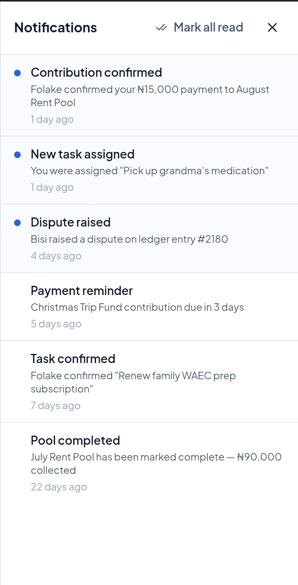
*A recipient's own inbox: unread notifications flagged with a dot, spanning several of the sixteen template types (contribution confirmation, task assignment, a dispute alert, a payment reminder, a task confirmation, and a pool-completion notice), oldest at the bottom.*

### Deduplication
Many notification types carry a computed dedup key (e.g., a specific reminder for a specific target on a specific calendar day) so the same underlying event can't fire the same notification twice — critical for anything a scheduled job might otherwise re-trigger on a re-run.

### Delivery safety net (the outbox pattern)
If enqueueing a push/email delivery job fails at send-time (e.g., a momentary Redis blip), the delivery record is marked `failed` rather than silently lost. A separate background job runs every 5 minutes specifically looking for deliveries stuck in `pending` or `failed` for more than 5 minutes and re-enqueues them — this closes the gap where a transient infrastructure failure during the original send could otherwise mean a notification simply never arrives with no trace of why.

### Push delivery details
Before actually sending a push notification, the system re-verifies the recipient's push token hasn't rotated since the job was queued (a device can get a new token between "notification decided to send" and "worker actually sends it") — sending to a stale token would silently fail anyway, so this check avoids wasted sends and mis-attributed delivery-failure logs.

### Email delivery details
All user-controlled text that ends up inside an HTML email body (container names, task titles, admin announcement text) is HTML-escaped before interpolation — without this, a container literally named `<script>...</script>` (unlikely, but not impossible) could inject arbitrary HTML into a transactional email.

### The inbox
Recipients see a paginated notification list (filterable by read/unread and by workspace), a lightweight unread-count endpoint (cheap enough to poll frequently for a badge icon), and can mark individual notifications or their entire inbox as read.

### Permissions
A user only ever sees their own notifications — there's no concept of viewing another member's inbox, even for admins.

---

## 21. Audit Log & Activity Feed

### Why it exists
Every action that touches shared family money or membership needs to be traceable to a specific person at a specific time — not for surveillance, but for the same reason any shared financial arrangement between people who trust each other *and* want accountability needs a paper trail: it's what lets "who changed this?" always have a real answer instead of becoming a family argument.

### What gets logged
An append-only record covering: container lifecycle (created, completed, archived, deleted, restored, settings changed, participants added, converted to recurring), ledger actions (confirmed, submitted, corrected, deleted), disputes (raised, resolved), workspace actions (settings changed, deleted, announcement sent), membership (created, invited, accepted, removed), groups (created, updated, deleted, members added/removed), cycle overrides, and tasks (created, completed, confirmed). Each entry captures the actor (both their user ID and their workspace-member ID), the workspace, the specific target entity, a metadata payload describing what changed, and the request's IP address and user agent.

### Human-readable descriptions
Raw action codes (`container.settings_changed`) are rendered into readable sentences ("updated container settings," or, when the metadata includes specific changed field names, "changed name, budget_target") for display in the activity feed — the goal being that a non-technical family member reading the dashboard's recent-activity widget sees a sentence, not a code.

### Viewing and exporting
Admins get a paginated, filterable (by action type, by actor, by date range) view of the full audit log, plus a CSV export using the identical filter logic — implemented as one shared filter-building function specifically so the paginated view and the CSV export can never silently drift out of sync and show different results for what should be the same query.

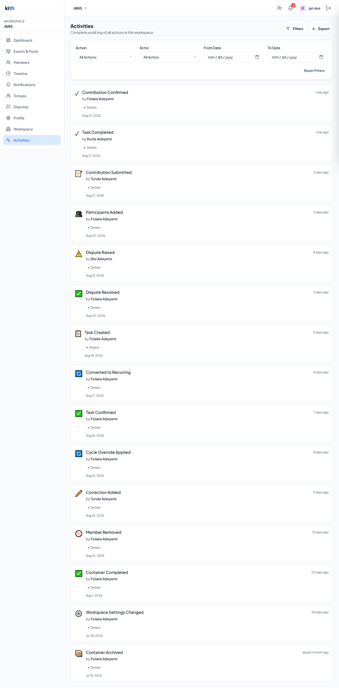
*The complete, filterable audit trail behind the dashboard's recent-activity widget — every consequential action in the workspace, human-readable, timestamped, and attributed to a specific member, with an expandable "Details" row per entry for the full metadata payload.*

### Permissions
Audit log viewing and export are admin-only — this is workspace-wide accountability information, not something every member needs visibility into.

### Related features
Directly powers the [Dashboard's](#18-dashboard) recent-activity widget. Every write-side feature in this document (containers, ledger, disputes, membership, groups, workspace settings, tasks) is an audit-log producer.

---

## 22. Data Export (GDPR)

### Why it exists
Users have a right to a copy of their own data, and building this well upfront avoids it becoming a manual, ad hoc, support-ticket-driven process later.

### How it works
A user requests an export from their account settings; the request is queued as a background job (not processed synchronously, since gathering everything can take real time) and the user is told to expect an email within 24 hours. The background worker resolves every workspace the user is (or was) an active member of, then gathers every ledger entry they contributed and every task ever assigned to them across those workspaces, builds two CSV files (contributions and tasks), and emails both as attachments alongside a personalized summary of what's included.

### Correctness detail worth calling out
Ledger entries and tasks are both keyed by `workspace_members.id`, not the user's own `users.id` (because a single person can hold different membership IDs in different workspaces) — the export explicitly resolves the user's full set of membership IDs across all their workspaces *once*, up front, and reuses that resolved list for both the ledger query and the task query, rather than two independent (and easy to get subtly inconsistent) resolutions.

### Permissions
Entirely self-service and self-scoped — a user can only ever request an export of their own data; there is no admin-triggered export of someone else's data.

### Failure handling
If the email provider isn't configured in a given environment, the export still runs and is logged as generated-but-not-emailed rather than silently failing — useful in development/staging environments without production email credentials.

---

## 23. File & Media Management

### Why it exists
Photos and PDFs (proof of payment, task completion evidence, milestone photos, cover photos, avatars) need to be stored somewhere durable and served efficiently, without turning the API server into a file-upload bottleneck or a security liability.

### The signed-URL pattern
Every upload in Kith follows the same two-step shape:
1. The client asks the API for a signed upload URL for a specific file type/size/name.
2. The client uploads the file **directly to Supabase Storage** using that URL — the bytes never pass through the Kith API server at all.
3. For anything that matters as "evidence" (ledger proofs, task proofs, milestone photos), the client then calls a **confirm** endpoint, which is where server-side verification happens (see below) before the file reference is attached to the actual record.

This keeps the API server fast and stateless with respect to file bytes, while still allowing a verification step before a file is trusted.

### Real file verification (not just trusting the label)
A client declaring a file as `image/jpeg` when generating an upload URL doesn't make it one — nothing stops a browser from uploading arbitrary bytes under a false content-type. For every "confirm" step involving evidence (ledger proofs, task proofs, milestone photos), Kith downloads the just-uploaded file and checks its actual byte signature (magic bytes) against the declared type — a real JPEG starts with `FF D8 FF`, a real PNG with a specific 8-byte signature, a real PDF with `%PDF`, and so on, with a dedicated check for WEBP's non-prefix-position marker. A mismatch is rejected with a clear "file may be corrupted, mislabeled, or not actually an image/PDF" error rather than silently trusting a file that could, for instance, be an HTML file with an embedded script served back to another user with an image content-type. This check can be disabled via configuration if it proves too costly at scale (it does require downloading the full file), but defaults to **enabled**, since it's treated as a security control rather than a convenience feature.

### Size and type limits per use case

| File type | Max size | Allowed formats |
|---|---|---|
| Ledger / task proof | 10 MB | JPEG, PNG, WEBP, GIF, PDF |
| Cover photo | 10 MB | JPEG, PNG, WEBP, GIF |
| Milestone photo | 10 MB | JPEG, PNG, WEBP, GIF |
| Outcome file | 50 MB | JPEG, PNG, WEBP, GIF, PDF |
| User avatar | 5 MB | JPEG, PNG, WEBP |
| Workspace avatar | 5 MB | JPEG, PNG, WEBP |

### Storage path structure
Files are namespaced by owner — `workspaces/{workspaceId}/{folder}/{filename}` for workspace-scoped files (proofs, cover photos, milestone photos), `users/{userId}/{folder}/{filename}` for user-scoped files (avatars) — with a randomized filename component so two uploads never collide even if a user re-uploads a file with the same original name.

### Downloads
Files are served via short-lived signed download URLs (15-minute default expiry) rather than public URLs, so access to a proof photo or milestone image still requires the requester to have gone through the API's own authorization check to obtain the link in the first place.

---

## 24. Public / Unauthenticated Surfaces

Two, and only two, surfaces in Kith are reachable without any authentication at all — both deliberately narrow in scope:

- **Invite preview** (`GET /v1/public/invites/:token`) — see [Section 11](#11-invitations).
- **Public container view** (`GET /v1/public/containers/:publicToken`) — see [Section 12](#12-containers--events--recurring-pools).

Both are protected by a dedicated, tighter rate limiter (30 requests/minute per IP) distinct from the general API rate limit, specifically because unauthenticated lookup endpoints keyed by a guessable-length token are a natural target for enumeration attacks — a generic rate limit tuned for normal API usage would be too permissive to meaningfully slow that down.

There is no public workspace page, no public member directory, and no public search — everything else in the product requires an authenticated session and active workspace membership.

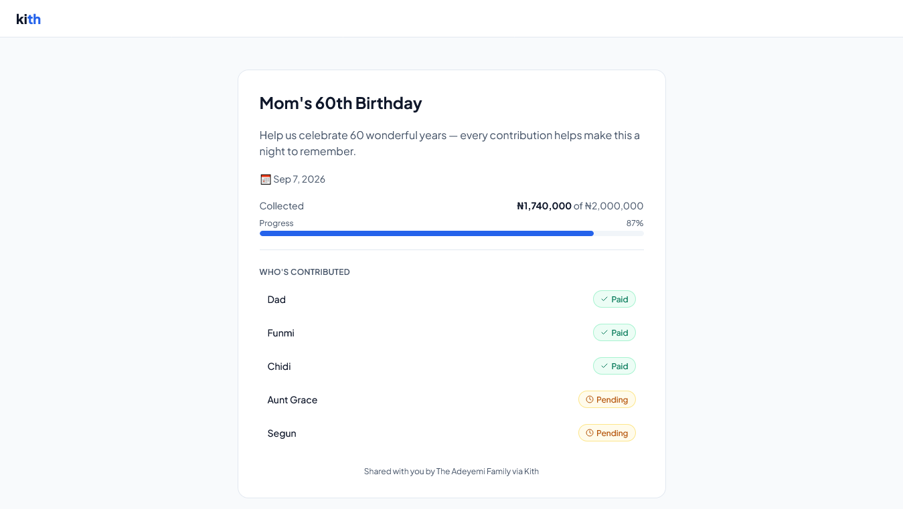
*A container's public share page as seen by someone outside the workspace entirely — no login, no membership. Budget progress and, because this container has `public_show_names` enabled, individual contributors' paid/pending status are visible; the underlying amounts each person gave are not.*

---

## 25. Background Jobs & Scheduling

### Why it exists
Family coordination shouldn't depend on someone remembering to open the app. Recurring pools need to roll forward on schedule, overdue balances need to be flagged without a human checking, and reminders need to go out a consistent number of days before something is due — this is the automation layer that makes Kith feel like it's running continuously rather than only reacting to taps.

### Architecture
Nine BullMQ queues, each with a dedicated worker, backed by the shared Redis instance. A separate scheduler process (or the combined single-process mode) registers cron-based repeatable jobs directly onto each target queue, so "the cron fires" and "the worker picks it up" always agree on which queue is involved — a subtlety worth calling out because the queue a repeatable job is registered on is the queue it will actually enqueue real work items into, and a mismatch there would mean a job schedule that fires into the void.

### The nine scheduled jobs

| Job | Schedule | What it does |
|---|---|---|
| **Reminder scan** | Daily, 07:00 UTC | Sends upcoming-payment reminders (due within 7 days), overdue reminders, admin overdue summaries per container, and cycle-closing-soon reminders (within 3 days, only to members with an outstanding balance) |
| **Cycle lifecycle** | Daily, 00:01 UTC | Opens any `upcoming` cycle whose start date has arrived (notifying each participant of *their own* target amount for that cycle); closes any `open` cycle past its end date, optionally carrying forward unpaid balances as new ledger entries into the next cycle |
| **Task overdue check** | Daily, 06:00 UTC | Flips pending tasks past due date to `overdue`, notifies the assignee and all admins |
| **Invite cleanup** | Daily, 02:00 UTC | Deletes expired, never-used invite links |
| **Engagement check** | Weekly, Sunday 06:00 UTC | Recomputes each non-proxy member's `last_active_at` from their most recent login, confirmed contribution, or completed task |
| **Cycle generation maintenance** | Daily, 03:00 UTC | Extends every active recurring container's cycles to maintain a rolling 3-month-ahead horizon (also runs on-demand immediately after a recurring container is created or converted) |
| **Notification outbox scan** | Every 5 minutes | Re-enqueues any push/email delivery stuck in `pending`/`failed` for over 5 minutes |
| **Notification delivery** | Continuous (queue-driven, not cron) | Actually sends each individual push/email once enqueued |
| **Data export** | Continuous (queue-driven, on request) | Processes a single user's GDPR export request |

### Cycle generation logic
For each active recurring container, the system computes the next cycle's start/end dates based on cadence (weekly = 7 days, monthly = calendar month, quarterly = 3 months, yearly = 1 year, custom = a configurable day count), respects any admin-configured pause/skip/adjust overrides for that specific cycle, and creates per-participant contributor targets for the new cycle from each participant's standing target (or an override, if one exists for that cycle). This runs far enough ahead (3 months) that a family should never open the app to find "no cycle exists yet" for the current period.

### Carry-forward logic
When a recurring container has `carry_forward_unpaid` enabled and a cycle closes with a participant still owing money, the shortfall is automatically recorded as a new, pre-confirmed `carry_forward` ledger entry attributed to the system (not any human) in the *next* cycle — so an unpaid balance doesn't just vanish when a cycle rolls over, and the next cycle's numbers honestly reflect the accumulated obligation.

### Fault isolation
Several of these jobs (reminder scan, in particular) deliberately isolate failures per-item rather than per-batch — if sending one member's reminder throws (a malformed record, a transient error), the other 200 reminders in that day's scan still go out, and the failure is logged rather than causing BullMQ to retry (and thus potentially re-send) the entire batch.

### Combined vs. split deployment
The codebase supports running the HTTP API and every worker in one process (`start-all.js`, convenient for smaller deployments or local development) or as fully separate processes (`server.js` for the API, `workers/index.js` for workers, `queues/scheduler.js` for the cron registrar) — useful for scaling workers independently of API traffic in a larger production deployment. Both paths share the exact same underlying job logic; nothing behaves differently based on which mode is running.

---

## 26. Redis Usage & Caching

Redis serves three genuinely distinct purposes in this system, worth distinguishing clearly:

### 1. BullMQ's backing store
Every queue, job, and repeatable-schedule registration described in [Section 25](#25-background-jobs--scheduling) is persisted in Redis — this is BullMQ's normal mode of operation, not a Kith-specific design choice.

### 2. Rate limiting
Backed by Redis so limits are enforced consistently across every server instance behind a load balancer, rather than each instance independently tracking its own counters (which would let a user get several times the intended limit just by virtue of which instance happened to handle each request). Two genuinely different limiter families exist:
- **IP-based limiters**, applied before authentication resolves (the global baseline, the auth-endpoint limiter, and the public-lookup limiter) — these key by IP because there's no authenticated identity yet at the point they run.
- **User-based limiters**, applied after authentication (the per-user general limiter, the invite-acceptance limiter, the upload limiter) — these key by the actual authenticated user ID, so heavy usage from one user doesn't throttle every other user sharing the same IP (e.g., a family on the same home network).

### 3. Short-lived membership/authorization cache
Every workspace-scoped request needs to answer "is this user an active member of this workspace, and what's their role?" — a check that would otherwise mean two database round-trips (member row + workspace row) on literally every single request to dozens of endpoints. The result is cached in Redis for 30 seconds per (workspace, user) pair. This is an explicit, documented product tradeoff: up to 30 seconds of staleness in exchange for removing two database queries from the hottest path in the entire application. Any authorization-relevant change made *through the app* (role change, deactivation, removal, workspace deletion) proactively invalidates the specific cache entry immediately rather than waiting out the TTL — the only residual staleness window is for changes made outside the application entirely (e.g., a direct database edit), which is bounded to that same 30-second maximum regardless. The cache fails open on any Redis error: a cache miss or read failure simply falls back to querying Postgres directly, never to a wrongly-granted or wrongly-denied request.

### 4. Debounced "last seen" writes
A lighter-weight use: rather than writing `last_seen_at` to the database on literally every authenticated request (expensive at scale for a field that only needs minute-level precision), a Redis `SET ... NX EX` claim ensures only one write per user happens per 5-minute window, coordinated correctly across every server instance.

---

## 27. External Services

| Service | Purpose | Where it's used | User-visible impact | Failure handling |
|---|---|---|---|---|
| **Supabase (Postgres)** | System of record for all application data | Everywhere | Core functionality depends on it entirely | API refuses to start if unreachable at boot; ongoing health-checked |
| **Supabase Auth** | Identity, sessions, JWTs, OAuth | Signup/login/refresh/OAuth | Login, session persistence | Auth-specific errors are mapped to user-friendly messages |
| **Supabase Storage** | File storage for all uploads | Proofs, photos, avatars, exports | Uploads/downloads of any image or document | Upload-URL generation fails loudly; verification failures block trusting a file |
| **Redis** | Queue backing, rate limiting, caching | Background jobs, all rate limiters, membership cache | Indirect — slower/less protected requests if degraded, not necessarily broken | Most Redis-dependent features fail open (skip the optimization, don't block the request); explicitly logged as degraded on the health endpoint |
| **BullMQ** (library, not a service) | Job queue orchestration on top of Redis | All background automation | Recurring pools roll forward, reminders go out, exports process | N/A — a library, inherits Redis's failure characteristics |
| **Firebase Cloud Messaging** | Push notification delivery | Notification delivery worker | Push notifications on phone/web/desktop | Missing config or missing/rotated token → delivery marked `skipped`, not retried indefinitely |
| **Resend** | Transactional email | Password reset, dispute alerts, admin announcements, data export delivery | Emails arriving | Missing config → export/notification proceeds but logs "not emailed" rather than failing the whole operation |
| **Sentry** | Error tracking | Wraps the whole app in production | None directly — an operational tool | Optional; only initializes if a DSN is configured |

---

## 28. Security Features

A consolidated view of security-relevant behavior that's woven throughout the feature sections above. Full technical detail is in [SECURITY.md](SECURITY.md) and [ARCHITECTURE.md §18](ARCHITECTURE.md#18-security-architecture).

- **JWT-based auth** via Supabase, with refresh tokens stored in an `httpOnly`, `secure`, `sameSite=strict` cookie scoped narrowly to the refresh endpoint's own path — never accessible to client-side JavaScript, and not usable against any other endpoint even if somehow exfiltrated.
- **Current-password verification** before any password change, closing the "stolen access token, no known password" account-takeover path.
- **Recovery-session-only password reset** — cryptographically distinguishes a password-recovery-link session from a normal logged-in session before permitting a password reset via that endpoint.
- **Open-redirect protection** on the Google OAuth flow — `redirect_to` is validated against an allow-list rather than honored blindly.
- **404, not 403, on workspace access by a non-member** — deliberately prevents a caller from being able to distinguish "this workspace doesn't exist" from "this workspace exists but I'm not in it," which would otherwise let someone enumerate valid workspace IDs.
- **Uniform failure responses on invite preview** — every invite-preview failure mode returns the same generic shape, for the same enumeration-prevention reason.
- **Real file-signature verification**, not just trusting a client-declared content-type, before any uploaded file is treated as legitimate proof/evidence.
- **Constant-time comparison** for the Bull Board admin-dashboard credentials, closing a timing side-channel that a naive string comparison would leave open.
- **IP allow-listing with real CIDR matching** (not naive substring matching) for the Bull Board admin queue-monitoring dashboard.
- **ILIKE wildcard escaping** on every user-supplied search/filter string that flows into a pattern-match database query, preventing a user's own `%`/`_`/`\` characters from unexpectedly broadening or narrowing their own query's matching behavior.
- **Idempotency keys** on financial writes, preventing duplicate financial records from client retries.
- **Atomic database transactions** (via stored procedures) for every multi-step operation with a real race condition if done as separate writes: invite acceptance, dispute raise/resolve, contribution-target setting, event-to-recurring-pool conversion.
- **Field-level authorization** (not just endpoint-level) on member profile edits — the specific field being changed, not just the endpoint being called, determines whether a non-admin is allowed to make the change.
- **Optimistic locking** on member profile updates to prevent silent concurrent-edit data loss.
- **Fail-closed guards on destructive financial actions** — disabling money tracking, deleting a container, deleting a participant, or hard-deleting a member are all blocked if doing so would erase or hide real confirmed financial history, and the underlying existence-check queries themselves fail loudly (not silently pass) if the check itself errors.
- **Two-tier rate limiting** (IP-based pre-auth, user-based post-auth) so shared-network households don't throttle each other, while still maintaining a defense-in-depth ceiling for unauthenticated traffic.
- **HTML-escaping of user-controlled content** before interpolation into transactional emails.
- **Explicit environment validation at boot** — the process refuses to start at all if required secrets/configuration are missing, rather than starting in a partially-broken state and failing confusingly on first real use.

---

## 29. Business Rules Reference

A consolidated, quick-reference list of the "why can't I do that" rules a support person or product manager would need at their fingertips, grouped by theme.

**Ownership & immutability of financial history**
- A container with confirmed ledger entries cannot be deleted.
- A container cannot have money tracking disabled if ledger entries already exist.
- A participant with confirmed ledger entries cannot be removed from a container, nor can their `money_enabled` flag be turned off.
- A member with confirmed ledger entries cannot be hard-deleted (soft-delete only).
- A confirmed ledger entry cannot be edited or deleted directly — only corrected via a new, linked correction entry.
- Only pending or proof-uploaded ledger entries can be edited or deleted.
- Corrections can only be posted against confirmed entries (not pending ones, which should simply be edited).

**Admin protection**
- The last remaining admin in a workspace cannot be demoted to member.
- The last remaining admin in a workspace cannot remove themselves.

**Proxy member rules**
- A proxy member can never self-record a ledger entry — only an admin can record on their behalf.
- Every admin action taken on behalf of a proxy is separately logged with both the proxy and the acting admin identified.
- Proxy members never receive push or email notifications.
- A proxy's designated manager must themselves be an active admin.

**Field-level authorization**
- A non-admin member may edit only their own display name, relationship-to-head, and date of birth.
- Role, proxy status/manager, active status, admin notes, and relationship category can only be changed by an admin.
- A non-admin can change a task's status only to `in_progress` or `completed`; every other task field is admin-only.

**Container lifecycle rules**
- Participants cannot be added to a completed or archived container.
- Only event containers (not already-recurring ones) can be converted to recurring pools.
- A container must be active or completed to be converted to recurring.
- Only active or completed containers can be archived.

**Target & cycle rules**
- A contributor target requires the container to have money tracking enabled.
- A cycle override can only be applied to an `upcoming` or `open` cycle, never a closed one.
- A `skip_member` override requires a member ID; an `adjust_target` override requires a new target amount.

**Duplicate/idempotency rules**
- The same idempotency key against the same workspace always returns the original entry, never a duplicate.
- A second contribution of the same amount to the same container within 10 minutes is blocked unless explicitly forced.

**Invite rules**
- An invite link expires after 7 days and is single-use.
- A user already actively a member of a workspace cannot accept another invite to the same workspace.

**Rate limits (user-facing)**
- Auth endpoints (signup/login/refresh/forgot-password): 5/minute per IP.
- Invite acceptance: 10/hour per user.
- File-upload URL generation: 20/hour per user.
- Public lookup endpoints (invite preview, public container view): 30/minute per IP.
- General API usage: 200/minute per IP (pre-auth baseline) and 200/minute per user (post-auth, workspace-scoped routes).

**Validation highlights**
- Passwords: 8–72 characters, at least one uppercase letter, at least one number.
- Correction notes and dispute-resolution notes: minimum 10 characters (forces an actual explanation, not a placeholder).
- Bulk task creation: capped at 50 tasks per request.
- Payment method must be one of a known, normalized set (cash, bank_transfer, mobile_money, crypto, other) — free-text values that don't map to a known synonym are rejected outright rather than silently bucketed as "other."

---

## 30. Complete End-to-End User Flows

### Flow: New user creates a family and invites relatives

1. User signs up with email/password (or Google) → account + profile created.
2. User verifies email (if required) → session established.
3. User creates a workspace ("The Adeyemi Family," NGN base currency) → they become its first admin, atomically.
4. User creates a container: an event ("Mom's 60th Birthday") with money and tasks both enabled, a budget target, and an event date.
5. User generates an invite link and shares it via WhatsApp (outside the app).
6. A relative opens the link → sees the public invite preview (workspace name, inviter, active containers) without logging in.
7. Relative signs up (or logs in if already a Kith user) → accepts the invite → atomically becomes a member → all admins are notified.
8. Admin adds the new member (and others) as participants in the birthday container, either individually or via a group, optionally setting a contribution target for each.
9. Dashboard now shows the active event with participant count and progress-to-budget.

### Flow: Recording and confirming a contribution

1. A member opens the container they're participating in, sees their own target and current status.
2. They submit a contribution: amount, currency, payment method, optional note, with an idempotency key generated client-side.
3. Entry is created as `pending`; all workspace admins are notified (`contribution_submitted`).
4. Member uploads a proof photo → requests a signed upload URL → uploads directly to storage → calls confirm-proof.
5. Server downloads the file, verifies its actual byte signature matches the declared type, attaches it, moves status to `proof_uploaded`.
6. Admin reviews the pending-confirmations queue on the dashboard, opens the entry, confirms it.
7. Entry moves to `confirmed`; the contributor is notified (`contribution_confirmed`); the amount now counts toward the container's confirmed total and the member's own contribution summary.

### Flow: A recurring monthly pool, end to end

1. Admin creates a recurring container: monthly cadence, start date, `carry_forward_unpaid` enabled.
2. Cycle-generation job runs immediately (queued at creation) and generates the next ~3 months of cycles, each with per-participant targets derived from their standing target.
3. Admin adds participants, each with (potentially different) monthly targets.
4. Nightly cycle-lifecycle job opens the current month's cycle on its start date, notifying each participant of *their own* target for that cycle.
5. Throughout the month, participants record contributions against the open cycle exactly as in a normal container.
6. If a family member is going through a hard month, an admin applies a cycle override (`adjust_target` or `skip_member`) for just that cycle.
7. At month-end, the cycle-lifecycle job closes the cycle. Anyone with an outstanding balance and `carry_forward_unpaid` enabled has that shortfall automatically recorded as a new ledger entry in the next cycle.
8. The daily cycle-generation maintenance job keeps extending the rolling 3-month horizon indefinitely, with no admin action required to keep the pool running.

### Flow: A dispute

1. A contributor sees a confirmed entry they believe is wrong (wrong amount, or they claim they never actually made it).
2. They raise a dispute with a reason. The entry's status flips to `disputed` atomically with the dispute's creation.
3. All active admins are notified urgently (in-app, push, and email).
4. Discussion happens via dispute notes — both the raiser and admins can add notes, building a timestamped thread.
5. An admin resolves the dispute with a required resolution note (minimum 10 characters).
6. The entry and dispute both update atomically; the original raiser is notified of the resolution.
7. If the resolution requires a numeric correction, the admin separately posts a correction entry referencing the original — never silently editing the original confirmed entry.

### Flow: Removing a member who has financial history

1. Admin attempts to remove a member who has confirmed ledger entries.
2. System checks confirmed-entry count; since it's non-zero, a hard-delete (`force=true`) is rejected outright.
3. Member is soft-deleted instead: marked inactive, `deleted_at` set — but all of their historical ledger entries, task assignments, and audit trail remain fully intact and attributed.
4. If they weren't the last admin, they're notified they've been removed; their cached authorization state is invalidated immediately.
5. Their profile-change history and contribution summary remain queryable by admins even after removal, since the underlying rows were never deleted.

### Flow: GDPR data export

1. User requests an export from account settings.
2. Job queued; user told to expect an email within 24 hours.
3. Worker resolves every workspace the user is/was an active member of, then their workspace-member IDs across all of them.
4. Worker fetches every ledger entry and task ever attributed to any of those member IDs.
5. Two CSVs are built (contributions, tasks) and emailed as attachments with a plain-language summary.
6. If email isn't configured in that environment, the export is still generated and logged, just not delivered — nothing silently disappears.

---

## 31. Feature Relationships — How It All Connects

Kith is deliberately built so that almost nothing is an island — most features exist specifically to feed or be fed by another feature. This section makes those connections explicit.

**Invitations → Membership → Notifications → Audit Log.** Accepting an invite doesn't just create a membership row; it notifies every admin and writes an audit entry, so "who joined and when" is answerable both proactively (notification) and retrospectively (audit log) from one action.

**Membership role → almost every permission check in the system.** Whether someone is `admin` or `member` gates container creation, participant management, ledger confirmation, dispute resolution, group management, workspace settings, and audit log visibility. This single field is the backbone of the entire authorization model.

**Proxy status → Ledger recording rules → Notification delivery.** A member's proxy flag changes who's allowed to record contributions for them (admin-only) and whether they receive external notifications at all (never) — one boolean field with consequences reaching into two otherwise-unrelated subsystems.

**Groups → Participants.** Groups exist purely to make bulk participant-adding fast; they have no other function in the system. A group with no containers using it is inert.

**Container completion → Milestones → Timeline.** Completing an event container is the single action in the system that reaches across domain boundaries to create an entity in a completely different feature (milestones) automatically, specifically so the family's narrative history stays complete without duplicate manual entry.

**Container type/cadence → Cycle generation → Cycle lifecycle → Ledger carry-forward.** A recurring container's cadence setting determines how cycle-generation computes cycle boundaries; cycle-lifecycle's nightly open/close sweep is what actually makes those cycles "live" (accepting contributions) or "closed" (potentially carrying forward unpaid balances as new ledger entries) — three separate systems chained by one container-level setting.

**Ledger status transitions → Notifications → Dashboard → Member engagement scoring.** Every ledger status change (submitted, proof-uploaded, confirmed, disputed) ripples into at least one notification and is reflected on the dashboard's live aggregates; a confirmed entry's timestamp also feeds directly into that contributor's engagement score.

**Disputes → Ledger status → Audit Log → Notifications.** A dispute never exists in isolation from the entry it targets — raising and resolving both atomically flip the underlying entry's status, guaranteeing the ledger and the dispute can never show contradictory states.

**Audit Log → Dashboard's Recent Activity.** The dashboard doesn't maintain its own separate "activity" concept; it's a live, human-readable view over the same audit log admins can also page through and export in full.

**Workspace Settings → Reminder wording → Background Reminder Scan → Notifications.** A workspace's custom reminder templates (configured once, in settings) are what the nightly reminder scan actually uses when composing due-soon and overdue notifications — settings and automation are directly wired together, not independently maintained.

**File upload confirm step → Ledger/Task/Milestone trust.** No uploaded file is treated as legitimate evidence anywhere in the system until it passes the confirm step's byte-signature verification — this is a single shared trust gate reused by three otherwise-separate features (ledger proofs, task proofs, milestone photos).

**Redis membership cache → every workspace-scoped endpoint.** A single cache layer sits in front of dozens of otherwise-independent features, all of which rely on the same "is this user an active member, with what role" answer.

---

## 32. System Lifecycle — A Day in the Life of the Backend

To make the automation layer concrete, here's what happens on a single ordinary day with zero user-initiated requests at all — purely the scheduled background system running:

- **00:01 UTC — Cycle Lifecycle job runs.** Any recurring pool cycle starting today is opened, and every participant in it is notified of their specific target for the new cycle. Any cycle that ended yesterday is closed; if its container carries forward unpaid balances, new ledger entries are created for anyone still owing money, and a fresh cycle-generation job is queued to keep that container's horizon extended.
- **02:00 UTC — Invite Cleanup job runs.** Any invite link that expired and was never used is deleted.
- **03:00 UTC — Cycle Generation Maintenance job runs.** Every active recurring container gets its cycle horizon checked and extended if it's fallen under the 3-month-ahead target — this is the safety net that guarantees a pool container is never caught without upcoming cycles even if an earlier on-demand generation call silently failed.
- **06:00 UTC — Task Overdue Check runs.** Any task still `pending` past its due date is flipped to `overdue`; the assignee and all admins of that workspace are notified.
- **07:00 UTC — Reminder Scan runs.** Four sub-scans execute in sequence: upcoming-payment reminders (due within 7 days), overdue-payment reminders, admin overdue summaries (grouped per container, one per admin per container per day), and cycle-closing-soon reminders (within 3 days, only to participants with a genuine outstanding balance for that cycle).
- **Every 5 minutes, continuously — Notification Outbox Scan runs.** Any push/email delivery that's been stuck `pending` or `failed` for more than 5 minutes is re-enqueued for another attempt.
- **Continuously, queue-driven — Notification Delivery worker** processes every enqueued push/email job as it arrives, verifying push tokens haven't rotated and escaping user content before building emails.
- **Sunday 06:00 UTC — Engagement Check runs (weekly).** Every non-proxy member's `last_active_at` is recalculated from their most recent login, confirmed contribution, or completed task.
- **On demand, whenever queued — Data Export worker** processes any GDPR export request a user submitted, gathering their cross-workspace data and emailing the result.

No part of this daily cycle requires a human to trigger it, check on it, or remember it happened — which is precisely the point: a family's shared financial coordination keeps functioning correctly even during the weeks nobody in the family is actively paying attention to the app.

---

## 33. Product Strengths

- **The proxy-member model is a genuinely distinctive idea.** Most family-finance or group-payment tools implicitly assume every participant is a user of the app. Kith's explicit support for representing someone who will never log in — with real safeguards (admin-only recording, separate proxy-action audit trail) rather than just a placeholder profile — reflects an unusually grounded understanding of how real families actually include their oldest and youngest members in shared financial life.
- **Financial history is treated as genuinely immutable once confirmed.** The correction-over-edit pattern, the fail-closed guards against deleting containers/participants/members with confirmed history, and the atomic dispute/resolution transactions all point at a system that takes "this is real money between real relatives" seriously rather than treating the ledger as just another editable table.
- **The recurring-pool automation is complete, not just scaffolded.** Cycle generation, opening, closing, per-cycle overrides, and carry-forward all exist and are wired to run on a schedule with no manual trigger required — a rotating family savings pool can run indefinitely without anyone "operating" it.
- **Idempotency and duplicate-detection are both present, and address different problems.** Recognizing that "the same network retry" and "a person genuinely double-submitting by mistake" are different failure modes needing different defenses (rather than solving only one and assuming it covers both) is a sign of real production experience.
- **The notification system has a genuine outbox/safety-net pattern**, not just a "send and hope" fire-and-forget — a rare level of reliability engineering to see in a family coordination tool's notification layer specifically.
- **Permission checks are enforced at the field level where it matters**, not just at the endpoint level — a member editing "their own record" is still blocked from changing admin-only fields on that same record, which is an easy corner to cut and wasn't cut here.
- **The public container page with a granular, per-contributor opt-out** (`exclude_from_public`) on top of a container-level show/hide toggle shows attention to an easy-to-miss privacy nuance: a container-level setting shouldn't necessarily override an individual's own preference.

---

## 34. Product Roadmap

Planned product surface area to extend on top of the current feature set — these are intentional future directions, not corrections to existing functionality.

**Surfacing existing data more proactively**
- **A dashboard widget for per-member engagement scoring** (active/quiet/inactive) — the underlying computation is already available via the API; a natural next step is surfacing it as a proactive "who's gone quiet" widget rather than something an admin has to specifically look up.
- **A task-focused dashboard widget.** The dashboard covers financial containers thoroughly (active events, recurring pools, deadlines, pending confirmations); a "tasks due soon" / "overdue tasks" widget would give tasks equivalent visibility, alongside the task overdue detection and notification that already exist.
- **A "celebrate this" surface for the family timeline** — an "on this day" or anniversary callback would be a natural extension of the milestone/timeline data already being collected.

**Net-new product surfaces**
- **A workspace-level public page**, analogous to the container-level public share link, so a family could share a single "here's our family's public initiatives" page rather than individual container links.
- **An in-app celebratory moment for a fully-funded container.** A budget target being fully met is a genuinely happy, shareable family moment; a dedicated notification template (distinct from `container_completed`, since a container can complete without hitting its budget target, or hit its target before completion) would give this its own acknowledgment.
- **A personal, cross-container obligations view for members.** The overdue summary today is an admin-only, workspace-wide view; a self-service "my obligations across every container I'm in" view is a natural companion, built on the same per-member contribution-summary data that already powers the admin view.
- **Server-side exchange-rate verification for `base_amount`.** Currency conversion currently trusts the client-supplied value; live exchange-rate verification at write time is a planned enhancement for cross-currency family contributions, which the product's wide supported-currency list already anticipates.

---

## 35. Appendix — Glossary & Terminology

| Term | Meaning |
|---|---|
| **Workspace** | A family's private tenant space within Kith; the top-level organizational unit. |
| **Workspace Member** | A person's specific membership record within one workspace — distinct from their overall Kith account, since one person can hold multiple memberships across different workspaces. |
| **Proxy Member** | A workspace member who doesn't use the app themselves; represented and acted for by an admin. |
| **Container** | Either an Event or a Recurring Pool — the unit of "a thing the family is coordinating." |
| **Event** | A one-time container tied to a specific date (wedding, funeral, graduation, etc.). |
| **Recurring Pool** | An ongoing container with a cadence (weekly/monthly/quarterly/yearly/custom), generating repeating cycles. |
| **Cycle** | One recurring time-window instance of a recurring pool (e.g., "March 2026") with its own targets and open/closed lifecycle. |
| **Participant** | A workspace member's specific involvement in one container, with their own money/task enablement and target. |
| **Contributor Target** | The amount, currency, and due date a specific participant is expected to contribute — either standing (container-wide) or cycle-specific. |
| **Ledger Entry** | A single financial record: a contribution, expense, correction, or system-generated carry-forward. |
| **Correction** | A new ledger entry that adjusts a previously confirmed entry's recorded numbers without editing the original. |
| **Dispute** | A formal, admin-adjudicated challenge to a specific ledger entry's accuracy. |
| **Group** | A named, reusable set of workspace members, used to bulk-add participants to containers. |
| **Invite Link** | A single-use, 7-day-expiry token that lets a new person join a workspace as a member. |
| **Milestone** | A recorded family life-event (birth, graduation, wedding, death, migration, achievement, custom), shown on the family Timeline. |
| **Timeline** | The merged, reverse-chronological feed of milestones and completed event containers. |
| **Audit Log** | The append-only record of every consequential action taken in a workspace, by whom, and when. |
| **Idempotency Key** | A client-generated unique value attached to a financial write, guaranteeing a retried request can never create a duplicate record. |
| **Base Currency / Base Amount** | The workspace's designated reference currency, and a ledger entry's amount converted into it for consistent aggregation across entries recorded in different original currencies. |
| **Carry-Forward** | The automatic creation of a new ledger entry representing an unpaid balance rolled from a closed cycle into the next one. |
| **Cycle Override** | An admin-applied exception to a specific cycle: pausing the whole pool, skipping one member, or adjusting one member's target, for that cycle only. |
| **Membership Cache** | The short-lived (30-second) Redis cache of a user's role/status within a workspace, used to avoid repeated database lookups on every request. |
| **Outbox (Notification)** | The safety-net background job that re-attempts any notification delivery stuck in a failed or pending state. |

---

*End of PRODUCT_OVERVIEW.md*
